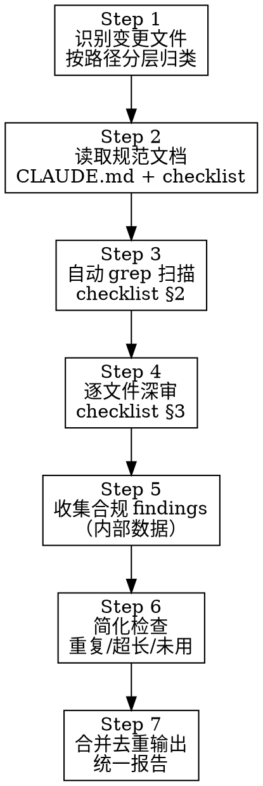

# Elicit 代码审查 Skill

## 核心原则

1. **每次审查必读规范文档** — 不凭记忆，以 `CLAUDE.md` 和项目设计文档为唯一权威
2. **按文件层级分配检查项** — 不同层（feature/store/agent/api/db）适用不同分类子集
3. **报告必须可操作** — 每条 finding 含 `file:line`、分类 ID、严重度、具体修改建议
4. **三级严重度** — 🔴 必改（违反硬性规则）/ 🟡 建议（风格优化）/ ✂️ 简化（可精简）
5. **单一输出** — 合规轨道与简化轨道合并去重后才输出，不分开报告

---

## 审查工作流（7 步）



### Step 1 — 识别变更文件

```bash
git diff --name-only HEAD~1     # 最近一次提交
git diff --name-only main...    # 相对 main 的全部变更
```

将文件按路径映射到层级和适用分类（见 checklist §1）：

| 路径模式 | 层级 | 适用分类 |
|---------|------|---------|
| `src/features/**/*.tsx` | Feature 组件 | A B C D E |
| `src/components/**/*.tsx` | 共享组件 | A B C D E |
| `src/stores/**/*.ts` | Zustand Store | A B C F |
| `src/services/**/*.ts` | 服务层 | A B C |
| `src/services/api-client/**/*.ts` | API 客户端 | A B C |
| `src/lib/**/*.ts` | 工具库 | A B C |
| `src/types/**/*.ts` | 类型定义 | B C |
| `src/types/enums/**/*.ts` | 枚举定义 | B（子集） |
| `src/db/schema/**/*.ts` | Drizzle Schema | B C G |
| `src/db/mappers/**/*.ts` | 数据映射 | A B C G |
| `src/db/models/**/*.ts` | 数据模型 | A B C G |
| `src/app/api/**/*.ts` | API 路由 | A B C H |
| `src/agents/nodes/**/*.ts` | Agent 节点 | A B C I |
| `src/agents/graphs/**/*.ts` | Agent 图 | A B C I |
| `src/agents/schemas/**/*.ts` | Agent Schema | B C I |
| `src/agents/models/**/*.ts` | Agent 模型 | B C I |
| `src/agents/prompt/**/*.ts` | Agent Prompt | B C I |
| `src/app/globals.css` | 全局样式 | E |

### Step 2 — 读取规范文档

每次审查**必须**读取：

1. `CLAUDE.md` — 项目级开发指引（路径别名、架构约定、值得注意的惯例）
2. `references/review-checklist.md` — grep 模式 + 结构检查索引

**按需读取**（仅涉及对应层时）：

3. `doc/详细设计/详细设计_v0.1_MVP.md` — 涉及 agent 代码时
4. `doc/测试验证/测试验证策略_v0.1_MVP.md` — 涉及测试文件时

### Step 3 — 自动 grep 扫描

按 checklist §2 的模式表，对变更文件逐条执行 grep。

- `auto` 判定的：命中即记录 finding
- `判读` 判定的：命中后读取上下文，确认是否为真阳性
- 同时执行 §4 全局扫描规则（不限于变更文件）

### Step 4 — 逐文件深审

读取每个变更文件的完整内容，执行 checklist §3 的结构检查：

- 按文件层级选择适用的检查项
- 检查代码结构、组织、模式合规
- 记录所有 findings（含 file:line）

### Step 5 — 收集合规 findings（内部）

将 Step 3 和 Step 4 的所有 findings 汇总到内部数据结构：

```
findings_compliance = [
  { file, line, id, severity, category, message, suggestion }
]
```

**此步骤不产出任何输出。**

### Step 6 — 简化检查

对变更文件执行轻量简化扫描，关注：

- **重复代码**：变更文件之间 / 与已有代码之间的重复片段
- **超长函数**：函数体 > 30 行，可分解
- **未用导入**：import 了但未在代码中引用
- **重复模式**：3 处以上相似代码可提取为工具函数
- **过度抽象**：仅用一次的抽象层可内联

```
findings_simplify = [
  { file, line, id: "SIM-xx", severity: "✂️", message, suggestion }
]
```

### Step 7 — 合并去重输出

1. 合并 `findings_compliance` + `findings_simplify` → `findings_all`
2. 去重：同 file+line 的语义相似 findings 合并为一条
3. 按文件分组，组内按行号排序
4. 输出统一报告

**输出格式：**

```
## 审查报告

### `src/features/chat/chat-message.tsx`

| 行 | ID | 严重度 | 问题 | 修改建议 |
|----|-----|--------|------|----------|
| 38 | B-03 | 🔴 | 使用了 `.then()` 链 | 改为 `async/await`：`const url = await getSignedUrl(...)` |
| 112 | S-01 | 🟡 | 文件 145 行，接近 200 行阈值 | 观察后续增长，超出时拆分 |

### `src/services/api-client/OssRequest.ts`

| 行 | ID | 严重度 | 问题 | 修改建议 |
|----|-----|--------|------|----------|
| 10 | B-03 | 🔴 | `.then()` 链式调用 | 重构为 async 方法 |
| 50 | B-03 | 🔴 | `.then()` 链式调用 | 重构为 async 方法 |

---

**汇总**：🔴 必改 3 / 🟡 建议 1 / ✂️ 简化 0
```

---

## 审查分类详解

### A — 导入与模块边界

**核心规则**：所有导入使用 `@/*` 路径别名，严格执行 `server-only` 边界。

| ID | 规则 | 严重度 |
|----|------|--------|
| A-01 | 禁止跨目录相对导入（`from '../'`），同目录 `./` 允许 | 🔴 |
| A-02 | 使用 `@/db/mappers/` 或 `@/db/index` 的文件须导入 `server-only` | 🔴 |
| A-03 | `"use client"` 文件禁止导入服务端模块 | 🔴 |
| A-04 | `createClient` 仅限 `supabase.ts` 和 `auth.ts`，其他文件用单例 | 🔴 |

### B — TypeScript 合规

**核心规则**：严格类型、async/await、`createEnum()` 工厂模式。

| ID | 规则 | 严重度 |
|----|------|--------|
| B-01 | 禁止 `: any` 类型注解 | 🔴 |
| B-02 | 禁止 `as any` 断言 | 🔴 |
| B-03 | 禁止 `.then()` 链，必须 async/await | 🔴 |
| B-04 | 禁止 TS `enum` 关键字，用 `as const` + `createEnum()` | 🔴 |
| B-05 | 禁止空 catch 块 | 🔴 |
| B-06 | 字面量联合枚举须收归 `src/types/enums/` | 🔴 |
| B-07 | `as const` 枚举对象须收归 `src/types/enums/` | 🔴 |
| B-08 | `.enum.ts` 文件必须在 `src/types/enums/` 目录 | 🔴 |
| B-09 | `src/types/enums/` 内文件须调用 `createEnum()`（豁免 `base.ts`） | 🔴 |
| B-10 | 禁止在 enums 外自维护 `Record<EnumType, string>` label 映射 | 🔴 |
| B-11 | API 边界建议 Zod 运行时入参校验 | 🟡 |

### C — 命名规范

**核心规则**：DB 列 snake_case / 其余 TS 一律 camelCase / 前端禁 snake_case。

| ID | 规则 | 严重度 |
|----|------|--------|
| C-01 | 业务组件文件须 PascalCase（如 `ChatBubble.tsx`，2026-06 约定）；`src/components/ui/` shadcn 生成件保持 kebab-case | 🟡 |
| C-02 | 枚举文件须 `camelCase.enum.ts`（如 `chatMessageRole.enum.ts`） | 🟡 |
| C-03 | Store 文件须 `use` 前缀（如 `useConversation.ts`） | 🟡 |
| C-04 | Props 类须 `XxxProps` 后缀（如 `ChatMessageProps`） | 🟡 |
| C-05 | 前端代码禁 snake_case 变量名（DB 列映射除外） | 🟡 |
| C-06 | DB 列必须 snake_case（Drizzle schema 中） | 🔴 |
| C-07 | 代码注释须为中文（项目惯例） | 🟡 |

### D — React / 组件结构

**核心规则**：函数式组件 + React Compiler，禁手动 memo。

| ID | 规则 | 严重度 |
|----|------|--------|
| D-01 | 禁止 class 组件 | 🔴 |
| D-02 | 禁止 `useMemo` / `useCallback`（React Compiler 已启用） | 🔴 |
| D-03 | 禁止 `React.memo`（React Compiler 已启用） | 🔴 |
| D-04 | 禁止内联视觉样式 `style={{}}`，用 Tailwind 类 | 🔴 |

### E — CSS / Tailwind v4

**核心规则**：Tailwind CSS v4 + oklch CSS 变量主题系统。

| ID | 规则 | 严重度 |
|----|------|--------|
| E-01 | 禁硬编码 hex 色值（`#fff` 等），用 Tailwind token 或 CSS 变量 | 🔴 |
| E-02 | 禁 CSS modules（`.module.css`），项目只用 Tailwind | 🔴 |
| E-03 | 禁组件内 `rgb()`/`hsl()` 等硬编码颜色函数 | 🔴 |
| E-04 | 条件 className 应使用 `cn()` 工具函数（from `@/lib/utils`） | 🟡 |
| E-05 | 禁 CSS-in-JS 库（styled-components / emotion） | 🔴 |

### F — Zustand Store

**核心规则**：类型化创建、async action 安全、selector 消费。

| ID | 规则 | 严重度 |
|----|------|--------|
| F-01 | Store 必须类型化 `create<StoreType>(...)` | 🔴 |
| F-02 | 组件消费 store 须用 selector `useStore(state => state.xxx)` | 🟡 |

### G — 数据库与持久化

**核心规则**：Drizzle 限服务端 / Supabase 客户端限浏览器 / 双通道不交叉。

| ID | 规则 | 严重度 |
|----|------|--------|
| G-01 | Drizzle 相关导入的文件须有 `server-only` 声明 | 🔴 |
| G-02 | `agents/` / `mappers/` 禁止导入 Supabase 客户端 | 🔴 |
| G-03 | 禁手编 `src/db/supabase/type.ts`，必须 `pnpm supabase:type` 生成 | 🔴 |
| G-04 | postgres 客户端须 `prepare: false`（Supavisor 兼容） | 🔴 |

### H — API 路由

**核心规则**：`withAuth()` + `BaseResponse` + Next.js 16 async params。

| ID | 规则 | 严重度 |
|----|------|--------|
| H-01 | 认证路由须 `withAuth()` 包裹 | 🟡 |
| H-02 | 响应须用 `BaseResponse.ofSuccess/ofError` | 🟡 |
| H-03 | 动态路由须 `const { param } = await params` | 🔴 |

### I — LangGraph / Agent

**核心规则**：标准日志、Zod schema、部分状态返回、模型单例。

| ID | 规则 | 严重度 |
|----|------|--------|
| I-01 | 节点须有 `console.log('XxxNode invoked with ...')` 入口日志 | 🟡 |
| I-02 | 节点须导出名称常量（如 `export const chatNodeName = 'chatNode'`） | 🟡 |
| I-03 | 模型须在 `models/` 定义为单例，节点内禁止实例化 | 🔴 |
| I-04 | 长 prompt 须提取到 `agents/prompt/` 目录 | 🟡 |

---

## 已知项目惯例（不视为违规）

以下模式是 elicit 项目的**既有惯例**，审查时不应标记为违规：

- **Props 使用 `class` 定义**（如 `class ChatMessageProps`）— 不要求改为 `interface`
- **`_common.ts` 下划线前缀** — `db/schema/_common.ts` 的命名是惯例，不算 C-01 违规
- **`globals.css` 内的 oklch/hex 值** — CSS 变量定义区允许直接写颜色值
- **中文 console.log** — 日志消息可以是中文
- **`export const` 导出工具函数** — `lib/` 下的工具函数使用 named export 而非 default export
- **业务组件统一命名导出** — `src/features/**/components/` 与 `src/components/` 下组件无 `export default`（2026-06 组件化重构起惯例）；S-05 仅适用于 `src/app/**` 的 page/layout（Next.js 要求 default export）
- **`src/lib/adminDb.ts` 的 service-role `createClient`** — server-only + 懒单例，是 A-04 的正当豁免点，与浏览器端 anon 单例天然不可复用
