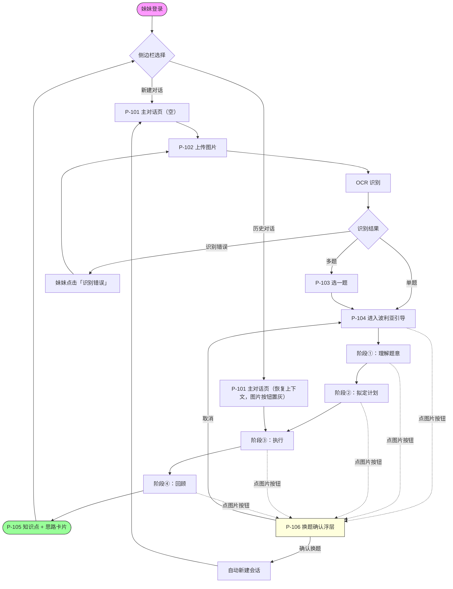

# PRD_v0.1_MVP — 引思助手 MVP 版本

## 1. 文档元信息

| 字段          | 值                        |
| ----------- | ------------------------ |
| 文档名称        | PRD_v0.1_MVP.md          |
| 版本          | v0.1                     |
| 状态          | 草稿                       |
| 创建日期        | 2026-05-19               |
| 最后更新        | 2026-05-19               |
| 产品负责人       | muzi（家长开发者）              |
| 评审人         | muzi                     |
| **关联文档**    |                          |
| ↑ 上游：原始草稿   | `MVP版本PRD.md`（已废弃，本文档替代） |
| → 下游：需求分析   | doc/需求分析/MVP.md（待产出）     |
| → 下游：高层架构设计 | doc/高层架构/高层架构设计_v0.1_MVP.md |
| → 下游：概要设计   | doc/设计/MVP_概要设计.md（待产出）  |
| → 下游：详细设计   | doc/设计/MVP_详细设计.md（待产出）  |

---

## 2. 产品背景与目标

### 2.1 背景

家中妹妹刚上初中，平时做数学作业经常拍照问家长怎么做。家长工作忙，常常半夜下班才回复，且即便回复也容易直接给答案，导致妹妹缺少独立思考过程，下次遇到类似题仍不会做。

引思助手以「**苏格拉底式反问**」为核心交互方式，让妹妹遇到不会的数学题时通过拍照上传 → Agent 引导思考 → 自己说出解题思路 → 沉淀知识点。**Agent 始终不直接给答案**，目标是让妹妹掌握「这类题的破题方法」，而不是「这一题的答案」。

### 2.2 业务目标

- **目标 1**：让妹妹遇到不会的数学题时，通过 Agent 引导能自己说出完整解题思路，沉淀本题涉及的知识点。
- **目标 2**：MVP 阶段先跑通主流程并被妹妹实际使用 2 周，再决定是否扩展（错题本 / 知识图谱 / 复习预习）。

### 2.3 成功指标（量化）

| 指标 | 基线 | 目标值 | 衡量方法 | 衡量时点 |
|---|---|---|---|---|
| 题目识别成功率 | N/A | ≥ 90% | 主观抽检妹妹上传的 20 张作业图，识别准确即算成功 | MVP 上线 2 周后 |
| 解题成功率 | N/A | ≥ 70% | 主观抽检 10 次会话，妹妹在 Agent 引导下最终说出完整正确思路即算成功 | MVP 上线 2 周后 |
| 平均引导轮数 | N/A | ≤ 10 轮 / 题 | 取上述 10 次会话的总轮数 ÷ 10 | MVP 上线 2 周后 |

---

## 3. 目标用户

| 角色 | 核心特征 | 本 PRD 能力边界 |
|---|---|---|
| **学生（妹妹）** | 13–16 岁，初中在读，使用**北师大版**数学教材，目标考区为**贵阳中考**（数学满分 150）；遇到不会的题习惯拍照求助 | 可注册登录、拍题 / 选图、与 Agent 多轮对话、查看历史会话；**不能调整 Agent 参数**、**不能跨学科提问** |
| **家长开发者（muzi）** | 后端工程师，负责开发与运营 Agent；夜间下班后偶尔抽检妹妹的对话 | 可登录、可访问 `/admin` **只读**查看所有学生会话；**不能在产品 UI 内调参**（参数调整通过改代码 + 重新部署完成） |

---

## 4. 功能范围

### 4.1 本 PRD 覆盖（In-Scope）

- **F001 拍题 / 选图**：Web H5 上调用相机拍摄或相册选图，上传题目照片
- **F002 OCR 多题识别 + 选一题**：识别图中所有题目并按 LaTeX 渲染，妹妹从中选一道作为本会话焦点；识别错误可反馈重识别
- **F003 波利亚四阶段引导对话**：Agent 按「理解 → 拟定计划 → 执行 → 回顾」四阶段引导，全程苏格拉底式反问，**不直接给答案**
- **F004 会话历史侧边栏**：一会话 = 一题；侧边栏列出历史会话，可点选恢复继续，可新建空白对话
- **F005 知识点 + 思路总结输出**：回顾阶段结束后，Agent 输出本题的知识点列表 + 思路总结卡片
- **F006 邮箱注册登录**：沿用现有 Supabase Auth 邮箱+密码流程
- **F007 家长只读后台**：`/admin` 路径，列出所有学生会话，可点进看完整对话历史

### 4.2 明确不含（Out-of-Scope）

- **错题本 / 题目收藏**：推迟到 v0.2
- **知识点知识图谱 / 复习 / 预习**：推迟到 v0.2+
- **教材作业管理 / 材料上传管理**：推迟到 v0.2+
- **家长可调参后台**（修改提示词 / 调整阈值）：MVP 不做，参数调整通过改代码完成
- **非北师大版教材的内容适配**：不在范围
- **非贵阳考区的特殊题型 / 命题倾向**（如某省独有压轴题路数）：不在范围；MVP 的方法术语 menu、ClassifyNode 题型分布权重、知识点对照表均以北师大版教材 + 贵阳中考考纲为基准
- **非数学学科**（英语 / 物理 / 化学等）：不在范围；上传时 Agent 礼貌拒答
- **强对错判断**（判定妹妹某一步答案是否正确）：MVP 仅做「方向是否在合理 menu 内」的弱判断，强判断推迟到 v0.2（见 §12 遗留问题）
- **多人 / 班级 / 教师视角**：不在范围

---

## 5. 端到端流程图



> **关键分支说明**
> - **多题选一**：每张图最多让妹妹选 1 道，其余丢弃（下次需要可重新上传）
> - **识别错误反馈**：在 P-103 确认前点「识别错误」按钮 → 回到上传步骤重拍 / 重选；**不新建会话**
> - **历史会话恢复**：从侧边栏进入直接落在执行阶段；**图片按钮置灰**——历史会话只能纯文本推进，要换题必须点左侧「新建对话」
> - **新会话内换题（已确认题目后再次点图片按钮）**：弹出 P-106 浮层确认 → 确认后**自动新建会话**并切过去（原会话保留侧边栏）；取消则留在原会话

---

## 6. 页面清单

| 页面 ID | 页面名称 | 所属场景 | 核心元素 |
|---|---|---|---|
| P-000 | 欢迎页 / 登录页 | 全局 | Logo、邮箱输入、密码输入、登录 / 注册切换、提交按钮 |
| P-001 | 主框架（含侧边栏） | 全局 | 顶栏（妹妹昵称、退出按钮）、左侧会话列表、「新建对话」按钮、主区域容器 |
| P-101 | 主对话页 | 场景1（解题答疑） | 消息列表（用户/Agent 气泡）、输入框、图片按钮（状态由会话状态决定，见下注）、发送按钮 |
| P-102 | 上传图片浮层 | 场景1 | 「拍照」「相册」二选一、图片预览、「确认上传」「取消」按钮 |
| P-103 | 多题确认浮层 | 场景1 | OCR 题目列表（LaTeX 渲染）、每题单选按钮、「确认选择」「识别错误」按钮 |
| P-104 | 引导对话进行中 | 场景1 | 与 P-101 共用；顶部细线**双层**提示：① 外层 `小问 N/M`（`subProblems.length=1` 时省略前缀）② 当前阶段（理解 / 拟定计划 / 执行 / 回顾）③ 内层 `破题点 K`（仅阶段 ③ 显示，K = `insightPoints.length`）；详见下方 mockup |
| P-105 | 知识点 + 思路总结卡片 | 场景1 | 题目摘要、知识点标签列表、解题思路步骤列表（每步含使用的方法术语）、「保存」（v0.2+ 占位）、「再来一题」按钮 |
| P-106 | 换题确认浮层 | 场景1 | 文案"换一道题吗？这道题会保留在侧边栏。"、「换一道」「取消」二选一按钮 |

> **P-101 图片按钮状态规约**
> - **可点击**：当前会话尚未通过 P-103 确认题目（含全新空白态）
> - **可点击但触发 P-106**：当前会话已通过 P-103 确认题目（即已在 P-104 / P-105 阶段）
> - **置灰不可点击**：当前在历史会话（从侧边栏恢复的会话）；hover tooltip 提示"换题请点左侧『新建对话』"

> **P-104 双层顶栏 mockup（B4 新增；最终视觉留详设期 D-X8 review）**
>
> 候选文案模式：`[小问 N/M · ] 阶段名 [ · 破题点 K ]`（外层与内层均为条件显示）
>
> ```
> ┌──────────────────────────────────────────────────────┐
> │  小问 1/2 · 拟定计划 · 破题点 2                       │  ← 多小问 + 阶段② 已积累 2 个破题点
> ├──────────────────────────────────────────────────────┤
> │  [对话气泡区...]                                       │
> └──────────────────────────────────────────────────────┘
>
> ┌──────────────────────────────────────────────────────┐
> │  执行 · 破题点 3                                       │  ← 单小问 + 阶段③ 已积累 3 个破题点
> ├──────────────────────────────────────────────────────┤
> │  [对话气泡区...]                                       │
> └──────────────────────────────────────────────────────┘
>
> ┌──────────────────────────────────────────────────────┐
> │  理解题意                                              │  ← 单小问 + 阶段①（无破题点显示）
> ├──────────────────────────────────────────────────────┤
> │  [对话气泡区...]                                       │
> └──────────────────────────────────────────────────────┘
> ```
>
> 文案显示规则：
> - 外层 `小问 N/M`：仅当 `subProblems.length ≥ 2` 时显示；切换小问时由 SSE `sub_problem_changed` chunk 触发顶栏刷新
> - 中层阶段名：始终显示，沿用现有"理解 / 拟定计划 / 执行 / 回顾"
> - 内层 `破题点 K`：仅阶段 ③（执行）时显示，且 K ≥ 1；K = 当前 subProblem 的 `insightPoints.length`
> - PROBLEM_BLOCKED 时阶段名展示为"已尽力，进入回顾"（不暴露 BLOCKED 字眼，避免妹妹有挫败感）

| P-201 | 家长后台 - 会话列表 | 场景2（家长只读） | 妹妹会话列表（标题、最后更新时间、轮数）、点击进入详情 |
| P-202 | 家长后台 - 会话详情 | 场景2 | 完整对话内容 + 当时上传的题目图片 + 知识点卡片（如有），**无任何修改入口** |

---

## 7. 场景与用户故事

### 场景 1：解题答疑（妹妹端）

| US 编号 | 故事标题 | 优先级 |
|---|---|---|
| US-001 | 从相册选题目图片上传 | Must |
| US-002 | 拍照上传题目图片 | Must |
| US-003 | Agent 自动 OCR 识别题目并按 LaTeX 渲染 | Must |
| US-004 | 多题图片中选定一道作为本会话焦点 | Must |
| US-005 | 识别错误时反馈给 Agent 重识别 | Must |
| US-006 | 没有思路时获得方向 / 涉及知识点提示 | Must |
| US-007 | Agent 拆步骤引导思考每一步关键点 | Must |
| US-008 | 妹妹回答偏离当前阶段时被引回 | Must |
| US-009 | 同一阶段连续 3 轮无进展时获得方法论 + 知识点提示 | Must |
| US-010 | 从侧边栏选择历史对话继续 | Must |
| US-011 | 新建空白对话 | Must |
| US-012 | Agent 能识别题型并使用对应方法术语引导 | Should |
| US-013 | 当前阶段判据满足时 Agent 主动推进到下一阶段 | Should |
| US-014 | 上传非数学题目时 Agent 礼貌拒答 | Must |
| US-016 | 在已确认题目的新会话里点图片按钮 → 弹换题确认浮层 → 确认后自动新建会话 | Must |
| US-017 | 在恢复的历史会话里图片按钮置灰不可点击 | Must |

### 场景 2：家长只读后台（家长开发者端）

| US 编号 | 故事标题 | 优先级 |
|---|---|---|
| US-015 | 家长登录后通过 `/admin` 只读查看所有会话 | Must |

---

## 8. Agent 行为规约

> **本章为产品视角的行为契约。**
> 技术实现细节（LangGraph 节点拓扑、state 字段、prompt 模板、JSON schema）见下游「高层架构 / 概要 / 详细设计」文档。

### 8.0 术语表（B4 新增）

> 本章 + §12 的核心术语在此统一定义；下游高层架构 / 概要 / 详细设计 / 需求分析 / 测试验证文档沿用同一术语。

| 术语 | 定义 | 主要出现位置 |
|---|---|---|
| **题目 / question** | 妹妹上传的一张图所含的一道完整数学题。一张图可能含多题（如作业图含 3 题），由 §4.3 多题选一处理 | §4.3 / §8.2 |
| **小问 / subProblem** | 一道题内部的递进式子问题，如 (1)(2)(3)。一道单一目标的题视为含 1 个小问的特例（subProblems.length = 1）| §8.2 / §12 #9 |
| **破题点 / insightPoint** | 妹妹在解一个小问过程中说出的**思路关键片段**（如"想到费马点"、"用反证法"、"做辅助线连 AB"）。一个小问可能需要 1~N 个破题点拼接才能推出最终结论 | §8.2 阶段 ③ + 内层循环 |
| **内层循环（多破题点）** | 同一 subProblem 内 阶段 ② ↔ 阶段 ③ 来回——妹妹卡住时可回到阶段 ② 拟定下一个破题点 | §8.2 阶段 ②↔③ |
| **外层循环（多小问）** | subProblems 队列驱动——一个小问完成后从下一小问的阶段 ① 重新开始；全部完成后才进入阶段 ④ | §8.2 外层段 |
| **SUB_PROBLEM_DONE** | 当前 subProblem 推出最终结论，外层路由切到下一 subProblem 或阶段 ④ | §8.2 阶段 ③ 出口 |
| **PROBLEM_BLOCKED（部分解）** | 妹妹在某 subProblem 5 问探路（§8.4.2）+ 知识点兜底后仍无突破 → Agent 输出"部分解"信号，该 subProblem 标记"未突破"，外层路由继续下一小问 | §8.2 阶段 ③→④ 出口 |

### 8.1 引导风格与边界

- **风格**：苏格拉底式反问。**始终不直接给具体步骤的答案**，但可以给「这一步涉及的知识点 + 常见做法的方向」。
- **学科边界**：仅接受初中数学题（北师大版初一 ~ 初三）；其他学科一律拒答。
- **话题边界**：与数学题无关的闲聊（如「今天天气怎么样」「介绍一下你自己」）一律拉回主题。
- **语气与措辞**：面向 13–16 岁中学生，口语化但不幼稚；避免「亲爱的」「宝贝」等过度亲密；称呼直呼姓名或「你」。

### 8.2 引导流程的产品现象（波利亚四阶段 + 双层循环）

> Agent 按「理解 → 拟定计划 → 执行 → 回顾」四阶段推进；**对于多小问综合题，外层按 subProblem 顺序推进，每个 subProblem 内部按四阶段走，阶段 ② ↔ ③ 之间可来回（内层循环）**。妹妹端在 P-104 顶栏看到"小问 N/M · 当前阶段 · 破题点 K" 提示（详见 §6 P-104 mockup）。

#### 外层：subProblems 推进
- **用户看到的现象**：题目含多个小问时（如 (1)(2)(3) 综合题），Agent 按顺序逐个引导，P-104 顶栏显示"小问 N/M"。单问题题视为 `subProblems.length = 1` 的特例，不出现"小问"前缀。
- **Agent 行为**：当前 subProblem 完成（SUB_PROBLEM_DONE 或 PROBLEM_BLOCKED）后，路由器选择下一 `subProblem.status = pending` 的小问，从【阶段 ①】重新开始；全部小问处理完后进入【阶段 ④】**1 次大回顾**。
- **顺序约束**：MVP **默认顺序处理**（先 (1) 后 (2)）。妹妹若主动说"我想先做第 (2) 问"，Agent 拉回："我们先把第 (1) 问做完再看第 (2) 问哦，这样对你打底更扎实。"（跳问支持 v0.2 评估，见 §12 #9）

#### 阶段 ① 理解题意
- **用户看到的现象**：Agent 用问句反问已知条件、求解目标、可否画图。**多小问时仅针对当前 subProblem 的条件 + 求解目标**。
- **Agent 行为**：不进入解法，只确认妹妹是否准确理解了当前 subProblem。
- **完成判据**（产品现象）：妹妹在回复中复述出当前 subProblem 的**已知条件 + 明确求解目标**。

#### 阶段 ② 拟定计划
- **用户看到的现象**：Agent 引导妹妹联想——"这类题你之前见过类似的吗？""能想到哪个定理 / 公式？""能不能换个角度？"
- **Agent 行为**：根据 §8.3 题型 menu 抛出与题型相关的方法术语作为提示锚点；若已积累过破题点（内层循环回来），不重复抛同类提示。
- **完成判据**（per 当前 subProblem）：妹妹**说出当前破题点的方向**（注：MVP 不要求妹妹一次性说出整条解题方向，仅当前破题点；后续破题点在阶段 ③ 内层循环中迭代——见下方"阶段 ②↔③ 内层循环"），且同时满足两条弱判断（强判断"方向能否解出本题"推迟 v0.2，见 §12 #1）：
  - **C1（menu 内合理性）**：方向落在 §8.3.1 题型对应 `problemType` 的方法术语内，或 §8.3.2 四大数学思想锚点内；OTHER 题型例外，不强卡 menu。
  - **C2（非复述 / 补意图）**：若方向词汇**直接复述** Agent 上一轮探路句（如 §8.4.2 5 问探路抛出的"画图试试？"），妹妹需**补一句应用意图**说明为何选这条路。
- **正例（COMPLETED）**：「我看了题目结构，左边能拆成 (x+1)²，所以想用因式分解」——方向在代数 menu 内 + 补了"看出结构 → 选方法"的应用意图。
- **反例 1（STAY，复述无意图）**：Agent 上一轮："要不画图试试？" 妹妹："好的我画图。" —— Agent 下一轮反问"画图之后你看出什么了？"，留在阶段②。
- **反例 2（STAY，跨题型轻量纠偏）**：代数题 → 妹妹："我想用面积法。" —— Agent 下一轮："这道题更像是代数题哦，要不试试设元 / 列方程？"

#### 阶段 ②↔③ 内层循环（多破题点，B4 新增）

> 一道题（一个 subProblem）可能需要 **1~N 个破题点拼接**才能推出最终结论。妹妹在阶段 ③ 执行过程中卡住时，可回到阶段 ② 拟定下一个破题点，再回到阶段 ③ 继续。

- **触发回阶段 ②**：阶段 ③ 内 StuckGuard 达阈值（同 subProblem 3 轮无推进） or 妹妹明确说"换个想法 / 这个方向走不通"等表达（信号 ESCALATE）
- **破题点记录**：妹妹说出一个有效新破题点时，Agent 内部记录到 `insightPoints[]`（妹妹看不到列表，但 P-104 顶栏会显示"破题点 K"）
- **Agent 行为**：回阶段 ② 时携带已积累的破题点上下文，避免重复抛同类提示；继续引导妹妹自己想下一个

#### 阶段 ③ 执行
- **用户看到的现象**：Agent 跟着妹妹选定的破题点，每一步反问"下一步你怎么走？"——**不代算**。
- **Agent 行为**：每步只确认推进方向是否合理（在题型 menu 内或一致延伸 + 与已积累破题点一致），不评判最终对错（强判断推迟 v0.2）。
- **完成判据**（per 当前 subProblem）：妹妹的破题点拼接出当前 subProblem 的**最终结论**（含 1~N 个破题点；不要求妹妹算出具体数值，仅推出方向性结论）→ Agent 内部信号 **SUB_PROBLEM_DONE**，外层路由进入下一小问或阶段 ④。
- **部分解出口（PROBLEM_BLOCKED）**：妹妹在某破题点上经过 §8.4.2 5 问探路 + 知识点兜底仍无突破 → Agent 内部信号 **PROBLEM_BLOCKED**；该 subProblem 标记"未突破"；外层路由跳过该小问的剩余环节，下一小问继续 / 全部小问处理完后进入阶段 ④。

#### 阶段 ④ 回顾
- **用户看到的现象**：Agent 引导回顾——除了基本的"用了哪些知识点 / 有没有别的解法 / 哪一步是关键"，还会主动追问 2~3 个**元认知问句**，让妹妹养成解完题后自反的习惯：
  - "有没有更短 / 更省力的路？"
  - "题目的条件如果再放宽一点 / 严一点，结果会变吗？"
  - "这道题像不像你之前做过的某一道？这类题以后再遇到，你第一步会怎么想？"
- **Agent 行为**：归纳本题涉及的知识点 + 各 subProblem 的破题点 + blocked 未突破的卡点 + 推荐"看老师讲解"提示，输出 **1 张** P-105 大卡片（不做"每小问 1 张"的小回顾，避免卡片刷屏）。
- **完成判据**：所有 subProblems 状态 ∈ {done, blocked} → P-105 卡片生成。

#### 完整示例（双层循环行为现象）

**正例 1（单问多破题点）**：初三压轴"在 △ABC 内求一动点 P 到三顶点距离之和的最小值"
- subProblems.length = 1（单问）
- 阶段 ②：妹妹"想到对称变换"（**破题点 1** 记入）→ COMPLETED
- 阶段 ③：妹妹"那就把 △ABC 绕 A 点旋转 60°...呃接下来怎么办？"→ StuckGuard 触发 → Agent 反问"旋转之后图形有什么新的关系？" → 妹妹"哦旋转后 PB 变 P'B' 长度不变"（**破题点 2** 记入，留在阶段 ③）
- 阶段 ③：妹妹"那 PA+PB+PC 转化成 PA+PA+P'B' 这是三段折线"→ 卡 → ESCALATE 回阶段 ② → 妹妹"想到三点共线时折线最短"（**破题点 3** 记入）→ 回阶段 ③：妹妹"所以最小值就是 A 到 B' 的距离" → **SUB_PROBLEM_DONE**
- 阶段 ④：1 张 P-105 卡片含 3 个破题点

**正例 2（多小问递进）**：二次函数 y=x²-2x-3 与 x 轴交于 A、B，顶点 P。(1) 求 A、B、P 坐标；(2) 求 △PAB 面积。
- subProblems.length = 2（两小问）
- subProblem (1)：阶段 ①→②→③（妹妹"用求根公式"+"配方求顶点"两破题点）→ SUB_PROBLEM_DONE → 外层路由切到 subProblem (2)
- subProblem (2)：阶段 ①（妹妹复述"在 (1) 基础上算面积"）→ ②（妹妹"用底×高/2，底是 AB 长，高是 P 到 x 轴距离"）→ ③（妹妹推出最终面积）→ SUB_PROBLEM_DONE
- 全部 done → 阶段 ④：1 张 P-105 卡片含两小问各自的破题点 + 整体回顾

**反例（卡死部分解，PROBLEM_BLOCKED）**：分类讨论题"讨论 x²+(m-2)x+m-2=0 根的情况"
- subProblems.length = 1
- 阶段 ②：妹妹"用判别式 Δ"（破题点 1）→ COMPLETED
- 阶段 ③：妹妹算出 Δ=(m-2)(m+2)，按 Δ>0/=0/<0 分类——卡在"<0 时怎么办"（没思路）
- StuckGuard 5 问探路 + 知识点兜底"涉及二次函数零点存在性，常见做法是与 x 轴交点对应"——妹妹仍不通
- → **PROBLEM_BLOCKED** → 阶段 ④
- P-105 卡片：标"已掌握破题点 = 用判别式分类；未突破点 = Δ<0 情形分析；建议复习课本相关章节，问老师"

### 8.3 引导锚点：题型术语 + 数学思想

> Agent 在引导对话时同时使用两层锚点：**题型术语**是"下手的工具"，**数学思想**是"往哪个方向想"。两者并行，不互斥。

#### 8.3.1 题型 → 方法论术语

> 进入阶段 ② 时，Agent 内部归类题型，并使用对应方法术语作为引导锚点。**产品视角的术语列表**，不规定 menu 数据结构。

| 识别题型 | 引导中会涉及的方法术语 |
|---|---|
| **代数题** | 设元 / 列方程 / 因式分解 / 配方 / 换元 / 待定系数法 |
| **几何题** | 辅助线五件套（中线、高线、角平分线、平行线、垂线）/ 全等与相似 / 勾股定理 / 面积法 / 坐标法 |
| **函数题** | 图像法 / 数形结合 / 分类讨论 / 顶点式 / 待定系数法 |

#### 8.3.2 四大数学思想（元认知锚点）

> Agent 在引导中应**主动唤起**与题目相关的思想——不仅说出术语，而是用对应的反问句让妹妹自己想到这层。四大思想跨题型通用，所有阶段都可能用到。

| 数学思想 | 核心解读 | Agent 唤起话术示例 |
|---|---|---|
| **数形结合** | "数缺形时少直观，形少数时难入微"——代数 ↔ 几何互相翻译 | "这道题能不能画个图看看？""这个方程的解，能不能想成两条曲线的交点？" |
| **分类讨论** | 问题存在不确定性时，分而治之，不重不漏 | "这里有几种可能？要不要分情况看？""绝对值里面是正是负，结果会不会不一样？" |
| **转化与化归** | 把陌生 / 复杂 / 未知问题 → 转化为熟悉 / 简单 / 已知问题 | "这道题你之前没见过，但有没有像哪道做过的？""能不能换个说法，让它变简单？" |
| **函数与方程** | 用动态视角看变量关系（函数），用静态视角看等量平衡（方程） | "我们能不能把它列成方程？""把不等式恒成立，转化成求最值会不会更顺？" |

### 8.4 兜底场景行为

#### 8.4.1 常规兜底矩阵

| 兜底场景 | 触发条件（产品现象） | Agent 话术示例 |
|---|---|---|
| **卡住** | 同一阶段连续 3 轮无推进迹象 | 进入「5 问探路 → 知识点兜底」两段式升级，详见 §8.4.2 |
| **偏离** | 妹妹的回复跨过了当前阶段（如理解阶段直接报答案）或离开了当前题目 | "等等，我们先停一下。我们刚才在【当前阶段名】这一步，你刚才说的【妹妹原话片段】是怎么想到的？" |
| **越界（学科）** | OCR 识别后判定不是数学题（如英语 / 语文 / 物理） | "我目前只能陪你想数学题。要不要拍一道数学题，我们继续？" |
| **越界（话题）** | 妹妹聊天气 / 闲谈 / 问 Agent 身份等 | "这个我们等会再聊，先把这题搞定？你刚才在【当前阶段名】这一步。" |
| **OCR 失败** | 图片无法识别出任何数学题（图太糊 / 不是作业） | "这张图我没看清题目，能不能重新拍一张，把字拍得清楚一点？" |

#### 8.4.2 卡住兜底的两段式升级

> "卡住"是**最频繁也最容易让 Agent 退化为答案机**的场景。这里规定 Agent 必须先走 **5 问探路**，5 问轮换后仍无突破才进入第二段抛知识点——整个过程**始终不给具体步骤的数值答案**。

**第一段：5 问探路**

Agent 在 5 轮内每一轮选其中一类反问作为引导句（按顺序或视情况选择），鼓励妹妹自己找突破口。

| # | 反问句类型 | Agent 话术示例 |
|---|---|---|
| 1 | 条件是否用完 | "题目里给的条件，你都用上了吗？看看有没有哪个还没用到的，它可能就是突破口。" |
| 2 | 画图 / 列表 | "要不试着把题目画出来 / 列个表？把脑子里的东西落到纸上。" |
| 3 | 简单特例探路 | "我们先取一个简单的数 / 一个特殊的图形看看会怎样？" |
| 4 | 等价改写 | "这个问题能不能换一种说法？或者把它翻译成方程 / 图像试试？" |
| 5 | 类比已做题 | "这道题你看着有点像哪道题？之前做过类似的吗？" |

**第二段：知识点兜底**

5 问轮换后妹妹仍无突破，Agent 进入收尾话术：

> "这一步我们涉及到的是【XX 知识点】，常见的做法是【YY 方法】。你试着按这个方向再想一下，能想到下一步怎么走吗？"

> ⚠️ 即便到了第二段，Agent 仍**只给方法和涉及知识点，不给具体步骤的数值答案**。这是「拒绝直接给答案」的最后一道防线。

### 8.5 知识点 + 思路输出形态（P-105 卡片）

回顾阶段结束后，妹妹端会看到一张**总结卡片**，包含：

- **题目摘要**：用一句话复述这道题在问什么（不带 LaTeX 公式细节）
- **涉及知识点**：以**标签列表**形式列出（如「一元二次方程 · 求根公式 · 判别式」），通常 3–5 个标签
- **解题思路**：**按步骤列出**，每步两部分：
  - 这一步做了什么（"设苹果有 x 个、橘子有 y 个"）
  - 用到的方法术语（"设元法"）
- **可执行操作**：
  - 「再来一题」按钮 → 回到 P-001 新建对话
  - 「保存到错题本」按钮 → MVP 灰显占位，提示「v0.2 上线」

---

## 9. 体验约束

| 约束类别 | 约束描述 |
|---|---|
| 内容 / 主题边界 | 仅北师大版初中数学（初一 ~ 初三），考纲对齐**贵阳中考**（数学 150 满分）；其他学科 / 教材版本 / 学段 / 考区一律拒答 |
| 含图题处理 | **接受**所有含图题（几何 / 函数图像 / 统计图表）；不拒答。视觉理解模型把图转为「文字 + 图形结构化描述」交给后续引导。**注意**：函数图像题、统计图表题这类「必须看图形状」的题，描述质量可能不足，妹妹端可能感知到引导精度下降——已在 §12 登记为 v0.2 优化项 |
| 用户年龄认知 | 妹妹 13–16 岁；语气口语化但不幼稚；不使用过度亲密称呼；引导问句不超过两句、单条 Agent 回复不超过 200 字 |
| 时延感知 | 流式回复在妹妹按发送后 **≤ 2 秒**开始出现首字；OCR 识别 **≤ 5 秒**完成 |
| 平台限制 | Web H5 浏览器；依赖现代浏览器的相机权限（用于拍照）；不依赖原生 App |
| 网络依赖 | 所有功能均需联网；不支持离线 |
| 安全 / 隐私 | 上传图片可能包含妹妹姓名 / 班级——仅限本人 + 家长开发者可见，不外发、不参与训练 |

---

## 10. 非功能要求（产品视角）

| 维度 | 产品期望描述 |
|---|---|
| 响应时效感知 | 发送消息后 2 秒内必须有可见反馈（流式起字 / loading）；OCR 必须有进度提示；**流式输出过程中发送按钮置灰禁用**（避免妹妹打断 Agent 推进思路）|
| 多 tab 行为 | 单个会话仅推荐在一个 tab 中操作；MVP **不支持多 tab 并发编辑同一会话**（两个 tab 同时发消息 → 后端单线 LangGraph thread 串行处理，前端体验为"另一 tab 看到迟到的回包"，不阻断但不保证一致）|
| 会话长度上限 | MVP 单会话消息数软上限 ≈ 100 轮（≥ 50 轮时 P-104 顶栏出现"对话已较长，建议新建对话"提示）；硬上限由 DeepSeek 模型 context（~128k tokens）兜底，超长时后端 LangGraph 自动截断最早消息（保留题目 + 当前阶段上下文）|
| SSE 长连接稳定性 | 网络中断时浏览器自动重连（AI SDK 内置 EventSource 重连）；后端 LangGraph thread 串行执行 + checkpoint 保证重连后从上次成功阶段继续；妹妹端表现为"消息回包断了一下又恢复"，无需手动刷新 |
| 数据安全承诺 | 妹妹的对话与上传图片仅存储在自有数据库与对象存储；不对外公开 |
| 隐私 | 家长后台只读、不能编辑；妹妹的会话标题以题目摘要呈现，避免将原始姓名暴露在侧边栏 |
| 家长后台数据可见性（P9 决策） | `/admin` 跨用户读时**展示原文，不做脱敏**——题目图片含妹妹姓名 / 班级时家长开发者可见（家长 = muzi 本人，与妹妹是亲属关系，MVP 阶段视为同一信任域）；v0.2 若引入更多家长账号 / 妹妹隐私敏感反馈，评估加 "auth.users.email" 字段级 mask 或图片打码 |
| 可观察性 | 家长开发者通过 `/admin` 能看到所有妹妹会话的完整原始内容，无需进数据库 |
| 容错友好性 | OCR 失败 / 网络异常 / Agent 异常时给妹妹**非技术语言**的提示（"图片看不清，再拍一张吧"），不暴露 stack trace |

---

## 11. 验收出口

### 11.1 用户故事验收（Given/When/Then）

#### US-001 从相册选题目图片上传
- **Given**：妹妹已登录，处于 P-101 主对话页
- **When**：点击图片按钮 → 弹出 P-102 → 选择「相册」 → 选一张图片
- **Then**：图片缩略图出现在对话输入区，发送按钮可用

#### US-002 拍照上传题目图片
- **Given**：妹妹已登录，处于 P-101 主对话页，浏览器已授予相机权限
- **When**：点击图片按钮 → 弹出 P-102 → 选择「拍照」 → 完成拍摄
- **Then**：照片缩略图出现在对话输入区，发送按钮可用

#### US-003 Agent 自动 OCR 识别题目并按 LaTeX 渲染
- **Given**：妹妹已上传题目图片并点击发送
- **When**：图片到达后端
- **Then**：5 秒内对话中显示识别结果，数学公式按 LaTeX 渲染（非纯文本）

#### US-004 多题图片中选定一道作为本会话焦点
- **Given**：OCR 识别出 ≥ 2 道题
- **When**：Agent 在 P-103 浮层中列出所有题目
- **Then**：妹妹可单选一题并点「确认选择」；其余题目本会话内不再出现

#### US-005 识别错误时反馈给 Agent 重识别
- **Given**：OCR 结果显示在 P-103 / P-101 但识别错误
- **When**：妹妹点「识别错误」按钮
- **Then**：返回 P-102 让妹妹重新拍 / 重新选图（不带入旧图）

#### US-006 没有思路时获得方向 / 涉及知识点提示
- **Given**：妹妹在阶段 ② / ③ 表达"不知道"或"没思路"
- **When**：Agent 检测到明确求助信号
- **Then**：Agent 给出涉及知识点 + 方向性提示（用 §8.4 「卡住」话术风格），**不给具体步骤答案**

#### US-007 Agent 拆步骤引导思考每一步关键点
- **Given**：妹妹已完成阶段 ② 并明确解题方向
- **When**：进入阶段 ③
- **Then**：Agent 一次只问下一步该走什么，妹妹答一步推进一步；Agent **不代算具体数值**

#### US-008 妹妹回答偏离当前阶段时被引回
- **Given**：妹妹处于某一波利亚阶段
- **When**：妹妹的回复跨过当前阶段（如理解阶段直接报最终答案）或脱离当前题目
- **Then**：Agent 用 §8.4 「偏离」话术拉回当前阶段，不进入下一阶段

#### US-009 同一阶段连续 3 轮无进展时获得方法论 + 知识点提示
- **Given**：妹妹在同一阶段已交互 ≥ 3 轮，每轮均无完成判据信号
- **When**：第 3 轮 Agent 检测到 stuck
- **Then**：Agent 进入 §8.4.2 **两段式升级**——
  - 第一段：用 5 问探路（条件用完 / 画图 / 特例 / 等价改写 / 类比），最多 5 轮
  - 第二段：若 5 问仍无突破，才抛出本阶段方法论 + 涉及知识点
  - 全程**不给具体步骤的数值答案**

#### US-010 从侧边栏选择历史对话继续
- **Given**：妹妹已登录，侧边栏有历史会话
- **When**：点击某条历史会话
- **Then**：主区域切换到 P-104，加载完整上下文，输入框可继续发送消息推进对话

#### US-011 新建空白对话
- **Given**：妹妹在任意页面
- **When**：点击「新建对话」按钮
- **Then**：主区域跳到 P-101 空白状态；原会话保留在侧边栏

#### US-012 Agent 能识别题型并使用对应方法术语引导
- **Given**：妹妹确认题目（已通过 P-103 选定）
- **When**：进入阶段 ②
- **Then**：Agent 的引导问句中至少出现 §8.3 表中该题型对应方法术语之一

#### US-013 当前阶段判据满足时 Agent 主动推进到下一阶段
- **Given**：妹妹在阶段 ① 已复述出已知 + 求解目标
- **When**：Agent 收到该回复
- **Then**：下一条 Agent 消息进入阶段 ② 风格的引导问句；P-104 顶栏阶段提示更新

#### US-014 上传非数学题目时 Agent 礼貌拒答
- **Given**：妹妹上传了非数学题图片（如英语作文）
- **When**：OCR 完成
- **Then**：Agent 用 §8.4 「越界（学科）」话术拒答，不进入波利亚循环

#### US-016 在已确认题目的新会话里点图片按钮 → 弹换题确认浮层 → 确认后自动新建会话
- **Given**：妹妹在新建的会话中，已通过 P-103 确认题目并进入波利亚阶段（P-104 / P-105 任意阶段）
- **When**：点击 P-101 输入区的图片按钮
- **Then**：
  - 弹出 P-106 浮层，文案"换一道题吗？这道题会保留在侧边栏。"
  - 点「换一道」→ 后端自动新建会话；前端主区跳到新会话的 P-101 空白态；原会话保留在侧边栏；继续点图片按钮进入 P-102
  - 点「取消」→ 关闭 P-106，留在原会话当前阶段，不新建会话

#### US-017 在恢复的历史会话里图片按钮置灰不可点击
- **Given**：妹妹从侧边栏点击了某条历史会话，主区已加载完整上下文
- **When**：尝试点击 P-101 输入区的图片按钮
- **Then**：图片按钮置灰、点击无响应；hover 显示 tooltip"换题请点左侧『新建对话』"

#### US-015 家长登录后通过 `/admin` 只读查看所有会话
- **Given**：家长开发者用自己账号登录
- **When**：浏览器访问 `/admin`
- **Then**：进入 P-201，能看到所有学生会话列表；点入任意一条进入 P-202 看完整原始对话；页面上**没有任何编辑 / 删除 / 配置按钮**

### 11.2 Agent 行为验收

- [ ] 学科越界拒答时使用 §8.4.1 「越界（学科）」表中的话术，不进入波利亚循环
- [ ] 卡住兜底触发时按 §8.4.2 **两段式升级**：先走 5 问探路（≤ 5 轮），再走知识点兜底；**全程不给具体步骤的数值答案**
- [ ] 偏离回正触发时使用 §8.4.1 「偏离」话术，不主动推进下一阶段
- [ ] 引导过程中至少出现 §8.3.2 四大数学思想之一对应的反问句（验证 Agent 不只是抛术语，也在唤起元认知）
- [ ] 回顾阶段必须产出 P-105 卡片（含知识点列表 + 思路步骤）；阶段 ③ 完成但卡片缺失视为不合格
- [ ] 回顾阶段必须出现 §8.2 阶段④的元认知问句（"更短的路 / 条件放宽 / 像哪道题"中至少一条）
- [ ] 单条 Agent 回复 ≤ 200 字（除 P-105 卡片外）

### 11.3 版本 DoD

- [ ] US-001 ~ US-017 全部 Must 优先级 US 验收通过（US-016 / US-017 是 v0.1 末期补充，确保「一会话 = 一题」原则在所有图片按钮路径上一致执行）
- [ ] 第 11.2 节全部 Agent 行为验收项通过
- [ ] 妹妹真实使用 ≥ 2 周，第 2.3 节量化指标全部达标
- [ ] 家长开发者签字确认可进入 v0.2 规划

---

## 12. 遗留问题

| # | 问题描述 | 影响范围 | 决策负责人 | 截止日 | 状态 |
|---|---|---|---|---|---|
| 1 | **思路对错强判断**：妹妹某一步答案数值或推导是否正确，需要能精确判断（US-007 / US-008 完整能力）。当前 MVP 只做「方向是否在合理 menu 内 + 非复述/补意图」的弱判断（B3.2 已在阶段② 落地；B4 将"破题点维度"延伸至阶段③，详见 §8.2 + 详设 §4.3.4 + §4.3.5） | F003 阶段 ②③ 引导质量 | muzi | 2026-06-30 | 推迟到 v0.2 |
| 2 | **错题本 / 知识点知识图谱**：妹妹回顾时点击「保存到错题本」按钮的目标设计 | F005 输出卡片可执行操作 | muzi | 2026-06-30 | 推迟到 v0.2 |
| 3 | **知识点体系结构化**：是否要把北师大初中数学知识点拉成结构化字典 / 标签体系，便于跨会话统计妹妹高频卡点 | F005 输出 + 未来错题本 | muzi | 2026-07-31 | 推迟到 v0.3 |
| 4 | **多解法的「另一种方法」回顾**：阶段 ④ Agent 是否要主动提供与妹妹路径不同的第二种解法 | F003 阶段 ④ / F005 输出 | muzi | 2026-06-15 | 待决策 |
| 5 | **会话标题自动生成的隐私边界**：题目内容若含妹妹姓名 / 班级，作为侧边栏标题是否合适 | F004 历史侧边栏 | muzi | 2026-06-15 | 待决策 |
| 6 | **高阶解题技法**（设而不求 / 韦达定理整体代换 / 同构法 / 障碍函数构造等）：MVP 优先打底，初三压轴 + 高中向技法暂不纳入引导锚点 | F003 阶段 ② / ③ 方法术语调度 | muzi | 2026-09-30 | 推迟到 v0.2+ |
| 7 | **重视觉依赖题型的引导精度**（函数图像题 / 统计图表题等"必须看图形状"的题）：MVP 用 Qwen-VL-Max 输出图形描述供 DeepSeek 引导，描述质量可能不够。v0.2 评估升级路径：a) 全链路换多模态模型；b) 引入图像专门解析器；c) Hybrid 路由 | F003 引导精度 | muzi | 2026-08-31 | 推迟到 v0.2 |
| 8 | **破题点完整性判定**：B4 引入 insightPoints[] 追踪后，"是否真的拼接出最终结论" 仍是弱判断（LLM 自评 + ExecuteNode prompt 启发式判断），不做正确性强校验。v0.2 评估方向：引入符号求解器 / 数值校验 / multi-step LLM judge | F003 阶段 ③ SUB_PROBLEM_DONE 判定 | muzi | 2026-09-30 | 推迟到 v0.2 |
| 9 | **subProblems 跳问支持**：MVP 默认顺序处理 (1)→(2)→(3)，妹妹要求跳问时 Agent 拉回（§8.2 外层规约）。v0.2 评估"按妹妹意愿跳问"——可能涉及前置依赖判断（如 (2) 答案用 (1) 结果时不能跳）+ UX 重设计 | F003 外层 subProblem 推进 | muzi | 2026-08-31 | 推迟到 v0.2 |
| 10 | **跨会话续话**：妹妹打断后第二天回来说"接着昨天那道题" 能否恢复 (subProblems, currentSubProblemIndex, insightPoints) 状态。v0.2 评估：LangGraph checkpoint 已支持，主要工作在前端 UX（会话恢复入口 + 上下文回放） | F004 历史侧边栏 | muzi | 2026-09-30 | 推迟到 v0.2 |
