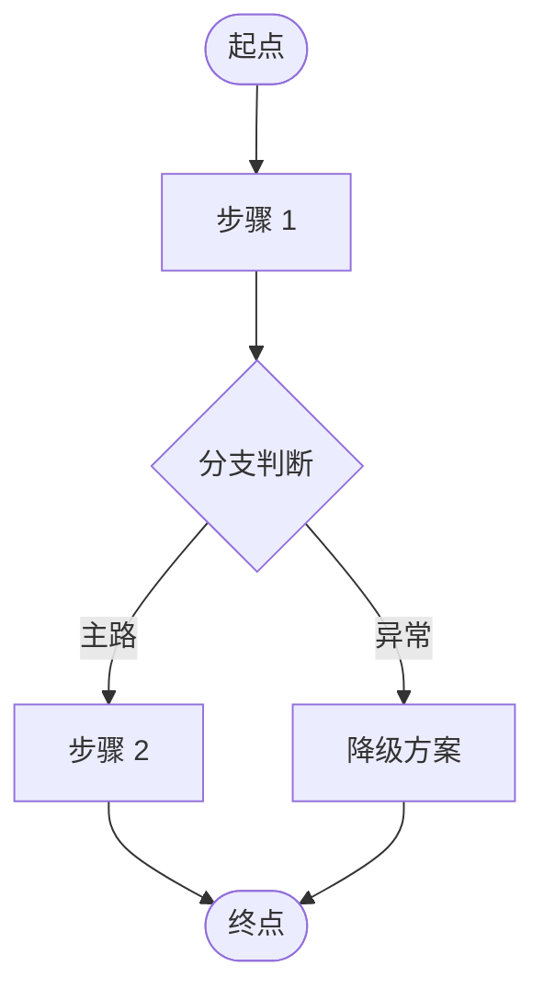

# 引思助手 PRD 模板

> **使用说明**
> - 每份 PRD 对应一个版本，命名规则：`PRD_v[版本号]_[功能名].md`（如 `PRD_v0.1_MVP.md`）
> - PRD 是「**产品视角的需求快照**」——只规约产品行为，**不写技术实现**
> - 技术细节交下游文档：**需求分析 → 高层架构设计 → 概要设计 → 详细设计**
> - 所有 US 编号必须在第 11 章「验收出口」中有对应的 Given/When/Then，否则视为 PRD 未完成

---

## 0. 本文档职责边界

> 每份 PRD 都是「**产品视角的需求快照**」——只规约用户能看到的产品行为。
> 技术实现交下游文档；每份下游文档同样在其 §0 明确职责边界。

### 0.1 本文档写什么

- 用户角色与场景（who、in what context）
- 功能范围 In / Out-Scope（产品 boundary）
- 端到端用户流程（user journey）
- 页面清单与核心元素（page inventory，非视觉规范）
- 用户故事 + Given/When/Then 验收（acceptance gate）
- Agent 行为契约（用户看见的 AI 行为：风格、阶段表现、兜底话术、输出形态）
- 体验约束与非功能产品期望
- 量化成功指标与衡量方法
- 遗留产品决策

### 0.2 本文档不写什么

| 不写                             | 写在哪里         |
| ------------------------------ | ------------ |
| 系统模块划分、模块依赖图、技术栈选型             | 高层架构设计       |
| 数据库表字段类型 / 索引 / RLS 策略         | 概要设计         |
| API 端点的字段契约 / 错误码              | 概要设计         |
| LangGraph 节点拓扑图 / state schema | 概要设计         |
| Prompt 模板 / 算法步骤 / 错误处理路径      | 详细设计         |
| 单元测试 / 集成测试代码                  | 详细设计 + 测试用例库 |
| UI 视觉规范 / 颜色 / 字号 / 字体         | 设计稿（Figma 等） |

### 0.3 与上下游文档的衔接

| 关系 | 文档 | 衔接点 |
|---|---|---|
| ↓ | 需求分析 | PRD 中每条 US 必须能在需求分析中找到对应 FR 与 TC |
| ↓ | 高层架构设计 | PRD 的「In-Scope 功能」「Agent 行为规约」「外部集成期望」是架构边界输入 |
| ↓ | 概要设计 | PRD 不直接驱动；通过需求分析与高层架构传导 |
| ↓ | 详细设计 | PRD 的「话术示例」「Agent 行为」由详细设计转化为 prompt 模板 |

---

## 1. 文档元信息

| 字段 | 值 |
|---|---|
| 文档名称 | PRD_v[X.X]_[功能名].md |
| 版本 | v[X.X] |
| 状态 | 草稿 / 评审中 / 已签发 |
| 创建日期 | YYYY-MM-DD |
| 最后更新 | YYYY-MM-DD |
| 产品负责人 | [姓名] |
| 评审人 | [开发负责人] |
| **关联文档** | |
| → 下游：需求分析 | doc/需求分析/[功能].md |
| → 下游：高层架构设计 | doc/高层架构/高层架构设计_v[X.X]_[功能名].md |
| → 下游：概要设计 | doc/设计/[功能]_概要设计.md |
| → 下游：详细设计 | doc/设计/[功能]_详细设计.md |

---

## 2. 产品背景与目标

> 写法：业务目标 + 可量化成功指标。避免"提升体验""更好用"之类的软描述。

### 2.1 背景

[一段话描述：为什么做这个版本，解决了谁的什么痛点，触发动机是什么]

### 2.2 业务目标

- 目标 1：[一句话，可衡量]
- 目标 2：[一句话，可衡量]

### 2.3 成功指标（量化）

| 指标 | 基线 | 目标值 | 衡量方法 | 衡量时点 |
|---|---|---|---|---|
| [指标名] | [现状值或 N/A] | [目标值] | [如：主观抽检 20 个样本] | [如：上线 2 周后] |
| [指标名] | — | [目标值] | [方法] | [时点] |

---

## 3. 目标用户

> 只摘录本 PRD 相关的核心特征，不重复完整用户画像。

| 角色 | 核心特征 | 本 PRD 能力边界 |
|---|---|---|
| [角色名] | [关键特征 1、关键特征 2] | [能做什么 / 不能做什么] |
| [角色名] | [关键特征] | [能力边界] |

---

## 4. 功能范围

> **明确写出不含内容**，防止后续讨论时的范围蔓延。

### 4.1 本 PRD 覆盖（In-Scope）

- [功能 1]
- [功能 2]
- [功能 3]

### 4.2 明确不含（Out-of-Scope）

- [不含项 1，说明留到哪一版]
- [不含项 2]

---

## 5. 端到端流程图

> 用户视角的主流程 + 关键分支。用 mermaid，**不画技术架构图**。

> **关键分支说明**
> - 主路：[描述触发逻辑]
> - 异常 / 降级：[描述降级路径]

---

## 6. 页面清单

> 页面 ID 格式：`P-[场景编号][页面序号]`
> - `P-000` 起始的为全局页 / 通用组件
> - `P-1XX` 场景 1 的页面，`P-2XX` 场景 2 的页面，以此类推

| 页面 ID | 页面名称 | 所属场景 | 核心元素 |
|---|---|---|---|
| P-000 | [全局页名] | 全局 | [元素 1、元素 2、元素 3] |
| P-101 | [场景 1 页面名] | 场景 1 | [元素列表] |
| P-2XX | [场景 2 页面名] | 场景 2 | [元素列表] |

---

## 7. 场景与用户故事

> 此处只列编号 + 标题，**验收 Given/When/Then 见第 11 章**。
> 优先级：Must（MVP 必须）/ Should（强烈建议）/ Could（可选）

### 场景 1：[场景名]

| US 编号 | 故事标题 | 优先级 |
|---|---|---|
| US-XXX | [标题] | Must / Should / Could |

### 场景 2：[场景名]

| US 编号 | 故事标题 | 优先级 |
|---|---|---|

---

## 8. Agent 行为规约

> **AI 项目专属章节。**
> 写**产品视角的行为契约**——「用户看到什么、Agent 说什么、什么时候推进 / 兜底」。
>
> **明确不写**（这些属于下游技术文档）：
> - LangGraph 节点拓扑图
> - State 字段定义
> - JSON schema / 接口契约
> - Prompt 模板

### 8.1 引导风格与边界

- **风格**：[一句话定调，如「苏格拉底式反问，不直答」]
- **学科 / 主题边界**：[Agent 接受什么、拒答什么]
- **话题边界**：[非主线话题如何应对]
- **语气与措辞**：[面向什么年龄段 / 什么角色]

### 8.2 引导流程的产品现象

> 描述用户视角看到的每个阶段的表现，以及每阶段「完成」的产品判据。
> 文字描述，**不画节点流程图**。

#### 阶段 1：[阶段名]
- **用户看到的现象**：[描述]
- **Agent 行为**：[描述]
- **完成判据**：[判定进入下一阶段的产品现象，如「用户说出 XX」]

#### 阶段 2：[阶段名]
- **用户看到的现象**：[描述]
- **Agent 行为**：[描述]
- **完成判据**：[描述]

### 8.3 题型 / 内容识别与方法论调度

> 识别为某类内容后，引导会涉及哪些方法 / 术语。**产品视角列举**，不写 menu 数据结构。

| 识别类型 | 引导中会涉及的方法术语 |
|---|---|
| [类型 A] | [术语 1、术语 2、术语 3] |
| [类型 B] | [术语 1、术语 2] |

### 8.4 兜底场景行为

| 兜底场景 | 触发条件（产品现象描述） | Agent 话术示例 |
|---|---|---|
| 卡住 | [如：同一阶段连续 N 轮无进展] | "[完整话术示例]" |
| 偏离 | [如：用户回复跨过当前阶段] | "[完整话术示例]" |
| 越界 | [如：用户提问超出主题范围] | "[完整话术示例]" |

### 8.5 知识点与思路的产品输出形态

> 用户最终看到的输出长什么样。**描述卡片字段和视觉结构**，不画 UI 稿，不写数据结构。

[描述输出卡片的字段、信息层级、用户可执行的操作（如「保存」「分享」「重做」）]

---

## 9. 体验约束

> 产品设计的硬性边界，**不是技术指标**。

| 约束类别 | 约束描述 |
|---|---|
| 内容 / 主题边界 | [本 PRD 接受 / 拒绝什么类型的输入] |
| 用户年龄认知 | [对应措辞、信息密度] |
| 时延感知 | [操作后 X 秒内有反馈 / 流式开始] |
| 平台限制 | [Web H5 / 移动端浏览器特性依赖] |
| 网络依赖 | [哪些功能需联网；哪些可离线] |
| 其他 | [项目特有约束] |

---

## 10. 非功能要求（产品视角）

> 产品对用户的感知期望，**不是技术量化指标**（性能 SLO 见技术/概要设计）。

| 维度 | 产品期望描述 |
|---|---|
| 响应时效感知 | [对用户的承诺：操作后 X 秒内有反馈 / 流式开始] |
| 数据安全承诺 | [对用户数据的保护承诺] |
| 隐私 | [图片 / 对话 / 个人信息的可见范围] |
| 可观察性 | [家长 / 开发者 / 运营能看到什么] |
| 容错友好性 | [错误提示用什么语言、是否有降级路径] |

---

## 11. 验收出口

> **准入规则**：以下所有 US 编号必须有对应的 Given/When/Then，否则本 PRD 不得进入需求分析阶段。

### 11.1 用户故事验收（Given/When/Then）

#### US-XXX [故事标题]
- **Given**：[初始状态]
- **When**：[用户操作 / 触发事件]
- **Then**：[期望结果，可观察、可验证]

[逐条列出每个 US 的 GWT]

### 11.2 Agent 行为验收

> 针对第 8 章规约的独立验收项，**不与功能 US 重复**。

- [ ] [验收项 1：如「越界话题拒答时使用 §8.4 表中的话术」]
- [ ] [验收项 2：如「连续 3 轮无进展时触发卡住兜底」]

### 11.3 版本 DoD (Definition of Done)

- [ ] 全部 Must 优先级 US 验收通过
- [ ] 全部 Agent 行为验收项通过
- [ ] [其他 DoD：如可观察性 / 性能 / 真实用户灰度]
- [ ] 产品负责人签字
- [ ] 开发负责人确认可进入需求分析阶段

---

## 12. 遗留问题

> 每条问题标注：问题描述 / 影响范围 / 决策负责人 / 决策截止日。
> 决策截止日超期未解决 → 自动升级为阻塞项。

| # | 问题描述 | 影响范围 | 决策负责人 | 截止日 | 状态 |
|---|---|---|---|---|---|
| 1 | [开放问题描述] | [影响哪些 US / 功能] | [姓名] | YYYY-MM-DD | 待决策 / 已决策 / 推迟 |
| 2 | [开放问题描述] | [影响范围] | [姓名] | YYYY-MM-DD | 待决策 |
