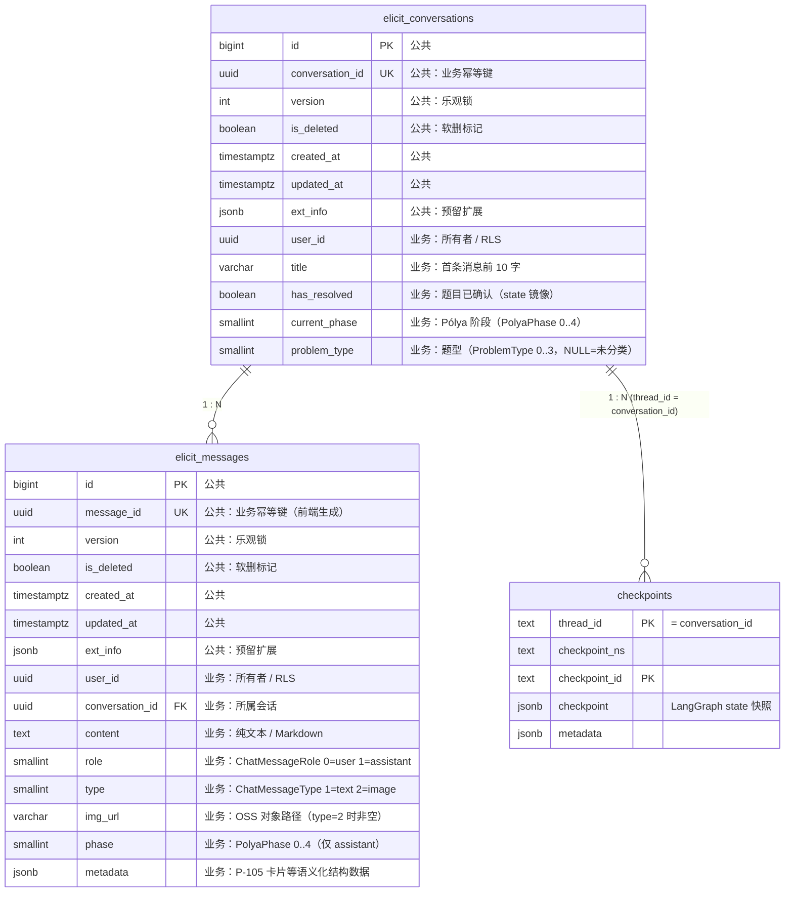

# 概要设计_v0.1_MVP — 引思助手 MVP 版本

## 0. 本文档职责边界

本文档把 `高层架构设计_v0.1_MVP.md` 的 7 子系统、8 节点拓扑、10 条 D 决策，落到 **DB 字段类型 / API 字段 / 函数签名 / Zod 类型 / RLS SQL / SSE chunk schema** 等可被详细设计直接消费的接口契约层面。

回答高层架构 §13.2 中归属"概要设计"的 **10 个开放问题**（#1, #2, #3, #4, #5, #6, #7, #10, #14, #21），并对 POC 现状中的若干小瑕疵做接口层纠偏（详见 §3.4 / §3.5 / §5.1 备注栏）。

详见 `概要设计模版.md §0`。

---

## 1. 文档元信息

| 字段 | 值 |
|---|---|
| 文档名称 | 概要设计_v0.1_MVP.md |
| 版本 | v0.1 |
| 状态 | 草稿 |
| 创建日期 | 2026-05-19 |
| 最后更新 | 2026-05-19 |
| 编写人 | Claude（开发主力）|
| 评审人 | muzi（产品负责人 + 架构方向把控）|
| **关联文档** | |
| ↑ 上游：PRD | `doc/PRD/PRD_v0.1_MVP.md` |
| ↑ 上游：需求分析 | `doc/需求分析/需求分析_v0.1_MVP.md` |
| ↑ 上游：高层架构 | `doc/高层架构/高层架构设计_v0.1_MVP.md` |
| → 下游：详细设计 | `doc/详细设计/详细设计_v0.1_MVP.md`（待产出）|

---

## 2. 设计原则与命名公约

### 2.1 沿用架构层 5 条原则

1. 可读性 > 性能
2. 就近迭代 > 完美重构
3. 显式 > 隐式
4. 拒绝早优化
5. 文档化决策（每个"非显然选择"在代码注释或本文档 §10 留痕）

### 2.2 数据层命名公约

> **沿用 `qian-quest` 项目 `代码规范.md §3.2`**（路径：`/Users/muzi/Project/qian-quest/技术/开发规范/代码规范.md`）。下方为 elicit 项目内适配版。

- **表名前缀**：业务表 `elicit_*`；LangGraph 系统表 `checkpoint*`（PostgresSaver 自管，不动）
- **DB 物理列名**：一律 `snake_case`（如 `conversation_id`、`created_at`、`has_resolved`）—— 与 Postgres / Supabase 生态对齐；DDL、迁移文件、SQL 字符串中保持原样
- **Drizzle 列定义**：TS 属性名用 `camelCase`，物理列名 SQL 字符串保持 `snake_case`，由 Drizzle 自动映射（如 `conversationId: uuid("conversation_id")`）。**Mapper / 节点 / Service 通过 Drizzle 拿到的对象已经是 camelCase**，无需再次转换
- **Supabase 自动生成 Row 类型**（`src/db/supabase/type.ts`）：snake_case，**视为"边界类型"**——只允许在 `src/db/models/*` 映射层出现；映射层负责 snake_case → camelCase 的 VO 转换；**严禁外泄到 store / hook / 组件**
- 自增主键统一为 `bigint id`；业务幂等键 `*_id`（如 `conversation_id`、`message_id`）
- 时间戳：`created_at` / `updated_at` 统一 `timestamp with time zone default now() not null`；`updated_at` 由数据库触发器维护
- **枚举**：用 `smallint` 存整形 code + check 约束（沿用 [qian-quest 代码规范 §6](file:///Users/muzi/Project/qian-quest/技术/开发规范/代码规范.md) 与 `src/types/enums/base.ts` 的 `createEnum` 范式；DB 存数字、TS 端通过命名常量 + 工厂提供 label 映射）。**不用** Postgres ENUM 类型（演化成本高、不向后兼容），**也不用** `varchar` 存字面量字符串（破坏 qian-quest 对齐）。详见 §2.4 + §10 C12
- 半结构化：`jsonb not null default '{}'`（jsonb 优于 json，原生索引 + 路径查询支持）
- 布尔状态镜像：state 权威 + DB 镜像，命名保持一致（如 DB 列 `has_resolved` ↔ Drizzle property / state / 前端 `hasResolved`）

### 2.3 API 路由公约

- **路径**：`/api/[子系统]/[资源]`，路径段 `kebab-case`（如 `/api/oss/sign-for-upload`）
- **鉴权**：所有 `/api/*` 路由必须经 `withAuth` 包裹；**当前 POC 中 `/api/oss/*` 两条未挂，本期补齐**（详见 §5.1 备注）
- **请求 / 响应字段**：一律 `camelCase`（与前端 VO 对齐，序列化为 JSON 时不做名字转换）—— 如 `conversationId`、`hasResolved`、`selectedQuestionIndex`
- **响应外壳**：非流式响应统一走 `BaseResponse<T>`（`src/types/response/BaseResponse.ts`）；流式响应走 AI SDK UI message 协议（SSE）
- **HTTP 状态码**：`200` 正常返回（业务成败由 `BaseResponse.status` 区分）；`401` 未授权；`403` 无权限；`500` 服务器错误
- **业务错误码**（`BaseResponse.status`）：`200` 成功；`-1` 通用业务失败；细化见 §5.7
- **外部系统对齐字段豁免**：与外部系统对话的字段保留原名（如 OSS POST policy 的 `x-oss-credential` / `x-oss-date` / `x-oss-security-token` 等 HTTP header 名），仅出现在 `OssService` / `OssUploadSignInfo` 这种边界类中（详见 §9.2）

### 2.4 接口层命名

> **跨层字段命名总规则**（沿用 qian-quest 代码规范 §3.2）：
>
> | 层 | 字段命名 |
> |---|---|
> | DB 物理列、SQL、DDL、迁移文件 | `snake_case` |
> | Drizzle property / Mapper 返回值 / Service 入参出参 / API DTO / Zod schema 字段 / Store / Hook / Props / 前端 VO | **`camelCase`，禁止 `snake_case`** |
> | 外部系统对齐字段（OSS form header、Supabase 自动生成 Row 类型） | 保留原名，仅出现在边界文件 |
>
> 字段名必须**见名知意**，避免无意义缩写（`ext` / `q` / `idx` 等仅允许在极短作用域 `arr.map(x => x + 1)` 中）。

**TS 标识符命名**：

| 类别 | 规范 | 示例 |
|---|---|---|
| 常量 | `UPPER_SNAKE_CASE` | `ADMIN_EMAIL_SET`、`DEFAULT_PHASE` |
| 函数 / 变量 | `camelCase` | `isAdmin`、`reconcileMirror` |
| 事件处理 | `onXxx` 或 `handleXxx` | `onPhaseChunk`、`handleTabChange` |
| 类 | `PascalCase` | `ConversationMapper`、`OssService` |
| 接口 / 类型 | `PascalCase` + 语义后缀 | 见下方后缀表 |
| **枚举命名常量对象** | `PascalCase` 单数；键 `UPPER_SNAKE_CASE` | `PolyaPhase.UNDERSTAND = 0` |
| **枚举工厂导出** | `{Name}Enum`（与命名常量配对） | `PolyaPhaseEnum.getLabel(0)` → `'弄清问题'` |
| SSE chunk `kind` 等字符串字面量 discriminator | 业务语义优先，全小写 + 下划线 | `chunk.kind: 'phase_changed'` |

**接口 / 类型后缀**：

| 后缀 | 用途 | 示例 |
|---|---|---|
| `*Schema` | Zod schema | `ElicitGraphStateSchema`、`KnowledgeCardSchema` |
| `*Request` / `*Response` | API 入参 / 出参 DTO | `ChatMessageRequest`、`ResolveConversationRequest` |
| `*Props` | 组件 Props / 前端展示对象 | `ChatMessageProps`、`ChatConversationProps` |
| `*Row` | DB 行类型 | `ElicitConversationRow`（仅 Mapper 内可见） |
| `*Mapper` | DB 映射类 | `ConversationMapper`、`MessageMapper` |
| `*Service` | 业务服务类 | `OssService` |

**枚举范式（沿用 [qian-quest 代码规范 §6](file:///Users/muzi/Project/qian-quest/技术/开发规范/代码规范.md) + `src/types/enums/base.ts` `createEnum` 工厂）**：

| 层 | 表示形态 |
|---|---|
| DB 物理列 | `smallint`（或 `int`）存整形 code；不存字符串字面量 |
| Postgres check 约束 | 数字白名单：`check (col in (0,1,2,...))`（或 `col is null or col in (...)`）|
| TS 命名常量 | `as const` 对象 `{ NAME: 0, ... }` + `type X = typeof X[keyof typeof X]` 双导出；**禁止用 TS `enum` 关键字**（无法挂载方法 + 与 qian-quest 不一致） |
| TS 工厂（label / item 查询） | `XxxEnum = createEnum([{ code, label }, ...])`，提供 `getLabel(code)` / `fromCode(code)` / `items` |
| Zod schema 字段 | `z.union([z.literal(0), z.literal(1), ...])`（强类型 + 数值字面量 union） |
| API 字段 / SSE chunk | 数字 code（与 DB 对齐）；前端展示文本走 `XxxEnum.getLabel(code)` |

**枚举文件命名 + 位置**：

- 目录：`src/types/enums/`
- 文件：`{枚举语义名}.enum.ts`（如 `polyaPhase.enum.ts`、`chatMessageRole.enum.ts`）
- 共享工厂：`src/types/enums/base.ts`（与 qian-quest `src/types/enums/base.ts` 完全一致的 `createEnum` 实现）
- 一个文件导出两个：`{Name}`（命名常量对象）+ `{Name}Enum`（工厂结果），并 `export type {Name}`

**典型枚举文件模板**：

```ts
// src/types/enums/polyaPhase.enum.ts
import { createEnum } from './base';

export const PolyaPhase = {
    UNDERSTAND: 0,  // 波利亚 ① 弄清问题
    PLAN:       1,  // 波利亚 ② 拟定方案
    EXECUTE:    2,  // 波利亚 ③ 执行方案
    REVIEW:     3,  // 波利亚 ④ 回顾
    DONE:       4,  // 已输出 P-105 卡片
} as const;

export type PolyaPhase = typeof PolyaPhase[keyof typeof PolyaPhase];

export const PolyaPhaseEnum = createEnum([
    { code: PolyaPhase.UNDERSTAND, label: '弄清问题' },
    { code: PolyaPhase.PLAN,       label: '拟定方案' },
    { code: PolyaPhase.EXECUTE,    label: '执行方案' },
    { code: PolyaPhase.REVIEW,     label: '回顾' },
    { code: PolyaPhase.DONE,       label: '已完成' },
]);
```

> **禁止**：① 用 TS `enum` 关键字；② 在组件内硬编码 `phase === 1 ? '拟定方案' : ...` 类映射；③ 在 DB 中用 `varchar` 存 `'plan'` 字面量字符串。

**项目专有惯例**：

- **节点**：`xxxNode = async (state) => {...}` + 同文件 `export const xxxNodeName = 'xxxNode'`（POC 现状惯例，保留）
- **条件路由函数**：`shouldXxx(state) => string[]` 或单值；导出名以 `should` / `route` 开头
- **Zod schema 文件**：文件名 `*Schema.ts`；导出 `*Schema` + `type *` 双导出
- **Mapper / Service**：单例模式 `export const xxxMapper = new XxxMapper()` 在模块末尾
- **客户端 store**：`use*`（Zustand 惯例）
- **`server-only` 强制边界**：`Mapper` / `Service` / `src/lib/admin-db.ts` 等只能在服务端运行的模块顶部 `import 'server-only'`（避免不慎在 client component 中引入触发 Next.js 构建错误）

---

## 3. 数据模型设计

### 3.1 表清单总览

| 表名 | 用途 | 拥有者子系统 | 写入方 | 读取方 |
|---|---|---|---|---|
| `elicit_conversations` | 会话元数据（标题 / 阶段 / 已确认题目镜像） | S6 会话生命周期 | S5 节点（Drizzle） | S2 前端（supabase-js + RLS）/ S5 节点 |
| `elicit_messages` | 对话消息（含图片 URL + 元数据 / P-105 卡片） | S6 会话生命周期 | S2 前端（supabase-js + RLS）/ S5 节点（Drizzle） | S2 前端（supabase-js + RLS）/ 家长后台 |
| `checkpoints` 等 4 表 | LangGraph 状态 checkpoint（PostgresSaver 自管） | S5 Agent 引擎 | PostgresSaver | PostgresSaver |

> 注：本期不新增表。所有新需求通过给现有两张业务表加字段实现（D5 inline JSON 决策的延续）。

### 3.2 业务表公共字段规约

> **沿用 `qian-quest` 详细设计的"公共字段"惯例**（例：`/Users/muzi/Project/qian-quest/技术/详细设计/详细设计_v0.1_NPC对话模块.md` 中 `NpcModel` 末尾的"// --- 公共字段 ---" 段）。本节定义所有 `elicit_*` 业务表的 **7 个必含公共字段**——任何业务表的 schema 都必须展开公共字段 helper，业务字段在各表自有节中加。

#### 3.2.1 必含公共字段（共 7 个）

每张 `elicit_*` 业务表都必须包含下列 7 个字段，类型 / 默认值 / 约束一致：

| 字段（DB 列） | TS property | Postgres 类型 | 约束 | 默认值 | 语义 |
|---|---|---|---|---|---|
| `id` | `id` | `bigint` | PK / `generated by default as identity` | — | 自增主键；仅运维 / 物理排序用，**不暴露到 API / 前端** |
| `{biz}_id` | `{biz}Id` | `uuid` | UNIQUE / NOT NULL | `gen_random_uuid()` | 业务幂等键；对外暴露的"逻辑主键"；命名 = `表名单数_id`（如 `conversation_id` / `message_id`） |
| `version` | `version` | `int` | NOT NULL | `0` | 数据版本号（乐观锁字段）；字段必含以备未来 UPDATE 时启用 `where version = ?` 检查；MVP 单用户场景下**字段存在但 UPDATE 不强制带 where**（详见 §10 C1） |
| `is_deleted` | `isDeleted` | `boolean` | NOT NULL | `false` | 软删标记；字段必含以备未来"撤销删除 / 家长可见删除历史"等需求；MVP 删除走硬删（具体 SELECT 是否加过滤详见 §10 C11） |
| `created_at` | `createdAt` | `timestamptz` | NOT NULL | `now()` | **DB 行创建时间审计字段**；仅 DB 内部含义，不承载业务语义；不下发前端 |
| `updated_at` | `updatedAt` | `timestamptz` | NOT NULL | `now()` | **DB 行更新时间审计字段**；由 `set_updated_at()` 触发器自动维护（详见 §3.4.3）；不下发前端 |
| `ext_info` | `extInfo` | `jsonb` | NOT NULL | `'{}'::jsonb` | **纯预留扩展字段**；用于承载"未来想加但现在不想 alter table 的杂项"；MVP 默认空对象，**不放语义化结构数据** |

> **`created_at` / `updated_at` 语义硬约束**（沿用 qian-quest 公共字段惯例）：
>
> | 维度 | 规约 |
> |---|---|
> | 含义 | **DB 时间审计字段**——仅记录"DB 行物理写入 / 更新时刻"，不承载任何业务语义 |
> | 维护 | `created_at` 由 DEFAULT `now()` 写入；`updated_at` 由 `set_updated_at()` 触发器自动维护；**业务代码绝对禁止显式 `UPDATE ... SET created_at = ...` 或 `SET updated_at = ...`** |
> | 暴露 | API / VO **绝不下发**给前端；也不作为"展示给用户的时间"使用 |
> | 排序 | 可用于 SQL 层 ORDER BY 物理排序（如消息列表按写入顺序加载），但前端不展示具体时间值 |
> | 业务时间另立 | 若业务确实需要"消息发送时间 / 会话最后活跃时间 / 删除时间"等用户感知字段，**必须新增业务字段**（如 `sent_at` / `last_active_at` / `deleted_at`），由业务代码显式维护；不复用 `created_at` / `updated_at` |
>
> **MVP 现状**：前端不展示任何会话 / 消息的具体时间数值（PRD 未要求）；侧边栏 / 消息列表的"按时间排序"仅在 SQL 层用 `created_at`，等价于"按写入顺序"，不暴露时间值。
>
> ---
>
> `ext_info` 不等于 `metadata`！区分如下：
>
> | | `ext_info`（公共字段） | `metadata`（业务字段，按需加） |
> |---|---|---|
> | 性质 | **纯预留**，不指定 schema | **语义化业务结构数据** |
> | 何时用 | 临时塞个未来要拆出的字段；运营杂项 | P-105 知识卡片 / 已知 schema 的结构化数据 |
> | Zod schema | `z.record(z.unknown())` | 在表自有节中定义具体 Schema |
> | 前端读取 | 弱类型，按需 `?.` 取 | 强类型 + 版本号 + fallback（CR-003） |
>
> MVP 仅 `elicit_messages` 有业务字段 `metadata`（承载 P-105 卡片 `metadata.knowledgeCard`）；`elicit_conversations` 暂无 `metadata`，所有扩展走 `ext_info`。

**不属于公共字段**：
- `user_id` —— 多租户隔离字段，**业务字段**；只在需要 RLS 隔离的表出现（MVP 两张表都是）；未来可能新增字典 / 配置类表无需 `user_id`
- `deleted_at` —— 仅在精确审计需要时配套 `is_deleted` 加；MVP 不加

#### 3.2.2 Drizzle 公共字段 helper

> 让所有 `elicit_*` 表共享同一份字段定义，避免每张表 copy-paste 漂移。新增 `src/db/schema/_common.ts`：

```ts
// src/db/schema/_common.ts（新增）
import { bigint, integer, boolean, timestamp, jsonb } from "drizzle-orm/pg-core";

/**
 * 业务表公共字段集——沿用 qian-quest 公共字段惯例（v0.1 7 字段）。
 * 通过对象展开复用：
 *   pgTable("elicit_xxx", { ...commonAuditFields, {biz}Id: uuid("{biz}_id")..., ...业务字段 })
 *
 * 注意：
 * - {biz}_id 因命名因表而异，各表自己声明（不进 helper）
 * - user_id 是业务字段（多租户隔离），各表按需声明（不进 helper）
 */
export const commonAuditFields = {
    id: bigint("id", { mode: "number" }).primaryKey().generatedByDefaultAsIdentity(),
    version: integer("version").notNull().default(0),
    isDeleted: boolean("is_deleted").notNull().default(false),
    createdAt: timestamp("created_at", { withTimezone: true }).defaultNow().notNull(),
    updatedAt: timestamp("updated_at", { withTimezone: true }).defaultNow().notNull(),
    extInfo: jsonb("ext_info").$type<Record<string, unknown>>().notNull().default({}),
};
```

各业务表 schema 用法：

```ts
// src/db/schema/conversation.ts（重构后示意）
export const elicitConversations = pgTable("elicit_conversations", {
    ...commonAuditFields,
    // —— 业务幂等键 ——
    conversationId: uuid("conversation_id").defaultRandom().unique().notNull(),
    // —— 多租户隔离 ——
    userId: uuid("user_id").notNull(),
    // —— 业务字段 ——
    title: varchar("title", { length: 64 }),
    hasResolved: boolean("has_resolved").notNull().default(false),
    currentPhase: smallint("current_phase").notNull().default(0), // PolyaPhase.UNDERSTAND
    problemType: smallint("problem_type"),                         // ProblemType | null
});
```

#### 3.2.3 公共字段在 API / VO 中的暴露规则

| 字段                        | API 响应      | 前端 store / VO | 备注                                         |
| ------------------------- | ----------- | ------------- | ------------------------------------------ |
| `id`（bigint）              | ❌ 不暴露       | ❌ 不暴露         | 仅运维 / DB 内部；用 `{biz}Id` 对外                 |
| `{biz}Id`（uuid）           | ✅ 必含        | ✅ 必含          | 对外的逻辑主键                                    |
| `version`                 | ❌ 不暴露       | ❌ 不暴露         | 仅服务端使用；MVP 不开启乐观锁逻辑，对外不暴露                  |
| `isDeleted`               | ❌ 不暴露       | ❌ 不暴露         | 服务端在 SELECT 时过滤（详细设计 D1 决定开关）；不需要前端感知      |
| `createdAt` / `updatedAt` | ❌ 不暴露       | ❌ 不暴露         | DB 时间审计字段；不承载业务语义，不展示给用户；如需展示时间走业务字段（如 `sentAt` / `lastActiveAt`） |
| `extInfo`                 | ❌ 默认不暴露     | ❌ 默认不暴露       | 预留字段；如某 key 上线对外，按需在 API 层显式映射（避免运营字段意外泄露） |

#### 3.2.4 MVP 阶段对公共字段的"启用程度"约定

公共字段必含 ≠ 业务逻辑必启用。MVP 阶段：

| 字段 | 字段存在 | MVP 业务逻辑 | 升级触发点 |
|---|---|---|---|
| `version` | ✅ 必含 | UPDATE **不强制**带 `where version = ?`；不抛 conflict 异常 | 多端并发写入需求（详见 §10 C1）|
| `is_deleted` | ✅ 必含 | SELECT **不加** `where is_deleted = false` 过滤（即字段恒为 false） | 妹妹"撤销删除" / 家长查看完整历史（详见 §10 C11）|
| `ext_info` | ✅ 必含 | 默认空对象；本期不放任何 key | 临时需要"加字段又不想迁移"时 |
| `created_at` / `updated_at` | ✅ 必含 | 仅作为 DB 内部审计 + SQL 层物理排序键；**前端不展示，业务代码不显式 SET**；业务时间字段另立 | PRD 增加"几点发的"类用户感知时间显示需求时——新增业务字段（如 `sent_at`）|

> 这样做的好处：① schema 一次到位，未来开启业务逻辑只改代码不动 DB；② 与 qian-quest 完全字段对齐；③ 避免后续 `alter table` 的连锁迁移（含 type.ts 重生、客户端兼容）。

### 3.3 ER 图



### 3.4 `elicit_conversations`

#### 3.4.1 字段定义

| 分类 | 字段 | 类型 | 约束 | 默认值 | 来源 / 用途 |
|---|---|---|---|---|---|
| **公共** | `id` | `bigint` | PK | identity | 公共字段 §3.2.1 |
| **公共** | `conversation_id` | `uuid` | UNIQUE / NOT NULL | `gen_random_uuid()` | 公共字段 §3.2.1；`{biz}_id` 实例化 |
| **公共** | `version` | `int` | NOT NULL | `0` | 公共字段 §3.2.1 |
| **公共** | `is_deleted` | `boolean` | NOT NULL | `false` | 公共字段 §3.2.1 |
| **公共** | `created_at` | `timestamptz` | NOT NULL | `now()` | 公共字段 §3.2.1 |
| **公共** | `updated_at` | `timestamptz` | NOT NULL | `now()` | 公共字段 §3.2.1；触发器维护 |
| **公共** | `ext_info` | `jsonb` | NOT NULL | `'{}'::jsonb` | 公共字段 §3.2.1；MVP 不放任何 key（预留） |
| 业务 | `user_id` | `uuid` | NOT NULL | `auth.uid()` | 多租户隔离 + RLS 过滤依据 |
| 业务 | `title` | `varchar(64)` | — | NULL | 首条用户消息前 10 字（POC 现状）；本期收紧类型上限到 64 |
| 业务 | `has_resolved` | **新增** `boolean` | NOT NULL | `false` | state.hasResolved 的 DB 镜像（FR-CONV-002 换图浮层判定的数据源；详见 §10 C1 / C9）|
| 业务 | `current_phase` | **新增** `smallint` | NOT NULL / check ∈ {0,1,2,3,4} | `0`（UNDERSTAND） | state.currentPhase 的 DB 镜像；编码见 `PolyaPhase`（0=UNDERSTAND / 1=PLAN / 2=EXECUTE / 3=REVIEW / 4=DONE） |
| 业务 | `problem_type` | **新增** `smallint` | NULL（**不加** DB check，仅 TS Zod / `ProblemTypeEnum` 守门；见 §10 C13） | NULL | state.problemType 的 DB 镜像；编码见 `ProblemType`（0=ALGEBRA / 1=GEOMETRY / 2=FUNCTION / 3=OTHER）；NULL 表示 ClassifyNode 尚未跑过 |

> 公共字段 `version` / `is_deleted` MVP 业务逻辑未启用（详见 §3.2.4 + §10 C11）。

#### 3.4.2 索引

| 索引名 | 字段 | 类型 | 用途 |
|---|---|---|---|
| `elicit_conversations_pkey` | `id` | PK / btree | 现状 |
| `elicit_conversations_conversation_id_key` | `conversation_id` | UNIQUE / btree | 现状 |
| `elicit_conversations_user_id_idx` **新增** | `(user_id, created_at desc)` | btree | 侧边栏会话列表按 DB 物理写入顺序倒序分页（等价于"按创建顺序"，但不展示具体时间值）；未来如需"按最后活跃"排序需新增业务字段 `last_active_at` |

#### 3.4.3 约束 / 触发器

```sql
-- 阶段枚举约束（PolyaPhase 是方法论级稳定枚举，DB 层加 check 做防御纵深；见 §10 C13）
alter table public.elicit_conversations
  add constraint elicit_conversations_current_phase_check
  check (current_phase in (0,1,2,3,4));  -- PolyaPhase 0/1/2/3/4 = understand/plan/execute/review/done

-- 题型枚举不加 DB check（最可能演化扩展，避免每加一个题型都要 alter table；仅 TS Zod / ProblemTypeEnum 守门；见 §10 C13）

-- updated_at 自动维护触发器（新增）
create or replace function public.set_updated_at()
returns trigger as $$
begin
  new.updated_at := now();
  return new;
end;
$$ language plpgsql;

create trigger elicit_conversations_set_updated_at
  before update on public.elicit_conversations
  for each row execute function public.set_updated_at();
```

#### 3.4.4 RLS 策略

```sql
-- 沿用现状（4 条），无变化：
-- conversations_select_own / insert_own / update_own / delete_own
-- 所有 policy 形如：(user_id = auth.uid())
```

> `/admin` 跨用户读策略**不放在本表**，而是在服务端 `/api/admin/*` 路由用 service_role client 绕过 RLS（详见 §10 C8）。

#### 3.4.5 与现状差异

| 字段 / 索引 | 现状 | 目标 | 迁移操作 |
|---|---|---|---|
| `version` | 不存在 | NOT NULL int default 0 | `alter table add column ... default 0 not null`（公共字段 §3.2.1）|
| `is_deleted` | 不存在 | NOT NULL boolean default false | `alter table add column ... default false not null`（公共字段 §3.2.1）|
| `ext_info` | 不存在 | NOT NULL jsonb default '{}' | `alter table add column ... default '{}' not null`（公共字段 §3.2.1）|
| `has_resolved` | 不存在 | NOT NULL default false | `alter table add column ... default false not null` |
| `current_phase` | 不存在 | NOT NULL smallint default 0 + check ∈ {0..4} | `alter table add column ... default 0 not null + add constraint` |
| `problem_type` | 不存在 | NULL smallint（**无 DB check**，TS Zod 守门） | `alter table add column ...`（不加 constraint；见 §10 C13） |
| `updated_at` 触发器 | 不存在 | 新增 | `create function + trigger` |
| `(user_id, created_at desc)` 索引 | 不存在 | 新增 | `create index` |
| `title` 类型 | `varchar`（无上限） | `varchar(64)` | `alter table alter column type` |

> Drizzle schema 在 `src/db/schema/conversation.ts` 同步增列；本表为 Drizzle 管辖，通过 `pnpm supabase:diff` 生成迁移。

### 3.5 `elicit_messages`

#### 3.5.1 字段定义

| 分类 | 字段 | 类型 | 约束 | 默认值 | 来源 / 用途 |
|---|---|---|---|---|---|
| **公共** | `id` | `bigint` | PK | identity | 公共字段 §3.2.1 |
| **公共** | `message_id` | `uuid` | UNIQUE（与 conv_id 联合） / NOT NULL | `gen_random_uuid()` | 公共字段 §3.2.1；前端生成；幂等键 |
| **公共** | `version` | `int` | NOT NULL | `0` | 公共字段 §3.2.1 |
| **公共** | `is_deleted` | `boolean` | NOT NULL | `false` | 公共字段 §3.2.1 |
| **公共** | `created_at` | `timestamptz` | NOT NULL | `now()` | 公共字段 §3.2.1 |
| **公共** | `updated_at` | `timestamptz` | NOT NULL | `now()` | 公共字段 §3.2.1；触发器维护 |
| **公共** | `ext_info` | `jsonb` | NOT NULL | `'{}'::jsonb` | 公共字段 §3.2.1；MVP 不放任何 key（预留） |
| 业务 | `user_id` | `uuid` | NOT NULL（**收紧自现状的 NULL allowed**） | `auth.uid()` | 多租户隔离 + RLS 过滤依据 |
| 业务 | `conversation_id` | `uuid` | NOT NULL / FK → `elicit_conversations.conversation_id` | **(修正：移除现有的 `default gen_random_uuid()`)** | 所属会话 |
| 业务 | `content` | `text` | NOT NULL | — | 纯文本 / Markdown 内容 |
| 业务 | `role` | `smallint`（**改自现状 varchar**） | NOT NULL / check ∈ {0,1} | — | 编码见 `ChatMessageRole`（0=USER / 1=ASSISTANT）；POC 现状用 varchar `'user'`/`'assistant'` 是漂移，本期纠正 |
| 业务 | `type` | `smallint` | NOT NULL / check ∈ {1,2} | — | 1=text、2=image（沿用 `ChatMessageTypeEnum`） |
| 业务 | `img_url` | `varchar(512)` | NULL | NULL | OSS 对象路径；`type=2` 时必填（本期不加 check，前端约束）|
| 业务 | `phase` | **新增** `smallint` | NULL / check ∈ {0,1,2,3,4} | NULL | 编码同 `current_phase`（`PolyaPhase`）；仅 assistant 消息填；用户消息为 NULL |
| 业务 | `metadata` | **新增** `jsonb` | NOT NULL | `'{}'::jsonb` | **语义化业务结构数据**；MVP 已知 key：`knowledgeCard`（P-105，详见 §4.2）；与公共字段 `ext_info` 区别详见 §3.2.1 注 |

#### 3.5.2 索引

| 索引名 | 字段 | 类型 | 用途 |
|---|---|---|---|
| `elicit_messages_pkey` | `id` | PK | 现状 |
| `elicit_messages_conversation_id_idx` **新增** | `(conversation_id, created_at asc)` | btree | 历史消息按 DB 物理写入顺序加载（等价于"按发送顺序"）；未来如需展示"几点发的"需新增业务字段 `sent_at` |
| `elicit_messages_message_id_unique` **新增** | `(conversation_id, message_id)` | UNIQUE | **修正现状重复消息漏洞**（POC 客户端在流式回调中调 `insertChatMessageRequest` 多次，无幂等保护） |

#### 3.5.3 约束 / 触发器

```sql
-- role / type / phase 枚举约束（新增）—— 三者都属"稳定枚举"，DB 加 check 做防御纵深；见 §10 C13
--   · role：业务分发依赖（if role === USER ...），脏数据走错分支后果严重
--   · type：text/image 已稳定，无演化预期
--   · phase：PolyaPhase 是方法论级不变量
alter table public.elicit_messages
  add constraint elicit_messages_role_check check (role in (0,1)),  -- ChatMessageRole 0/1 = user/assistant
  add constraint elicit_messages_type_check check (type in (1,2)),
  add constraint elicit_messages_phase_check
    check (phase is null or phase in (0,1,2,3,4));  -- PolyaPhase 同上

-- 修正：移除 conversation_id 的错误默认值
alter table public.elicit_messages
  alter column conversation_id drop default;

-- updated_at 触发器（复用 §3.4.3 的函数）
create trigger elicit_messages_set_updated_at
  before update on public.elicit_messages
  for each row execute function public.set_updated_at();

-- 收紧 user_id：从 nullable 改为 not null
alter table public.elicit_messages
  alter column user_id set not null;
```

#### 3.5.4 RLS 策略

```sql
-- 沿用现状（4 条），无变化：
-- elicit_messages_select_own / insert_own / update_own / delete_own
-- 形如：(user_id = auth.uid())
```

#### 3.5.5 与现状差异

| 字段 / 索引 | 现状 | 目标 | 迁移操作 |
|---|---|---|---|
| `version` | 不存在 | NOT NULL int default 0 | `alter table add column ... default 0 not null`（公共字段 §3.2.1）|
| `is_deleted` | 不存在 | NOT NULL boolean default false | `alter table add column ... default false not null`（公共字段 §3.2.1）|
| `ext_info` | 不存在 | NOT NULL jsonb default '{}' | `alter table add column ... default '{}' not null`（公共字段 §3.2.1）|
| `conversation_id` | `default gen_random_uuid()` | 无默认 | `alter column drop default`（**bug 修复**） |
| `user_id` | nullable + `default auth.uid()` | not null + `default auth.uid()` | `alter column set not null` |
| `role` 类型 | `varchar` 存 `'user'`/`'assistant'` | `smallint` 存 0/1 | **breaking change**：`alter column type smallint using case when role='user' then 0 when role='assistant' then 1 end` + `add constraint` |
| `type` 枚举 check | 不存在 | check ∈ {1,2} | `add constraint`（已是 smallint，仅加 check） |
| `phase` | 不存在 | nullable smallint + check ∈ {0..4} | `add column + constraint` |
| `metadata`（业务字段，承载 P-105）| 不存在 | NOT NULL jsonb default '{}' | `add column ... default '{}' not null` |
| `(conversation_id, message_id)` UNIQUE | 不存在 | UNIQUE | `create unique index`（**幂等保护**） |
| `(conversation_id, created_at)` 索引 | 不存在 | btree | `create index` |
| `img_url` | `varchar`（无上限） | `varchar(512)` | `alter column type` |
| `updated_at` 触发器 | 不存在 | 新增 | 复用函数 |

> 本表为**手写迁移**（不走 Drizzle diff，因 Drizzle schema 中无 `elicit_messages` 定义）。新增一份迁移 `supabase/migrations/[timestamp]_elicit_messages_v01_mvp_schema.sql`。

### 3.6 LangGraph 系统表（4 张）

| 表 | 维护方 | 本期约束 |
|---|---|---|
| `checkpoints` | PostgresSaver | 不动；`thread_id` 永远等于 `conversation_id` |
| `checkpoint_blobs` | PostgresSaver | 不动 |
| `checkpoint_writes` | PostgresSaver | 不动 |
| `checkpoint_migrations` | PostgresSaver | 不动 |

> 全新数据库部署时必须先手工调一次 `await checkpointer.setup()`（POC 现状已注释在 `ChatGraph.ts:16`）。本期不在代码里恢复该调用，改为**写进部署 Runbook**（详细设计交付），原因：避免每次启动重复 setup 的副作用，且生产环境表已存在。

### 3.7 RLS 策略汇总

| 表 | SELECT | INSERT | UPDATE | DELETE | `/admin` 跨用户读 |
|---|---|---|---|---|---|
| `elicit_conversations` | `user_id = auth.uid()` | 同 | 同 | 同 | 不走 RLS；服务端 `/api/admin/*` 用 service_role |
| `elicit_messages` | `user_id = auth.uid()` | 同 | 同 | 同 | 同上 |
| `checkpoint*` | grant 全开（沿用现状）| 同 | 同 | 同 | 不暴露给前端 |

### 3.8 迁移与回滚

| 改动 | 文件 / 命令 | 回滚方式 |
|---|---|---|
| 新增 `commonAuditFields` helper | 新增 `src/db/schema/_common.ts`（详见 §3.2.2） | 删除文件，各表 schema 内联展开字段 |
| `elicit_conversations` schema 重构（用 helper）+ 业务字段增列 + 公共 3 字段（`version` / `is_deleted` / `ext_info`） | 改 `src/db/schema/conversation.ts` → `pnpm supabase:diff` → 自动生成迁移 | `alter table drop column ...` |
| `elicit_messages` 增列 + 约束 + 唯一索引 + 公共 3 字段（`version` / `is_deleted` / `ext_info`） | 手写 `supabase/migrations/[ts]_elicit_messages_v01_mvp_schema.sql`（**不走 Drizzle diff**，因该表无 Drizzle schema） | 同上 |
| 类型生成 | 任一 schema 改后 `pnpm supabase:type` 重生 `src/db/supabase/type.ts` | git checkout 该文件 |
| 触发器函数 `set_updated_at` | 放在 `elicit_conversations` 这次迁移头部；**两张业务表共用同一个 function** | `drop function public.set_updated_at() cascade` |

---

## 4. LangGraph State Schema 设计

### 4.1 ElicitGraphStateSchema 完整定义（新版）

> 现状见 `src/agents/schemas/ElicitGraphStateSchema.ts:8-18`（6 字段）。本期新增 5 字段：`currentPhase` / `problemType` / `stuckCountPerPhase` / `probedQuestionIds` / `lastDeviationAt`。

```ts
// src/agents/schemas/ElicitGraphStateSchema.ts（目标版）
import { z } from "zod";
import { BaseMessage } from "@langchain/core/messages";
import { MessagesZodMeta } from "@langchain/langgraph";
import { registry } from "@langchain/langgraph/zod";
import { OcrSchema } from "@/agents/schemas/OcrSchema";
import { PolyaPhase } from "@/types/enums/polyaPhase.enum";
import { ProblemType } from "@/types/enums/problemType.enum";

// PolyaPhase 数值字面量 union（与 DB smallint 对齐；详见 §2.4 枚举范式 + §10 C12）
export const PolyaPhaseSchema = z.union([
    z.literal(PolyaPhase.UNDERSTAND), // 0 — 波利亚 ① 弄清问题
    z.literal(PolyaPhase.PLAN),       // 1 — 波利亚 ② 拟定方案
    z.literal(PolyaPhase.EXECUTE),    // 2 — 波利亚 ③ 执行方案
    z.literal(PolyaPhase.REVIEW),     // 3 — 波利亚 ④ 回顾
    z.literal(PolyaPhase.DONE),       // 4 — 已输出 P-105 卡片，会话进入终态
]);

// 、 数值字面量 union
export const ProblemTypeSchema = z.union([
    z.literal(ProblemType.ALGEBRA),   // 0 — 代数
    z.literal(ProblemType.GEOMETRY),  // 1 — 几何
    z.literal(ProblemType.FUNCTION),  // 2 — 函数
    z.literal(ProblemType.OTHER),     // 3 — 兜底
]);

// stuckCount 用 PolyaPhase code 做 key 不易读；保留对象语义化 key（state 内部数据，不入 DB）
const StuckCountSchema = z.object({
    understand: z.number().int().min(0).default(0),
    plan:       z.number().int().min(0).default(0),
    execute:    z.number().int().min(0).default(0),
    review:     z.number().int().min(0).default(0),
});

export const ElicitGraphStateSchema = z.object({
    // —— 沿用 POC 字段 ——
    messages: z.array(z.custom<BaseMessage>()).register(registry, {
        ...MessagesZodMeta,
        default: () => [],
    }),
    userId:         z.string().uuid(),
    conversationId: z.string().uuid(),
    questionImgUrl: z.string().url().optional(),
    hasResolved:    z.boolean().default(false),
    ocrResult:      OcrSchema.optional(), // 现状 OcrSchema 为非 optional 是 POC bug；首轮无图时必须可空

    // —— 本期新增 5 字段 ——
    currentPhase:        PolyaPhaseSchema.default(PolyaPhase.UNDERSTAND), // 0
    problemType:         ProblemTypeSchema.optional(),                    // ClassifyNode 跑过后才有值
    stuckCountPerPhase:  StuckCountSchema.default(() => ({
        understand: 0, plan: 0, execute: 0, review: 0,
    })),
    probedQuestionIds:   z.array(z.number().int().min(1).max(5)).default(() => []),
    lastDeviationAt:     z.number().int().nullable().default(null),       // 上一次拉回偏离的轮次（messages 长度）
});

export type ElicitGraphState = z.infer<typeof ElicitGraphStateSchema>;
```

> **现状 bug 顺手修**：`ocrResult: OcrSchema`（无 `.optional()`）会导致首轮无图请求构造 state 时 Zod 校验失败。本期改为 `.optional()`，并在 VisionNode 内部以 discriminatedUnion 处理。

### 4.2 P-105 卡片 inline JSON Schema

> D5 已定"assistant message 内嵌"。概要阶段细化为 **`content` 写人类可读 Markdown + `metadata.knowledgeCard` 镜像结构化 JSON**——文本流式不被破坏，前端可选择高亮卡片渲染。详见 §10 C4。

```ts
// src/agents/schemas/KnowledgeCardSchema.ts（新增）
import { z } from "zod";

const KnowledgePointSchema = z.object({
    name:        z.string().min(1).max(40),                // 例："一元二次方程根的判别式"
    textbookRef: z.string().max(40).optional(),            // 例："北师大 九上 §2.3"
});

// MethodCategory 枚举（新增 src/types/enums/methodCategory.enum.ts；详见 §2.4 / §10 C12）
// 0=代数变形 / 1=几何辅助线 / 2=函数性质 / 3=统计分析 / 4=其他
import { MethodCategory } from "@/types/enums/methodCategory.enum";
const MethodSchema = z.object({
    name:     z.string().min(1).max(40),                       // 例："配方法"
    category: z.union([
        z.literal(MethodCategory.ALGEBRAIC),    // 0 代数变形
        z.literal(MethodCategory.GEOMETRIC),    // 1 几何辅助线
        z.literal(MethodCategory.FUNCTIONAL),   // 2 函数性质
        z.literal(MethodCategory.STATISTICAL),  // 3 统计分析
        z.literal(MethodCategory.OTHER),        // 4 其他
    ]),
});

export const KnowledgeCardSchema = z.object({
    schemaVersion: z.literal(1),                           // ⚠️ 卡片 schema 协议版本（非 DB 行 `version` 列；演化时递增）
    type:          z.literal("knowledge_card"),            // metadata 内分辨器
    knowledgePoints: z.array(KnowledgePointSchema).min(1).max(3),
    methods:         z.array(MethodSchema).min(1).max(2),
    insight:         z.string().min(1).max(150),           // 一句话思路回顾
});

export type KnowledgeCard = z.infer<typeof KnowledgeCardSchema>;

// elicit_messages.metadata 的完整 Zod（MVP 仅含 knowledgeCard 一个 key）
export const MessageMetadataSchema = z.object({
    knowledgeCard: KnowledgeCardSchema.optional(),
}).default({});
```

### 4.3 State 字段读写矩阵

| 字段 | startFanout | Conversation | Vision | Classify | Understand | Plan | Execute | Review | 前端 |
|---|---|---|---|---|---|---|---|---|---|
| `messages` | R | R | R | R | RW | RW | RW | RW | R |
| `userId` | R | R | R | R | R | R | R | R | — |
| `conversationId` | R | W（首次）| R | R | R | R | R | R | R |
| `questionImgUrl` | R | — | R | — | — | — | — | — | W（前端上传后传入） |
| `hasResolved` | R | — | W | W | R | R | R | R | R（经 DB 镜像）|
| `ocrResult` | — | — | W | R | R | R | R | R | R（经 DB 镜像）|
| `currentPhase` | R | — | — | W | W | W | W | W | R（经 DB 镜像 + SSE 推送）|
| `problemType` | — | — | — | W | R | R | R | R | R（经 DB 镜像）|
| `stuckCountPerPhase` | — | — | — | — | RW | RW | RW | RW | — |
| `probedQuestionIds` | — | — | — | — | RW | RW | RW | — | — |
| `lastDeviationAt` | — | — | — | — | RW | RW | RW | RW | — |

> R = 读，W = 写，RW = 读+写。"经 DB 镜像"指前端通过 `elicit_conversations` 列读到（详见 §10 C9）。

---

## 5. API 契约

### 5.1 路由清单总览

| 路径 | 方法 | 鉴权 | 流式 | 用途 | 备注 |
|---|---|---|---|---|---|
| `/api/chat/[conversationId]` | POST | `withAuth` ✅ | SSE | 对话流式响应 | 沿用现状 |
| `/api/oss/sign-for-upload/[conversationId]` | GET | `withAuth` ⚠️**待补** | 否 | 申请 OSS POST policy | POC 未挂；本期挂上 |
| `/api/oss/sign-for-preview` | POST | `withAuth` ⚠️**待补** | 否 | 预览签名 URL | POC 未挂；本期挂上 |
| `/api/conversation/[conversationId]/resolve` | POST | `withAuth` ✅ | 否 | **新增**：标记会话已确认题目（FR-CONV-002 显式入口） | 详见 §5.4 |
| `/api/admin/conversations` | GET | `withAdminAuth` ✅ | 否 | **新增**：跨用户会话列表（家长后台 FR-ADMIN-002） | 详见 §5.6 |
| `/api/admin/conversations/[id]/messages` | GET | `withAdminAuth` ✅ | 否 | **新增**：跨用户消息列表 | 详见 §5.6 |

> **不新增 `POST /api/conversation/new`**（架构 §13.2 #6）。决策详见 §10 C7：MVP 沿用流式内 `conversationNode` 隐式建会话 + `data-custom` chunk 回传，无需独立路由。

### 5.2 POST /api/chat/[conversationId]

- **路径参数**：`conversationId: uuid`（前端在新会话时由 `setTempConversationId` 生成）
- **鉴权**：`withAuth`（Bearer Supabase JWT）
- **请求体**：

```ts
// src/types/request/ChatMessageRequest.ts（沿用，本期不动）
class ChatMessageRequest {
    role: ChatMessageRoleEnum;   // 'user' | 'assistant'
    message: string;             // 用户文本内容
    imgUrl?: string;             // 题目图片 OSS 对象路径（仅 type=2 时填）
}
```

- **响应**：`text/event-stream`（AI SDK UI message 协议，由 `createUIMessageStreamResponse + toUIMessageStream` 包出）
- **副作用**：
  - LangGraph 以 `thread_id = conversationId` 跑 `compiledElicitGraph.stream(...)`
  - 首轮会触发 `conversationNode` 建表行
  - 节点内 `getWriter()` 推送 `data-custom` chunk（schema 详见 §9.1）
  - PostgresSaver 在节点退出时落 checkpoint

### 5.3 GET /api/oss/sign-for-upload/[conversationId]

- **路径参数**：`conversationId: uuid`
- **鉴权**：`withAuth`（**本期补挂**，纠正 POC 漏洞）
- **响应体**：

```ts
BaseResponse<OssUploadSignInfo>
// OssUploadSignInfo 沿用现状（src/types/response/OssUploadSignInfo.ts）：
// {host, policy, xOssSignatureVersion, xOssCredential, xOssDate, signature, dir, securityToken}
```

### 5.4 POST /api/conversation/[conversationId]/resolve（新增）

> FR-CONV-002 的显式触发入口：用户在 P-103 浮层点击"确认这就是要做的题"时，前端调用此接口把 `has_resolved` 推到 true。承担"题目已确认"状态推进的唯一可信来源。

- **路径参数**：`conversationId: uuid`
- **鉴权**：`withAuth`
- **请求体**：

```ts
type ResolveConversationRequest = {
    // 多题场景下，用户选了哪一道；单题场景可省略
    selectedQuestionIndex?: number;
};
```

- **响应体**：

```ts
BaseResponse<{
    conversationId: string;
    hasResolved: true;
    currentPhase: 'understand';
}>
```

- **副作用**：
  1. Drizzle 事务：`update elicit_conversations set has_resolved = true, current_phase = 'understand' where conversation_id = ?`
  2. 触发一次 `compiledElicitGraph.invoke(...)`（**非流式**），让 ClassifyNode 跑出 `problemType` 并写镜像
  3. 返回最终镜像值给前端

### 5.5 客户端直读 DB 的契约

> POC 现状：前端通过 `supabase-js + RLS` 直接读写 `elicit_conversations` / `elicit_messages`。本期形式化以下契约：

| 表 | 客户端操作 | 受 RLS 保护 | 写入字段约束 |
|---|---|---|---|
| `elicit_conversations` | SELECT 列表（侧边栏） | ✅ | 仅服务端写；客户端**不写** |
| `elicit_messages` | SELECT by `conversation_id` | ✅ | 客户端写 user 消息（`insertChatMessageRequest`）；服务端写 assistant 消息 |

**客户端写 user 消息字段约束**（`src/db/models/ChatMessage.ts:7-15`）：

| 字段 | 客户端必填 | 备注 |
|---|---|---|
| `message_id` | ✅ | 前端 `generateId()` UUID |
| `conversation_id` | ✅ | — |
| `role` | ✅ | 固定 `ChatMessageRole.USER`（= `0`） |
| `content` | ✅ | — |
| `type` | ✅ | 1 或 2 |
| `img_url` | type=2 时必填 | — |
| `user_id` | ⛔ 不传 | 由 DB `default auth.uid()` + RLS `with check` 兜底 |
| `phase` / `metadata` | ⛔ 不传 | 用户消息无此语义 |

> 服务端写 assistant 消息走 Drizzle（**新增 MessageMapper**，详见 §7.2），可填 `phase` 和 `metadata.knowledgeCard`。

### 5.6 家长后台 API（新增）

- `GET /api/admin/conversations?limit=50&offset=0&user_id=<uuid>`：分页列出会话；`user_id` 缺省返回所有用户合并列表（按 created_at desc 排序）
- `GET /api/admin/conversations/[id]/messages`：返回该会话全部消息

**实现策略**：服务端用 **service_role client**（绕过 RLS）；路由用 `withAdminAuth` 包裹。详见 §6.2 / §10 C8。

- **请求**：仅 query 参数
- **响应体**：

```ts
BaseResponse<{
    items: Array<{
        conversationId: string;
        userId: string;
        userEmail: string;          // join auth.users.email
        title: string | null;
        hasResolved: boolean;
        currentPhase: PolyaPhase;
        problemType: ProblemType | null;
        // ⚠️ 不下发 createdAt / updatedAt（公共字段规约 §3.2.1）；
        //    服务端按 DB created_at desc 排序，前端信任顺序；
        //    家长后台若需要展示"创建时间"，详细设计阶段加业务字段如 lastActiveAt
    }>;
    total: number;
}>
```

### 5.7 统一错误响应体与错误码表

```ts
// src/types/response/BaseResponse.ts（沿用，本期不动）
class BaseResponse<T> {
    status: number;
    message: string;
    data: T;
}
```

| 业务 status | HTTP | 含义 | 触发场景 |
|---|---|---|---|
| `200` | 200 | 成功 | 正常返回 |
| `-1` | 200 | 通用业务失败 | OSS 签发失败 / 数据库错误（前端弹通用提示） |
| —  | 401 | 未授权 | `withAuth` 未通过（无 token / token 过期） |
| —  | 403 | 无权限 | `withAdminAuth` 中 `isAdmin(user)` 为 false |
| —  | 500 | 服务器错误 | `withAuth` catch 兜底；详细堆栈写日志不下发（NFR-UX-001）|

> **不细化更多业务 status code**（如 `-1001` 不是合法 conversation_id 等）。原则 #4：MVP 单用户场景，统一 `-1 + message` 文案已经够用，前端不基于 code 做分支。

---

## 6. 鉴权与权限扩展

### 6.1 withAuth context 形态（沿用现状）

```ts
// src/lib/auth.ts（沿用现状）
type AuthenticatedHandler = (
    req: NextRequest,
    context: { params: unknown; user: User }
) => Promise<Response>;

export function withAuth(handler: AuthenticatedHandler): RouteHandler;
```

- 错误：无 token → `401 {error: '未授权'}`；JWT 校验失败 → `401 {error: '身份校验失败'}`；其它异常 → `500 {error: '服务器错误'}`
- **本期补充**：把 `/api/oss/*` 两条路由用 `withAuth` 包一层（POC 漏洞修复）

### 6.2 isAdmin 与 withAdminAuth（新增）

```ts
// src/lib/auth.ts（新增导出）
import type { User } from '@supabase/supabase-js';

// 模块加载时一次性解析 ENV，避免每次请求 split
const ADMIN_EMAIL_SET: Set<string> = new Set(
    (process.env.ADMIN_EMAILS ?? '')
        .split(',')
        .map(s => s.trim().toLowerCase())
        .filter(Boolean)
);

// 启动日志（详细设计补 console.log；此处仅约定时机）
// console.log('[auth] Loaded admins:', [...ADMIN_EMAIL_SET]);

export function isAdmin(user: User): boolean {
    return user.email != null && ADMIN_EMAIL_SET.has(user.email.toLowerCase());
}

export function withAdminAuth(handler: AuthenticatedHandler) {
    return withAuth(async (req, ctx) => {
        if (!isAdmin(ctx.user)) {
            return NextResponse.json({ error: '需要管理员权限' }, { status: 403 });
        }
        return handler(req, ctx);
    });
}
```

- ENV 载入**仅在模块加载时一次**；新增 admin 必须重启进程（AR-003，可接受）
- email 比较统一小写化（防止 `Lxinlucas@gmail.com` vs `lxinlucas@gmail.com` 漏判）

### 6.3 RLS 与服务端鉴权的职责分工

| 攻击场景 | 由谁拦 |
|---|---|
| 未登录访问任何 API | `withAuth`（401） |
| 已登录访问 `/api/admin/*` 但非家长 | `withAdminAuth` → `isAdmin`（403） |
| 已登录但构造别人的 `conversation_id` 直接 supabase-js 查询 | **Postgres RLS**（返回空集 / `42501 permission denied`）|
| 已登录但构造别人的 `conversation_id` 调 `/api/chat/[id]` | LangGraph 节点内 `state.userId !== conversation.user_id` 时拒绝（详细设计 D1 实现；本期由 `withAuth` + RLS 双兜底）|
| 服务端 `/api/admin/*` 跨用户读 | **service_role client** 绕过 RLS；权限由 `withAdminAuth` 保证 |

---

## 7. 子系统模块内部接口

### 7.1 S5 Agent 引擎：节点函数签名

```ts
// 拓扑层（src/agents/graphs/ChatGraph.ts）
export const compiledElicitGraph: CompiledStateGraph<ElicitGraphState>;

// 节点（src/agents/nodes/*.ts）—— 每个节点导出 (函数, 节点名) 二元组
export const startFanoutNode:    (state: ElicitGraphState) => Promise<string[]>;
export const startFanoutNodeName: 'startFanoutNode';

export const conversationNode:    (state: ElicitGraphState) => Promise<Partial<ElicitGraphState>>;
export const conversationNodeName: 'conversationNode';

export const visionNode:    (state: ElicitGraphState) => Promise<Partial<ElicitGraphState>>;
export const visionNodeName: 'visionNode';

export const classifyNode:    (state: ElicitGraphState) => Promise<Partial<ElicitGraphState>>;
export const classifyNodeName: 'classifyNode';

export const understandNode:    (state: ElicitGraphState) => Promise<Partial<ElicitGraphState>>;
export const understandNodeName: 'understandNode';
// plan / execute / review 同形

// 条件边路由函数
export const shouldCreateConversation: (state: ElicitGraphState) => Promise<string[]>;
export const shouldOcr:                (state: ElicitGraphState) => string[];
export const phaseRouter:              (state: ElicitGraphState) => string; // 历史会话恢复入口
```

- **守卫 pre-check** 不作为节点导出，作为节点入口的**函数调用**（详见 §10 与架构 §6.4）。函数签名：

```ts
// src/agents/guards/*.ts（新增目录）
export const stuckGuard:       (state, phase) => StuckAction | null;
export const deviationGuard:   (state) => DeviationAction | null;
export const outOfScopeGuard:  (state) => boolean; // true 即应跳到 END
export const visionFailureGuard: (state) => boolean;

// 各 Action 的结构由详细设计定义（含话术 / 是否推进阶段 / 是否计数）
```

### 7.2 S6 ConversationMapper（含双写边界）

```ts
// src/db/mappers/ConversationMapper.ts（扩展现状）
class ConversationMapper {
    // 沿用
    async create(conversationId: string, userId: string, title: string): Promise<ElicitConversationRow>;
    async findById(conversationId: string): Promise<ElicitConversationRow | undefined>;

    // 新增：状态镜像更新（仅服务端节点调用）
    async updatePhaseAndType(
        conversationId: string,
        patch: { currentPhase?: PolyaPhase; problemType?: ProblemType; hasResolved?: boolean }
    ): Promise<void>;

    // 新增：state 主 / DB 镜像双向 reconcile（兜底）
    // 在 chatNode 入口调用一次；若 DB 镜像落后于 state，补一次 UPDATE。
    async reconcileMirror(
        conversationId: string,
        state: Pick<ElicitGraphState, 'hasResolved' | 'currentPhase' | 'problemType'>
    ): Promise<void>;
}

// 新增：MessageMapper（服务端写 assistant 消息 + metadata）
class MessageMapper {
    async insertAssistant(
        conversationId: string,
        messageId: string,
        userId: string,
        content: string,
        phase: PolyaPhase,
        metadata?: MessageMetadata
    ): Promise<void>;
}
```

- **事务边界**：所有需要"state 推进 + DB 镜像更新"成对发生的场景，统一由调用方（节点函数）显式用 `db.transaction(async (tx) => { ... })` 包裹（详见 §10 C9）。`updatePhaseAndType` 接受 `tx` 可选参数（实现层细节，签名略）。

### 7.3 S3 OssService（沿用现状）

```ts
// src/services/OssService.ts（不动）
class OssService {
    getUploadSignInfo(conversationId: string): Promise<OssUploadSignInfo>;
    getSignedUrl(fileNameOrUrl: string): Promise<string>;
}
export const ossService: OssService;
```

### 7.4 S4 VisionNode I/O 契约（不含 prompt）

- **输入**：`state.questionImgUrl`（必需）+ `state.messages` 末位用户文本（可选辅助说明）
- **输出**：`{ocrResult: OcrSchema, hasResolved?: boolean, questionImgUrl?: undefined}`
  - `ocrResult.isSolvable === true`：抽取 `sanitizedContent.{topic, latexFull, givenConditions, implicitConditions, goal}` + `milestones`
  - `ocrResult.isSolvable === false`：`errorReason` 填入提示话术依据（详细设计转化）
  - 单题 + 可解 → 同时把 `hasResolved` 推到 true（避免再次进入 VisionNode）
- **失败模式**：模型调用异常 / 返回不符合 schema → 由 `visionFailureGuard` 在下一节点入口拦截（详细设计 D2）

### 7.5 S2 前端关键 store / hook 签名

```ts
// src/stores/useConversation.ts（扩展现状）
type ConversationStore = {
    // 沿用
    chatMessages: ChatMessageProps[];
    chatConversation: ChatConversationProps[];
    currentConversationId: string;
    tempConversationId: string;
    setCurrentConversationId: (id: string) => Promise<void>;
    setTempConversationId: () => string;
    isStreaming: boolean;
    isWaitingFirstChunk: boolean;
    sendMessage: (message: ChatMessageProps) => Promise<void>;
    loadAllConversation: () => Promise<boolean>;

    // 新增（用于阶段进度条 / P-104）
    currentPhase: PolyaPhase | null;             // 由 SSE `data-custom` 推送 / 历史会话载入填充
    onPhaseChunk: (phase: PolyaPhase) => void;   // 内部，给 streamIterator 分发用
};

// SSE chunk 联合类型（扩展 src/lib/utils.ts ChunkMessage）
export type ChunkMessage =
    | TextDeltaChunk
    | ConversationCreatedChunk
    | PhaseChangedChunk
    | KnowledgeCardChunk;
// 详见 §9.1 schema
```

---

## 8. LangGraph 编译与运行策略

### 8.1 compiledElicitGraph 编译时机

- **采纳：模块顶层单例 + lazy 首次 import 时编译**（沿用 POC 现状 `ChatGraph.ts:28`）
- Next.js standalone build 下，Route Handler 同进程复用模块缓存，编译开销 ≤ 100ms 只发生一次
- **不引入** `instrumentation.ts` 预热钩子（拒绝早优化）
- 详见 §10 C5

### 8.2 checkpointer 配置

```ts
const DB_URI = process.env.POSTGRES_URL!;
const checkpointer = PostgresSaver.fromConnString(DB_URI);
// await checkpointer.setup();  // ❗注释永久保留；首次部署由 Runbook 手工调
```

- **复用同一 `postgres-js` 连接池**（与 Drizzle 共用）—— 本期不做，PostgresSaver 自管一份连接；评估后再合并（CR-002）
- **失败处理**：节点抛错时 PostgresSaver 不会落 checkpoint；下次进入 thread 从上一个成功 checkpoint 恢复（语义正确）

### 8.3 条件边路由函数签名约定

```ts
// startFanoutNode：返回节点名数组，LangGraph runtime 并行 fan-out
// 数组语义：每个节点 ≥ 1 次执行；返回空数组等价于直接进入 END
export const startFanoutNode: (state: ElicitGraphState) => Promise<string[]>;

// 子路由（被 startFanoutNode 内部调用，sub-decision 颗粒）
export const shouldCreateConversation: (state) => Promise<string[]>;  // [conversationNodeName] | []
export const shouldOcr:                (state) => string[];            // [visionNodeName] | []
export const shouldClassify:           (state) => string[];            // [classifyNodeName] | []  (state.hasResolved && !state.problemType)
export const shouldResume:             (state) => string[];            // PhaseRouter 选阶段
```

- **空数组语义**：本期约定 `startFanoutNode` 返回 `[]` 等价于"直接进 chat / phase 节点"——若所有子路由都返回空，**必须显式 push 一个阶段节点名**（沿用 POC `StartFinoutNode.ts:22-25` 的 default-to-chat 逻辑，但目标节点由 `state.currentPhase` 决定，不再硬编码 `chatNodeName`）

---

## 9. 跨进程关键协议

### 9.1 SSE 流式协议（`/api/chat/[conversationId]`）

**总线 chunk 形态**：`data: {json}\n`（由 AI SDK `toUIMessageStream` 包装；客户端 `streamIterator` 按 `\n` 切片并 JSON.parse）

**chunk 联合类型**：

```ts
// 1. 文本增量（AI SDK 自动产出，来自 ChatNode/UnderstandNode 等输出 token）
type TextDeltaChunk = {
    id: string;                  // assistant message_id
    type: 'text-delta';
    delta: string;
};

// 2. 会话创建（由 ConversationNode 通过 getWriter() 推送）
type ConversationCreatedChunk = {
    id: string;                  // 与 message_id 无关，可填会话 id
    type: 'data-custom';
    delta: '';                   // 无文本
    data: {
        kind: 'conversation_created';
        conversationId: string;
        title: string;
    };
};

// 3. 阶段切换（由 Pólya 节点在 currentPhase 跳变时推送，供前端 P-104 进度条）
type PhaseChangedChunk = {
    id: string;
    type: 'data-custom';
    delta: '';
    data: {
        kind: 'phase_changed';
        from: PolyaPhase;
        to: PolyaPhase;
    };
};

// 4. P-105 知识点卡片（由 ReviewNode 在 phase=done 时推送）
type KnowledgeCardChunk = {
    id: string;                  // 关联 message_id（卡片附着到哪条 assistant 消息）
    type: 'data-custom';
    delta: '';
    data: {
        kind: 'knowledge_card';
        card: KnowledgeCard;     // 见 §4.2
    };
};
```

**客户端分发约定**（`src/stores/useConversation.ts` 的 `sendMessage` 内）：

| `chunk.type` | `chunk.data.kind` | 分发动作 |
|---|---|---|
| `text-delta` | — | `upsetChatMessage(chunk)` 累加到当前 assistant 消息 |
| `data-custom` | `conversation_created` | 插入侧边栏首项 + 触发 `insertChatMessageRequest`（沿用现状） |
| `data-custom` | `phase_changed` | `set({currentPhase: chunk.data.to})` |
| `data-custom` | `knowledge_card` | 把 `card` 缓存到对应 message 的 `metadata.knowledgeCard`；前端组件 `KnowledgeCard.tsx` 检测后渲染高亮卡片 |

> **现状偏差修正**：POC 现状 `ChunkMessage` 类型（`src/lib/utils.ts:4`）的 `data?.conversationId` 字段是 ① 平铺 ② 缺 `kind` 分辨器。本期改为带 `kind` 的 discriminated union（不破坏 `text-delta` 主路径）。

### 9.2 OSS POST policy 字段（沿用现状）

| 字段 | 必选 | 来源 | 校验 |
|---|---|---|---|
| `host` | ✅ | `https://{bucket}.{region}.aliyuncs.com` | 前端构造 form action |
| `policy` | ✅ | base64(JSON) | 含 bucket / credential / signature-version / date / 可选 sts-token |
| `x-oss-signature-version` | ✅ | `OSS4-HMAC-SHA256` | 固定值 |
| `x-oss-credential` | ✅ | `getCredential(date, region, accessKeyId)` | 由 ali-oss SDK 算 |
| `x-oss-date` | ✅ | `formatDateToUTC(...)` | ISO 8601 紧凑格式 |
| `signature` | ✅ | `client.signPostObjectPolicyV4(policy, date)` | base64 |
| `dir` | ✅ | `{conversationId}/{yyyy-MM-dd}/` | 对象 key 前缀；前端在此基础上加文件名 |
| `securityToken` | conditional | STS 返回 | 仅 STS 路径时；POST 表单字段名 `x-oss-security-token` |

> 本期不动 `policy.conditions`（bucket 硬编码 `muzi-elicit` —— 与架构 §4 警示一致，详细设计 D3 优化）。

### 9.3 SSE 长连接对反代的接口层约束

> 概要只规约"必要条件"——具体 nginx.conf 在详细设计 D2 / 部署 Runbook 给出。

| 必要条件 | 原因 |
|---|---|
| 上游（Next.js）写出 `Content-Type: text/event-stream; charset=utf-8` | AI SDK 自动满足 |
| 上游写出 `Cache-Control: no-cache, no-transform` | 防止中间代理压缩 / 缓存 chunk |
| 上游写出 `X-Accel-Buffering: no` | 显式告知 nginx 关闭对该响应的缓冲（即使 `proxy_buffering on`）|
| 反代 `proxy_buffering off`（at least on this location） | nginx 默认缓冲会累积 chunk |
| 反代 `proxy_read_timeout ≥ 120s` | 覆盖最长一次 LLM 调用 + OCR；DeepSeek 高峰偶发 60s+ |
| 反代 `proxy_http_version 1.1` + 不发 `Connection: close` | 保 keep-alive |
| 反代不开 gzip on `text/event-stream` | gzip 会延迟 flush |

### 9.4 会话历史恢复路径

- 进入历史会话时，LangGraph 从 `checkpoints.checkpoint`（thread_id = conversationId）反序列化整个 state
- 概要约定：`startFanoutNode` 在 `state.hasResolved && state.currentPhase !== 'done'` 时调用 `shouldResume(state)` → 返回阶段节点名（如 `understandNodeName` / `planNodeName` ...）
- DB 镜像（`elicit_conversations.current_phase`）与 state 不一致时，**state 为准**；进入 chatNode 入口由 `reconcileMirror` 兜底回写

---

## 10. 关键设计决策

### 10.1 决策清单总览

| ID | 议题 | 采纳方案 | 回答的开放问题 |
|---|---|---|---|
| **C1** | `elicit_conversations` 扩展字段 + 是否乐观锁 | +`has_resolved` / `current_phase` / `problem_type`；**不加** `version` | 架构 §13.2 #1 |
| **C2** | `elicit_messages` 扩展字段 + 同步纠正 POC bug | +`phase` / `metadata`（业务） + 公共字段 `version`/`is_deleted`/`ext_info`（C11）；移除 `conversation_id default`；加 UNIQUE(conv_id, msg_id)；user_id 收紧 not null | 架构 §13.2 #2 |
| **C3** | `ElicitGraphStateSchema` 5 新字段 Zod 类型与默认值 | 见 §4.1 完整定义 | 架构 §13.2 #3 |
| **C4** | P-105 卡片存储形态 | `content` 写 Markdown + `metadata.knowledgeCard` 镜像结构化 JSON | 架构 §13.2 #10 |
| **C5** | `compiledElicitGraph` 编译策略 | 模块顶层单例 + lazy；不加预热 | 架构 §13.2 #4 |
| **C6** | `isAdmin` 函数签名 + ENV 载入策略 | 模块加载时一次性解析 `ADMIN_EMAILS`，email 小写比对 | 架构 §13.2 #5 / AR-003 |
| **C7** | `POST /api/conversation/new` 字段 | **不实现独立路由**；沿用 chat 流式内 conversationNode 隐式建会话 + `data-custom` chunk | 架构 §13.2 #6 |
| **C8** | `/admin` 跨用户读策略 | 服务端 `/api/admin/*` + service_role client（绕过 RLS）；不改 RLS 行策略 | 架构 §13.2 #7 |
| **C9** | `has_resolved` 双写一致性事务边界 | 节点内显式 `db.transaction` 包裹"state 推进 + mirror 更新"；chatNode 入口 reconcile 兜底 | 架构 §13.2 #14 / AR-002 |
| **C10** | SSE 反代接口层约束 | 6 条必要条件（§9.3），nginx.conf 留详细 D2 | 架构 §13.2 #21 |
| **C11** | 业务表公共字段规约 | 7 字段必含集（id / {biz}_id / version / is_deleted / created_at / updated_at / ext_info）；`user_id` 是业务字段不入 helper；MVP version/is_deleted 字段必含但业务逻辑不启用；Drizzle 抽 `commonAuditFields` helper | 概要新规约（沿用 qian-quest） |
| **C12** | 枚举规范（DB 整形 + TS createEnum） | DB 列一律 `smallint` 存整形 code；TS 端 `src/types/enums/*.enum.ts` 用 `as const` 命名常量 + `createEnum` 工厂；Zod 用数字字面量 union；禁止 TS `enum` 关键字 + DB 存字符串字面量 | 概要新规约（沿用 qian-quest §6） |
| **C13** | 枚举值 IN-list check 约束放哪一层 | **按字段分级**：稳定枚举（`role` / `type` / `current_phase` / `phase`）DB 加 check 做防御纵深；演化可能性高的（`problem_type`）只靠 TS Zod / `*Enum` 守门，DB 不加 check | 概要新规约 |

### 10.2 决策详情

#### C1 elicit_conversations 扩展字段 + 乐观锁字段策略

- **问题陈述**：架构 §13.2 #1 要求 `elicit_conversations` 加 `has_resolved` + `current_phase` 字段；并提出 AR-002 双写一致性，问是否引入 `version` 字段做乐观锁。
- **候选方案**：
  - A: 仅加 `has_resolved` + `current_phase`（业务字段）
  - B: A + 加 `version int default 0`（字段必含，但 MVP UPDATE 不强制带 `where version = ?`）
  - C: B + 加 `problem_type`（题型镜像）
- **采纳**：**方案 C**（与 C11 公共字段规约合并：业务字段 `has_resolved` / `current_phase` / `problem_type` + 公共字段 `version` 必含但 MVP 不启用乐观锁逻辑）
- **理由**：
  - `version` 字段**沿用 qian-quest 公共字段惯例**（C11），统一对齐；零额外迁移成本
  - 单用户 + 一会话 = 一 LangGraph thread + thread_id 串行 checkpoint，MVP **并发写入为零**，故业务逻辑不强制带 `where version = ?`（原则 #4 拒绝早优化）
  - AR-002 的实际风险是"checkpoint 成功但 mirror 写失败"，不是"并发覆盖"，乐观锁不解决此问题；事务包裹 + reconcile 兜底（C9）才是对症
  - `problem_type` 镜像让家长后台聚合（FR-ADMIN-002）零额外 LangGraph 调用，符合原则 #1
- **备选退路**：若 v0.2 引入家长共编辑等多端写入，**只改代码**（UPDATE 加 `where version = ? returning version`）即可启用乐观锁；字段已就位

#### C2 elicit_messages 扩展字段 + 现状纠偏

- **问题陈述**：架构 §13.2 #2 要求加 `phase` + `metadata jsonb`。概要阶段补勘探发现 POC 现状 3 个小瑕疵需顺手纠正：① `conversation_id default gen_random_uuid()`（消息表不该默认建会话 id）② `user_id` 可空（破坏 RLS 安全语义） ③ 缺 `(conversation_id, message_id)` 唯一索引（客户端流式回调可能调 `insertChatMessageRequest` 多次，无幂等保护）。
- **候选方案**：
  - A: 仅加新字段，不动现状（保留 3 个瑕疵）
  - B: 加新字段 + 同步纠正 3 个瑕疵
- **采纳**：**方案 B**
- **理由**：本期已经要对该表做手写迁移，合并纠错的边际成本接近零；原则 #5 文档化决策（迁移文件 + 本节）。瑕疵 ③ 是真实 bug，POC 现状每条用户消息可能存 2 次（`sendMessage` 流程末尾 `await insertChatMessageRequest(...)` 与 chunk 处理路径都会插入）。
- **备选退路**：若 UNIQUE 索引在迁移时撞上历史脏数据，先 `DELETE` 重复行再加索引（提前在 dev 环境验证）

#### C3 ElicitGraphStateSchema 5 新字段 Zod

- **问题陈述**：架构 §6.3 已给字段语义，概要需要给完整 Zod 类型 + 默认值 + 校验。
- **采纳**：见 §4.1 完整代码块。关键决策点：
  - `currentPhase` 用 `z.enum([...])` 而非 `z.string()`，让 TS 类型自动收敛
  - `stuckCountPerPhase` 用对象（`{understand, plan, execute, review}`）而非 `Record<string, number>`，让 stuck 计数键集合静态可知，防止详细设计阶段误传字符串
  - `probedQuestionIds` 限定 `min(1).max(5)`，对应 PRD §8 的"5 问 menu"，超界即逻辑错误
  - `ocrResult` 由 POC 现状的 required 改为 optional（修复无图首轮 Zod 校验失败 bug）
- **备选退路**：若 5 问 menu 在详细设计 D1 改为 7 问，调整 `.max(5)` 上限即可

#### C4 P-105 卡片存储形态

- **问题陈述**：D5 已定"assistant message content 内嵌 JSON"。概要细化：是真的把 JSON 字符串塞进 `content`，还是另寻物理位置？
- **候选方案**：
  - A: `content` 字段 = `JSON.stringify(card)`（字面 inline）— 文本流式被破坏，前端必须解析才能显示给用户
  - B: `content` 写 Markdown 文本（人类可读） + 同时把结构化 JSON 写到 `metadata.knowledgeCard` 镜像（前端可选高亮渲染）
  - C: 双 message：第 N 条文本回顾，第 N+1 条 `type=3 knowledge_card`（新引入类型）
- **采纳**：**方案 B**
- **理由**：
  - 文本流式（NFR-PERF-001 首字 ≤ 2s）不能被结构化 JSON 解析阻塞
  - `metadata jsonb` 反正本期要加，零增量成本承载镜像
  - 前端 `KnowledgeCard.tsx` 优先读 metadata 高亮；若 metadata 缺失（旧消息 / 异常），fallback 渲染纯文本（优雅降级）
  - v0.2 升级到独立 `knowledge_cards` 表（D5 备选退路）时，迁移脚本只需 `select metadata->'knowledgeCard' from elicit_messages where metadata ? 'knowledgeCard'` 一次性导出
- **备选退路**：若发现前端 metadata 与 content 显示不一致（同一卡片信息两份），强制 ReviewNode 只填 metadata、content 留空一句"已为你生成思路卡片，请看下方" 占位

#### C5 compiledElicitGraph 编译策略

- **问题陈述**：架构 §13.2 #4。Next.js standalone build 下，编译时机影响冷启动延迟（NFR-PERF-001）。
- **候选方案**：
  - A: 模块顶层 `const compiledElicitGraph = elicitGraph.compile(...)`（POC 现状）— lazy 首次 import 时编译；同进程内单例复用
  - B: `instrumentation.ts` register 时显式预热（next/instrumentation hook）— 服务启动时即编译，首请求零延迟
  - C: 每个请求内 `elicitGraph.compile(...)`（重新编译每次）— 不可接受
- **采纳**：**方案 A**
- **理由**：
  - LangGraph `compile()` 内部只是把 nodes/edges 索引到运行时数据结构，**实测耗时 < 50ms**（POC 主观体感）；冷启动那次延迟在 NFR-PERF-001（首字 ≤ 2s）的预算内
  - 单用户 + ECS 长驻进程，冷启动只在 systemd restart 后发生一次；不值得为之引入 `instrumentation.ts` 额外文件（原则 #4）
  - 方案 B 一旦引入，未来对 compile 报错的排查变难（启动期错而非请求期错）
- **备选退路**：若详细设计阶段实测冷启动 + 首请求合计 > 2s，加 `instrumentation.ts`（约 5 行代码）

#### C6 isAdmin 与 withAdminAuth

- **问题陈述**：架构 §13.2 #5。`withAuth` 已存在；如何最简地扩展 admin 判定？
- **采纳**：见 §6.2 代码。要点：
  - **ENV 模块加载时一次性解析为 Set**（不是每次请求 split，O(1) 查询）
  - email **小写比对**（防 `Lxinlucas@gmail.com` 漏判）
  - `withAdminAuth = withAuth ∘ isAdmin 检查`（组合而非平行实现）
  - 启动日志在详细设计 D1 给出（仅约定时机：模块加载时）
- **理由**：
  - 复用 `withAuth` 已经验证过的 JWT 校验路径，admin 检查只是一层薄包装（原则 #2 就近迭代）
  - Set 查询 + 小写归一让"判定逻辑"无可争议（原则 #3 显式）
  - AR-003（改 ENV 需重启）已在架构层接受
- **备选退路**：v0.2 家长数 ≥ 3 升级到 Supabase `app_metadata.role=admin`，函数签名 `isAdmin(user)` 不变，实现替换

#### C7 POST /api/conversation/new 字段

- **问题陈述**：架构 §13.2 #6 要求给该路由的请求 / 响应字段。但概要勘探现状后发现：POC 没有此路由，会话创建走流式内 `conversationNode` 隐式触发 + `data-custom` chunk 回传，已经够用。
- **候选方案**：
  - A: 新增独立 `POST /api/conversation/new`，返回 `{conversationId, title}`；客户端先调它再调 `/api/chat`
  - B: MVP **不实现独立路由**；沿用现状流式建会话；本期只形式化"建会话事件"在 SSE chunk 协议中的 schema（§9.1）
- **采纳**：**方案 B**
- **理由**：
  - 方案 A 多一次 RTT（建会话 + 发消息），破坏 NFR-PERF-001（首字 ≤ 2s）的延迟预算
  - 流式内建会话的核心契约（节点函数 + `data-custom` chunk）已在 §9.1 形式化，"独立路由"本来就是冗余的同义事
  - FR-CONV-002（换图浮层判定）由独立的 `POST /api/conversation/[id]/resolve`（§5.4）承载，与"建会话"语义解耦
- **备选退路**：v0.2 若引入"先建空会话再异步推送图片"等场景（如离线草稿），再加独立路由

#### C8 /admin 跨用户读策略

- **问题陈述**：架构 §13.2 #7。前端家长后台需要读到非自己的会话和消息——RLS 行策略 vs service_role？
- **候选方案**：
  - A: 给 `elicit_*` 表加 RLS 策略 `using (user_id = auth.uid() OR is_admin_uid(auth.uid()))`，前端 supabase-js 直读；需要在 Postgres 实现 `is_admin_uid` SQL function
  - B: 服务端 `/api/admin/*` 路由 + service_role client（绕过 RLS）+ `withAdminAuth` 中间件；前端通过 fetch 拿数据
  - C: 给家长账号在 Supabase `auth.users.app_metadata.role=admin`，配合 RLS 策略读 `auth.jwt() ->> 'role'`
- **采纳**：**方案 B**
- **理由**：
  - 方案 A 需要 SQL function 内读 ENV / 静态表，复杂度高且与 D4 (`ADMIN_EMAILS` ENV) 形态不一致
  - 方案 C 需要"修改用户 metadata"的运维步骤（service_role 调用），与 D4 同样不一致
  - 方案 B 让"管理员判定"完全归 `withAdminAuth` 一处，RLS 只管"非家长用户必须 user_id = auth.uid()"这一不变量，**职责清晰**（原则 #3）
  - service_role client 仅在服务端 admin 路由内构造，不下发浏览器（NFR-SEC 安全边界保持）
- **备选退路**：若部署 service_role key 配置忘记（AR-005 同类风险），admin 页面返回 500 + 错误日志直接定位

#### C9 has_resolved 双写一致性事务边界

- **问题陈述**：架构 AR-002 / §13.2 #14。state 是权威 + DB 镜像（D3），如何保证两边一致？
- **场景拆解**：
  1. 进入会话首轮，state.hasResolved = false（默认），DB 行尚未存在 → ConversationNode 内一次 INSERT（mirror=false）
  2. ClassifyNode 在 OCR 识别单题且可解时，state.hasResolved 推到 true → 需要 UPDATE mirror
  3. 极端：UPDATE mirror 失败但 checkpoint 写成功 → 前端读 mirror 仍是 false，体验出错
- **候选方案**：
  - A: 全靠 checkpoint 保证（事务包裹 checkpoint 写 + Drizzle UPDATE）— PostgresSaver 不暴露事务句柄给节点函数
  - B: 节点函数内显式 `db.transaction(async (tx) => { await mapper.updatePhaseAndType(...tx); /* 节点返回 patch 给 LangGraph，由后者再独立写 checkpoint */ })` — 事务保证"mirror 写 + 节点其它 Drizzle 操作"一致；mirror 写与 checkpoint 写之间允许不一致
  - C: 节点退出后由 LangGraph runtime 写完 checkpoint，外层加一个 post-write hook 触发 mirror 写 — LangGraph 不提供此 hook
  - D: 接受弱一致 + 入口 reconcile：每次 chatNode 入口跑一次 `mapper.reconcileMirror(conversationId, state)`，把 state 中的最新值写回 mirror；UPDATE 失败也只是日志告警，下次再补
- **采纳**：**方案 B + D 组合**（B 是主路径，D 是兜底）
- **理由**：
  - 节点内事务（B）保证"业务 Drizzle 操作"一致；这是绝大多数场景的写入
  - checkpoint 写与 mirror 写跨 transaction 不一致是接受的（PostgresSaver SDK 限制），通过 D 兜底
  - state 权威保证了"语义正确"，mirror 只是"前端快查的副本"，弱一致可接受
  - 实现简单（每个节点的 mirror 更新就一行；reconcile 是一个 SELECT + 可能一个 UPDATE，性能开销忽略）
- **备选退路**：若 reconcile 兜底统计显示漂移率 > 1%，详细设计阶段升级到"PostgresSaver 自定义 wrapper 暴露事务"

#### C10 SSE 反代接口层约束

- **问题陈述**：架构 §13.2 #21（项目状态 §4 归概要；架构原标详细 D2）。概要回答"哪些约束属于接口契约层（必须满足，否则功能不通）"，具体 nginx.conf 留详细。
- **采纳**：6 条必要条件，见 §9.3 表
- **理由**：这 6 条是"SSE 流跨反代正常工作"的最小充分条件；任何一条失守都会让 NFR-PERF-001（首字 ≤ 2s）失败。详细设计 D2 在此基础上加 location 块、超时单位、limit_req 等具体 conf 行
- **备选退路**：若部署后发现 nginx 默认配置已经满足 5 条（除 `X-Accel-Buffering` 需上游写出），可省一条

#### C11 业务表公共字段规约

- **问题陈述**：muzi 在评审 §2 命名公约时指出"公共字段也需要统一"。POC 现状 `elicit_conversations` 与 `elicit_messages` 字段定义各写各的，易漂移。需要一套与 [qian-quest 详细设计](file:///Users/muzi/Project/qian-quest/技术/详细设计/详细设计_v0.1_NPC对话模块.md)（`NpcModel` 末尾 7 字段模板）对齐的"业务表必含字段集"。
- **候选方案**：
  - A: 文档规约 only（§3.2 写清楚，但每张表 schema 各写各的，靠 PR review 守纪律）
  - B: A + Drizzle `commonAuditFields` helper 对象，所有业务表 `pgTable("...", { ...commonAuditFields, ...业务字段 })` 共享；改 helper 一次扩散到所有表
  - C: B + 自动 lint（写自定义 ESLint 规则检测 `pgTable` 调用是否展开 helper）
- **采纳**：**方案 B**
- **理由**：
  - 仅 2 张业务表 + 未来增量小，方案 C 的 lint 投入收益不成正比（拒绝早优化）
  - Drizzle 对象展开 zero-overhead；类型安全自动传递；改一处全表受益（原则 #2 就近迭代）
  - 公共字段语义集与 qian-quest 完全对齐，muzi 后续维护两个项目认知一致
- **公共字段必含 7 项**（详见 §3.2.1）：`id` / `{biz}_id` / `version` / `is_deleted` / `created_at` / `updated_at` / `ext_info`
- **不属于公共字段的两类**：
  - `user_id` —— **业务字段**（多租户隔离），仅在需要 RLS 行级隔离的表声明；未来可能有字典 / 配置类表无 `user_id`
  - `metadata` —— **业务字段**（语义化结构数据），仅在需要承载已知 schema 的结构化 JSON 时加；与公共 `ext_info`（纯预留）严格区分（见 §3.2.1 注）
- **MVP 阶段对 `version` / `is_deleted` 的启用程度**（详见 §3.2.4）：**字段必含 + 业务逻辑暂不启用**
  - `version`：UPDATE 不带 `where version = ?`；不抛 conflict；C9 双写一致性依赖 reconcile 兜底，不依赖乐观锁
  - `is_deleted`：SELECT 不加 `where is_deleted = false`；删除走硬删（POC 现状的 RLS `delete_own` 策略不变）
- **理由（为什么字段先加上，逻辑暂不启用）**：① schema 一次到位，未来开启业务逻辑只改代码不动 DB；② 与 qian-quest 完全字段对齐；③ 避免后续 `alter table` 的连锁迁移（含 type.ts 重生、Drizzle row 类型扩散、Supabase 客户端类型）
- **备选退路**：
  - 若 MVP 上线后发现妹妹"误删会话"投诉率高，立刻启用 `is_deleted` 逻辑（改代码即可，字段已就位）
  - 若 v0.2 引入多端协作场景，启用 `version` 乐观锁逻辑（同上）
  - 若 lint 真的需要（PR review 漏过几次没用 helper），再升级方案 C

#### C12 枚举规范（DB 整形 + TS createEnum）

- **问题陈述**：muzi 评审时指出"枚举规范也需要参考 qian-quest 的枚举规范，数据库存整形"。POC 现状两个问题：① `ChatMessageRoleEnum.ts` / `ChatMessageTypeEnum.ts` 用 TS `enum` 关键字（qian-quest §6 禁止）；② 概要 v0 草案的 `current_phase` / `problem_type` / `role` / `phase` 用 `varchar(16)` 存字面量字符串（破坏 qian-quest 对齐）。需要把 elicit 的枚举范式整体迁移到 qian-quest 的"DB 整形 + TS `as const` + `createEnum`"模式。
- **候选方案**：
  - A: 沿用现状（TS `enum` + DB varchar），写文档但代码不动
  - B: DB 改 smallint + TS 改 `as const` + 用 `createEnum` 工厂；新建 `src/types/enums/base.ts` 复制 qian-quest 实现；POC 两个 `*Enum.ts` 重构
  - C: 中间方案：DB 改 smallint，但 TS 端仍用 TS `enum` 关键字（差异化对齐）
- **采纳**：**方案 B**（完全对齐 qian-quest）
- **理由**：
  - DB 整形对齐 qian-quest 习惯；smallint 比 varchar 索引体积小、范围 check 简单
  - `as const` + `createEnum` 让 enum 可挂方法（`getLabel` / `fromCode` / `items`），覆盖前端展示 / 后端日志 / Zod 校验全场景
  - 与 [feedback-naming-convention] 命名公约联动：所有枚举值在 TS 层是 number、不出现 snake_case
  - C 方案保留 TS `enum` 关键字与 qian-quest 不一致，没有真正"对齐"
- **影响范围**：
  - **新增**：`src/types/enums/base.ts`（复制 qian-quest）；`polyaPhase.enum.ts` / `problemType.enum.ts` / `chatMessageRole.enum.ts` / `chatMessageType.enum.ts` / `methodCategory.enum.ts`
  - **重构**：POC `src/types/enums/ChatMessageRoleEnum.ts` / `ChatMessageTypeEnum.ts` 删除并替换（文件改名 `*.enum.ts`，去掉 `enum` 关键字）
  - **DB 迁移**：`elicit_messages.role` `varchar` → `smallint`（含数据迁移 case-when，详见 §3.5.5）；`elicit_conversations.current_phase` / `problem_type` 直接以 smallint 新增；`elicit_messages.phase` 同
  - **state schema**：`PolyaPhaseSchema` / `ProblemTypeSchema` 改为 `z.union([z.literal(0), ...])`（详见 §4.1）
  - **API**：所有枚举字段在响应中是 number；前端 reader 通过 `XxxEnum.getLabel(code)` 渲染中文
- **备选退路**：若发现某场景"字面量 string 反而比 code 更可读"（如对外公开 API、需要日志直接 grep），按需在该场景加一层 "code ↔ name" map（不动 DB schema）

#### C13 枚举值 IN-list check 约束放哪一层

- **问题陈述**：C12 已定 DB 列用 `smallint` 存枚举 code。下一步问题——是否在 DB 层为每列加 `CHECK ... IN (0,1,2,3,...)` 约束？muzi 在概要评审时提出"check 约束是否应该放到业务代码层（Zod）以提高性能"。
- **性能澄清**：Postgres `CHECK ... IN (常量列表)` 是纯 CPU 评估、单行纳秒级，对 `smallint` 上的小集合 IN 检查开销可忽略；MVP 写入量（人类打字速度）下，移除 check **没有可测量的性能收益**——性能不是真理由。
- **真实权衡**：**schema 演化摩擦** vs **防御纵深**
  - 去掉 DB check 的真实收益：未来新增枚举值（如 `ProblemType` 加"概率统计"）只改 TS const + Zod，不用 `alter table drop/add constraint` 迁移
  - 留着 DB check 的真实价值：防御纵深——supabase dashboard 手改 SQL、绕过 Zod 的脚本、未来新写入路径……DB 是最后一道闸；尤其驱动业务分发的字段（脏数据静默走错分支比写失败糟）
- **候选方案**：
  - A: **全保留** check 约束（POC 概要 v0 草案做法；演化时全表迁移）
  - B: **全去掉** check 约束（一律靠 Zod / `*Enum` 守门；演化零摩擦但全场放弃防御纵深）
  - C: **按字段分级**：稳定枚举保留 check，可能演化的枚举只靠 TS 守门
- **采纳**：**方案 C（按字段分级）**

| 字段 | DB check | 理由 |
|---|---|---|
| `elicit_messages.role` | ✅ 保留 `IN (0,1)` | 业务分发依赖（`if role === USER`），脏数据静默走错分支后果严重；user/assistant 二值已稳定 |
| `elicit_messages.type` | ✅ 保留 `IN (1,2)` | 业务分发依赖（文本 vs 图片渲染路径不同）；text/image 已稳定，无演化预期 |
| `elicit_conversations.current_phase` | ✅ 保留 `IN (0..4)` | 波利亚四阶段 + DONE 是方法论级不变量，几十年不变 |
| `elicit_messages.phase` | ✅ 保留 `IN (0..4)` | 同上 |
| `elicit_conversations.problem_type` | ❌ **不加** | 题型最可能演化扩展（未来或加"概率统计"/"数论"/"组合"等）；业务侧已有 `OTHER` 兜底，脏值落到 OTHER 分支不会致命 |

- **理由**：
  - 性能不是真问题——撤掉理由要在"演化摩擦 vs 防御纵深"上找
  - 五个字段不是同质的：3 个驱动业务分发或锁定方法论的稳定枚举，1 个真有演化预期；一刀切（全保留或全去）都次优
  - 与 [C12] 不冲突——C12 管"DB 存什么形态"，C13 管"DB 层是否加值域约束"；两者正交
  - 与原则 #4「拒绝早优化」一致：去 check 不是为了性能，而是为了演化弹性，仅对真有演化预期的字段去
- **实现影响**：
  - §3.4.3 移除 `elicit_conversations_problem_type_check` 约束块（已更新）
  - §3.4.1 `problem_type` 列的约束栏改为 "NULL（无 DB check，TS 端守门）"（已更新）
  - §3.4.5 与现状差异表中 `problem_type` 迁移操作改为 "仅 add column，不 add constraint"（已更新）
  - §3.5.3 注释加一行说明保留 role/type/phase check 的理由（已更新）
- **备选退路**：
  - 若 MVP 上线后发现 `problem_type` 出现脏数据（如手改 SQL 时误填 99），加回 check 约束的迁移成本极低（一条 `alter table add constraint`）
  - 反向：若某个本期保留 check 的字段（如 `type`）未来真的要加新枚举值（如 `type=3 audio`），迁移时同步 `drop + add constraint`（一条迁移，可接受）
- **关联风险**：[CR-011]——`problem_type` 失去 DB 防御纵深，依赖 TS 端 Zod / `ProblemTypeEnum` 守门；详细设计 D1 需确认 ClassifyNode 写入 mirror 前必经 Zod 校验

---

## 11. 明确不做议题（升级路径登记）

> 列出 MVP 阶段刻意不做的设计 / 工程议题，以及其升级触发点与升级方向。每条 = 一个"未来回头看时不会以为是漏想"的备忘。每条须三要素齐：① MVP 不做的理由（约束 / 拒绝早优化依据）；② 升级触发点（什么信号出现就要做）；③ 升级方向（朝哪个形态演化）。

| 议题 | MVP 不做的理由 | 升级触发点 | 升级方向 |
|---|---|---|---|
| **API 版本化**（`/api/v1/*`） | 单用户 + 同进程同部署 | 多客户端 / 第三方集成 | 路径前缀化 + 兼容旧版兜底 |
| **GraphQL / tRPC** | 路由 ≤ 6 条，REST 完全够用；引入额外抽象层无收益 | 路由 > 30 条 / 复杂 nested resource | tRPC（与 Zod 复用） |
| **OpenAPI / 自动生成 SDK** | 客户端是 muzi 维护的同仓 Next.js 前端，类型直接 import 即可 | 多客户端语言 | openapi-typescript |
| **独立 `knowledge_cards` 表** | D5 已定 inline；MVP 不需要错题本聚合查询 | 错题本上线（v0.2） | 见 D5 / C4 备选退路 |
| **独立 `admin` 表** | D4 已定 ENV allowlist；家长 = 1 人 | 家长 ≥ 3 / 需要 UI 管理 | 见 D4 备选退路 |
| **数据库分区 / 分表** | 月增量 < 10MB，3 年 < 360MB | 总数据 > 5GB | Postgres 表分区 + 冷热分离 |
| **统一日志 / Trace ID 注入** | 单实例 systemd journal grep 足够 | 多服务 / 多实例 | OpenTelemetry + Sentry |
| **Redis 缓存层** | 无热点查询、单用户、一会话一题 | 多用户共享题库 / 错题本上线 | Upstash Serverless |
| **RLS 行策略实现 admin 跨用户读**（C8 备选） | service_role 路径职责更清晰 | 改 D4 到 Supabase metadata | RLS function `is_admin_uid(uuid)` |
| **PostgresSaver 与 Drizzle 共用连接池** | PostgresSaver 自管连接已稳定运行 | 连接数撞到 Supavisor 限额 | 自定义 PostgresSaver wrapper |
| **乐观锁 UPDATE 检查**（`version` 字段已必含，业务逻辑不启用） | MVP 并发为零；C1 决策 | 多端协作 / 家长共编辑 | **只改代码**：UPDATE 加 `where version = ? returning version`，不变 schema |
| **软删过滤 SELECT**（`is_deleted` 字段已必含，业务逻辑不启用） | MVP 走硬删；家长后台无"看已删除"需求 | 妹妹误删投诉率高 / 家长查看完整历史 / 错题本上线 v0.2 | **只改代码**：① 所有 Mapper / supabase-js SELECT 加 `where is_deleted = false`；② Mapper.delete 改为 `UPDATE set is_deleted=true`；③ RLS policy 不变 |
| **`deleted_at` 字段** | `is_deleted` 已够标记；MVP 不需要精确审计删除时间 | 需要"x 天后真删"等保留策略 | `alter table add column deleted_at timestamptz null` + 同步 `commonAuditFields` |
| **业务字段 lint（强制使用 `commonAuditFields`）** | 仅 2 张业务表，PR review 够用 | 业务表 > 5 张 / 多人协作 | 自定义 ESLint 规则检测 `pgTable` 是否展开 helper |
| **业务时间字段**（如 `last_active_at` / `sent_at`） | PRD 未要求展示"几点发的 / 何时活跃"；前端不展示具体时间值；DB 排序用 `created_at` 物理顺序即可 | PRD 增加"消息时间戳气泡"等用户感知时间展示 / 需要"按最后活跃排序" / 跨设备同步显示时间 | 各业务表新增专用字段（如 `last_active_at timestamptz`），由 Mapper 在对应业务事件时显式 UPDATE；**不复用 `updated_at`** |
| **`ProblemType` 单列「统计与概率」题型**（MVP 4 类：ALGEBRA / GEOMETRY / FUNCTION / OTHER，统计概率走 OTHER 通用引导） | ① PRD §8.3.1 仅为代数 / 几何 / 函数三类定义了方法术语 menu，新增类型需 PRD 同步扩 menu；② 统计概率在贵阳中考占比仅约 10%（~15/150），且解题方法以套公式 / 列举法 / 树状图为主，对"思想引导"型 menu 依赖弱；③ PRD §11 #6（方法术语扩充）/ #3（知识点体系结构化）已统一推迟至 v0.2+ | 贵阳中考统计概率板块改革加重 / 妹妹实际使用中统计题命中率高且引导失效率 > 30% / 引入错题本（v0.2）需要按板块统计盲区 | ① TS `ProblemType` 加 `STATISTICS_PROBABILITY = 4`；② PRD §8.3.1 补"统计题→列举法 / 树状图 / 古典概型 / 数据分析"方法术语行；③ ClassifyNode prompt 扩四类；DB 层因 C13 已免 check 约束，零迁移 |

---

## 12. 风险与未决问题

> 概要层新发现的风险（CR-*）+ 继承架构层 AR-* 中本期需要追踪的项。

| 编号 | 风险描述 | 影响接口 / 模块 | 严重度 | 应对 | 决策时点 |
|---|---|---|---|---|---|
| **CR-001** | `elicit_messages` 加 UNIQUE(conv_id, msg_id) 时，POC 已有重复消息会让迁移失败 | §3.5 迁移 / S6 数据层 | 低 | 迁移文件前置 `DELETE FROM ... WHERE id NOT IN (SELECT MIN(id) FROM ... GROUP BY ...)`；dev 环境先验 | 迁移执行 D1 |
| **CR-002** | PostgresSaver 与 Drizzle 各自维护连接池，Supavisor 单 IP 连接数可能撞顶（默认 ~60） | §8.2 / S5 / S7 | 低 | 自建 Supabase 上 Supavisor 限额可调；MVP 监控连接数；超限时合并连接池（详细设计 CR-002） | MVP 上线后第 1 周观察 |
| **CR-003** | `metadata jsonb` 演化时缺 schema 版本号 → 旧消息 metadata 与新前端 reader 不兼容 | §4.2 / S2 前端 | 中 | `KnowledgeCardSchema.schemaVersion = 1` 已加；前端 reader 在 `card.schemaVersion !== 1` 时 fallback 纯文本 | 详细设计 D2（前端 reader 实现） |
| **CR-004** | `withAdminAuth` 内 service_role client 误传到非 admin 路由 → 越权 | §6.2 / S1 | 中 | service_role client 实例放在 `src/lib/admin-db.ts`（新文件），用 `server-only` 导入；其它文件不引入 | 详细设计 D1 |
| **CR-005** | `data-custom` chunk 新增 `kind` 后客户端旧版本不识别（用户开着旧 tab 升级） | §9.1 / S2 | 低 | 前端 chunk 分发 default branch 静默忽略未知 kind | 详细设计 D2 |
| **CR-006** | 触发器 `set_updated_at` 与 LangGraph checkpoint 写镜像更新撞车（同一行 1s 内多次 UPDATE） | §3.4.3 | 低 | 接受；`updated_at` 仅 DB 内部审计字段，不下发前端、不参与业务（公共字段规约 §3.2.1） | — |
| **CR-009** | POC 现状 `ChatConversationProps`（`src/features/chat/props/ChatConversationProps.ts:4`）含 `createdAt: Date` 字段，前端读 supabase row 时映射 `created_at` 直接暴露——违反公共字段 §3.2.1 "DB 时间不下发"约束 | §3.2.1 / S2 前端 / §5.5 | 中 | 详细设计 D1 清理：① `ChatConversationProps` 移除 `createdAt`；② `loadAllChatConversation` SELECT 不取 `created_at`（或取了但映射时丢弃）；③ 前端如需"按时间排序"信任后端顺序；④ 若 PRD 后续要求展示时间，新增业务字段 `last_active_at` | 详细设计 D1 |
| **CR-010** | POC `src/types/enums/ChatMessageRoleEnum.ts` / `ChatMessageTypeEnum.ts` 用 TS `enum` 关键字 + `ChatMessageRoleEnum` 用字符串值，违反 §2.4 / §10 C12 枚举范式 | §2.4 / §10 C12 / S2 前端 / S5 节点 | 中 | 详细设计 D1：① 重命名文件 `chatMessageRole.enum.ts` / `chatMessageType.enum.ts`；② 改为 `as const` + `createEnum`；③ `ChatMessageRole.USER = 0` / `ChatMessageRole.ASSISTANT = 1`；④ Mapper.insertChatMessageRequest / `ChatMessageProps.role` 改用 number；⑤ 同步迁移 `elicit_messages.role` varchar→smallint（含 case-when 数据转换） | 详细设计 D1 / 迁移执行 D1 |
| **CR-007** | `ext_info`（公共预留）与 `metadata`（业务语义化）混用 → 卡片数据被塞进 `ext_info` 或反之 | §3.2.1 / §4.2 / S5 ReviewNode | 低 | §3.2.1 注表 + 模版规约 + PR review；Mapper.insertAssistant 仅接受 `metadata?: MessageMetadata`，不暴露 `extInfo` 入参 | 详细设计 D2 |
| **CR-008** | `is_deleted` 字段必含但 MVP 不过滤 SELECT；某 query 不慎写了 `where is_deleted = false` 会导致字段语义"半启用"漂移 | §3.2.4 | 低 | MVP 阶段所有 SELECT **统一不带** is_deleted 过滤；启用决策走 §10 C11 备选退路一次性切换全表 | 详细设计 D1 |
| **CR-011** | `problem_type` 失去 DB check 防御纵深（C13 决策）；若 ClassifyNode 写入 mirror 前漏过 Zod 校验、或 supabase dashboard 手改 SQL 误填非法码，将出现脏数据；前端 `ProblemTypeEnum.getLabel(99)` 返回 undefined → UI 渲染异常 | §3.4.3 / §10 C13 / S5 ClassifyNode | 低 | ① 详细设计 D1 确认 ClassifyNode 的 mirror 写入路径必经 `ProblemTypeSchema.parse(...)`；② 前端 `ProblemTypeEnum.getLabel` 对未知 code 返回 `'未分类'` 兜底而非 undefined；③ 若线上观察到脏数据，按 C13 备选退路一条 `alter table add constraint` 加回 check | 详细设计 D1 |
| **AR-002** | has_resolved 双写漂移（继承架构层） | §10 C9 | 中 | 见 C9 应对（事务 + reconcile 兜底） | 概要 D1 已闭环 |
| **AR-003** | `ADMIN_EMAILS` ENV 改动需重启（继承） | §6.2 / C6 | 低 | 启动日志打印（详细 D1）+ README | 详细设计 D1 |
| **AR-006** | 全新部署 `checkpointer.setup()` 注释问题（继承） | §3.6 / §8.2 | 低 | Runbook 显式步骤（详细 D3） | 详细设计 D3 |
| **AR-005** | OSS STS 信任策略未端到端验证（继承） | §5.3 / S3 | 中 | MVP D1 跑端到端上传一次 | MVP D1 |

---

## 13. 详细设计准入检查表 + 下游开放问题

### 13.1 详细设计准入（硬门控）

| # | 检查项 | 状态 | 备注 |
|---|---|---|---|
| 1 | 所有业务表 schema 完整（字段 / 索引 / 约束 / RLS） | ⬜ | §3.4 / §3.5 |
| 2 | 所有 API 路由的请求 / 响应字段已定义 | ⬜ | §5（6 条路由全覆盖）|
| 3 | State Schema Zod 类型 + 默认值齐全 | ⬜ | §4.1 |
| 4 | P-105 卡片 inline JSON schema 已定义 | ⬜ | §4.2 |
| 5 | 所有子系统对外接口签名齐全 | ⬜ | §7（S2~S6 全覆盖；S1 在 §6） |
| 6 | LangGraph 编译策略 + checkpointer 配置明确 | ⬜ | §8 |
| 7 | SSE chunk schema 全集已列出（4 种） | ⬜ | §9.1 |
| 8 | 错误响应体 + 错误码表齐全 | ⬜ | §5.7 |
| 9 | 关键决策 §10 每条有"备选退路" | ⬜ | §10.2（C1~C10 全覆盖）|
| 10 | 明确不做议题已列出升级触发点 | ⬜ | §11（16 条；其中 C13 联动新增「ProblemType 不单列统计概率」） |
| 11 | 风险表覆盖架构 §12 所有未关闭风险 | ⬜ | §12（含 AR-002/003/005/006）|
| 12 | 下游开放问题已分配到详细设计 / 运维 / 流程 | ⬜ | §13.2 |
| 13 | 编写人 + 评审人确认可进入详细设计 | ⬜ | — |

### 13.2 下游开放问题清单

> 三分组：**详细设计 / 运维 / 流程**（沿用架构 §13.2 结构）。

#### 详细设计要回答（继承架构 §13.2 中未在概要回答的 + 概要阶段新发现的）

| # | 问题 | 由谁回答 | 截止日 |
|---|---|---|---|
| 1 | 5 个 Pólya 节点的 prompt 完整模板（含波利亚阶段指令、题型 menu、数学思想清单、阶段完成判据的 `phase_signal:"COMPLETED"` 协议、200 字限制）| 详细 D1~D2 | 架构 §13.2 #8 |
| 2 | VisionNode prompt：单 prompt 同时输出 OCR + LaTeX + 图形描述 + 函数图像题视觉特征 checklist | 详细 D2 | 架构 §13.2 #9 |
| 3 | StuckGuard 关键词命中规则：哪些妹妹回复触发 stuck？ | 详细 D1 | 架构 §13.2 #10 |
| 4 | 5 问探路顺序：固定 1→5 还是 Agent 自选？已尝试集合在 prompt 内表达 | 详细 D1 | 架构 §13.2 #11 |
| 5 | DeviationGuard 算法：纯关键词 / phase mismatch / LLM-as-judge？ | 详细 D1 | 架构 §13.2 #12 |
| 6 | OutOfScopeGuard 学科判定：VisionNode 输出 `subject` 字段 vs 单独再分类 | 详细 D1 | 架构 §13.2 #13 |
| 7 | Daily cost log：每个 LLM 调用后 token 数 + 估算成本入日志 | 详细 D2 | 架构 §13.2 #16 |
| 8 | AR-011 备用模型方案：DeepSeek 故障降级到哪个模型？降级触发条件？ | 详细 D2 | 架构 §13.2 #22 |
| 9 | Nginx 完整 conf（基于概要 §9.3 的 6 条必要条件展开） | 详细 D2 | 概要 C10 延续 |
| 10 | service_role client 实例文件 `src/lib/admin-db.ts` 实现 + `server-only` 校验 | 详细 D1 | 概要 CR-004 |
| 11 | KnowledgeCard 前端 reader 版本兼容（`card.version !== 1` fallback） | 详细 D2 | 概要 CR-003 / CR-005 |
| 12 | `withAuth` 启动日志（含 `Loaded admins: [...]`） | 详细 D1 | 架构 AR-003 / 概要 C6 |

#### 运维 / 部署 Runbook 要回答

| # | 问题 | 由谁回答 | 截止日 |
|---|---|---|---|
| 13 | 全新部署 Supabase 项目首次 Runbook（含 `checkpointer.setup()` 一次性手工调用、`ADMIN_EMAILS` 配置、OSS STS RAM 策略检查清单） | 详细 D3 / Runbook | 架构 §13.2 #15 |
| 14 | 阿里云轻量应用服务器初始化 Runbook（地域 / 镜像 / 防火墙 / swap） | 详细 D3 | 架构 §13.2 #17 |
| 15 | Supabase 自建 docker-compose.yml 剪裁版 | 详细 D3 | 架构 §13.2 #18 |
| 16 | Postgres 每日 `pg_dump` → OSS 备份策略 + 恢复演练 | 详细 D3 | 架构 §13.2 #20 |
| 17 | 北师大初中数学知识点术语对照表（嵌 ReviewNode prompt） | 详细 D3 + 资源准备 | 架构 §13.2 #14（原） |
| 18 | `elicit_messages` 加 UNIQUE 前清理重复行的 SQL | 迁移执行 D1 | 概要 CR-001 |

#### 流程 / 业务要回答

| # | 问题 | 由谁回答 | 截止日 |
|---|---|---|---|
| 19 | ICP 备案 D1 启动（继承） | MVP 启动 D1 | 架构 §13.2 #19 |
