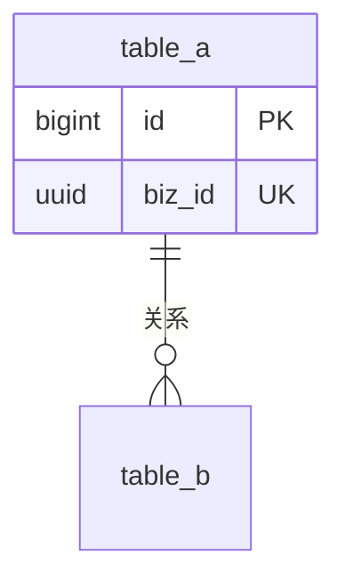

# 引思助手 概要设计模版

> **使用说明**
> - 每份概要设计对应一个版本，命名规则：`概要设计_v[版本号]_[功能名].md`（如 `概要设计_v0.1_MVP.md`）
> - 上游 = 同版本高层架构；下游 = 详细设计
> - 概要设计回答「**表 schema 怎么落地、API 字段长什么样、模块内部接口怎么签、State 类型怎么定义、RLS / 编译 / 协议怎么裁决**」
> - **不回答**：prompt 模板、算法步骤、错误处理流程、部署 Runbook、单测代码——那是详细设计的事

---

## 0. 本文档职责边界

> 概要设计是「**模块视角的接口契约**」——把高层架构的 7 个子系统、节点拓扑、技术决策，进一步落到 **DB 字段类型 / API 字段 / 函数签名 / Zod 类型 / RLS SQL** 等可被详细设计直接消费的层面。
> **不指定模块内部的算法或 prompt**，那是详细设计的事。

### 0.1 本文档写什么

- **数据模型**：表 schema（字段类型 / 索引 / 约束 / 触发器 / RLS SQL）+ ER 图 + 迁移与回滚策略
- **State Schema**：LangGraph state 的完整 Zod 定义（类型 + 默认值 + 校验规则）+ 嵌套 JSON 结构
- **API 契约**：所有路由的请求 / 响应字段 + 鉴权要求 + 流式协议（含 SSE chunk schema）+ 错误码表
- **鉴权细节**：`withAuth` 调用约定 + 权限扩展函数签名（如 `isAdmin`）
- **模块内部接口**：每个子系统对外暴露的类 / 函数签名（不写实现）
- **编译与运行策略**：LangGraph 编译时机、conditionalEdges 路由函数签名、节点 fan-out 行为
- **跨进程关键协议**：SSE chunk 全集、OSS POST policy 字段、长连接对反代的接口层约束
- **关键设计决策**：每条含「问题陈述 / 候选方案 / 采纳 + 理由 / 备选退路」（沿用架构 §8 格式）
- **明确不做的设计议题**：列出 + 升级触发点
- **风险与未决问题**：概要层新发现的 + 继承架构层的
- **详细设计准入检查表**（硬门控）+ **下游开放问题清单**

### 0.2 本文档不写什么

| 不写 | 写在哪里 |
|---|---|
| Prompt 模板 / 词汇库 / 模型参数调优 | 详细设计 |
| 算法步骤 / 关键词命中规则 / 判定逻辑 | 详细设计 |
| 错误处理路径 / 用户提示话术 | 详细设计 + PRD §8 联动 |
| 部署 Runbook / Docker / Nginx 完整 conf | 详细设计 / Runbook |
| 单元测试 / 集成测试代码 | 详细设计 + 测试用例库 |
| 业务目标、功能需求、量化指标 | PRD / 需求分析 |
| 子系统拆分 / 技术选型 / C4 图 | 高层架构 |

### 0.3 与上下游文档的衔接

| 关系 | 文档 | 衔接点 |
|---|---|---|
| ↑ | 高层架构 | 每张表来自架构 §6.3 实体；每个 API 来自架构 §4 子系统；每条决策回答架构 §13.2 下游开放问题 |
| ↑ | 需求分析 | 每条 FR 至少能在本文档找到一个接口承载点；每条 NFR 必须能在某个接口约束中体现 |
| ↓ | 详细设计 | 本文档的节点函数签名 → 节点内部 prompt + 算法；本文档的 API 错误码 → 详细错误处理流程；本文档的 SSE chunk schema → 详细的客户端分发实现 |

---

## 1. 文档元信息

| 字段 | 值 |
|---|---|
| 文档名称 | 概要设计_v[X.X]_[功能名].md |
| 版本 | v[X.X] |
| 状态 | 草稿 / 评审中 / 已签发 |
| 创建日期 | YYYY-MM-DD |
| 最后更新 | YYYY-MM-DD |
| 编写人 | [姓名] |
| 评审人 | [开发负责人 / 产品负责人] |
| **关联文档** | |
| ↑ 上游：PRD | doc/PRD/PRD_v[X.X]_[功能名].md |
| ↑ 上游：需求分析 | doc/需求分析/需求分析_v[X.X]_[功能名].md |
| ↑ 上游：高层架构 | doc/高层架构/高层架构设计_v[X.X]_[功能名].md |
| → 下游：详细设计 | doc/详细设计/详细设计_v[X.X]_[功能名].md |

---

## 2. 设计原则与命名公约

> 沿用高层架构 §2 的 5 条原则（可读性 > 性能 / 就近迭代 > 完美重构 / 显式 > 隐式 / 拒绝早优化 / 文档化决策），新增数据层 / API 层 / 接口层公约。

### 2.1 沿用架构层原则

简单列出 + 1 行说明（不重复写架构 §2 的展开）。

### 2.2 数据层命名公约

> **沿用 `qian-quest` 项目 `代码规范.md §3.2`**（`/Users/muzi/Project/qian-quest/技术/开发规范/代码规范.md`）。

- 表名前缀：业务表 `elicit_*`；LangGraph 系统表 `checkpoint*`（PostgresSaver 自管）
- **DB 物理列**：一律 `snake_case`（如 `conversation_id`、`created_at`），仅出现在 DDL / 迁移文件 / SQL 字符串
- **Drizzle 列定义**：TS 属性名 `camelCase`，物理列名保持 `snake_case`，由 Drizzle 自动映射
- **Supabase 自动生成 Row 类型**（`src/db/supabase/type.ts`）：snake_case 边界类型，只在 `src/db/models/*` 映射层出现，**禁止外泄到 store / hook / 组件**
- 主键 `bigint id`；业务幂等键 `*_id`（如 `conversation_id`）
- 时间戳：`created_at` / `updated_at`（`timestamp with time zone default now() not null`），`updated_at` 由触发器维护
- 枚举：用 `smallint` 存整形 code + check 约束（沿用 qian-quest §6 + `createEnum` 工厂；详见 §2.4）；**不用** Postgres ENUM 类型，**也不用** `varchar` 存字面量字符串
- 半结构化：`jsonb not null default '{}'`（jsonb 优于 json，索引支持好）

### 2.3 API 路由公约

- 路径：`/api/[子系统]/[资源]`，路径段 `kebab-case`（如 `/api/oss/sign-for-upload`）
- 鉴权：所有 `/api/*` 路由必须经 `withAuth`；豁免须在本章显式列出
- **请求 / 响应字段**：一律 `camelCase`（与前端 VO 对齐）
- 响应外壳：统一走 `BaseResponse<T>`（`{status, message, data}`）；流式响应除外（走 AI SDK UI message 协议）
- 错误码：`200` 成功；`-1` 业务错误；HTTP 401/403/500 由 `withAuth` / Next.js 直接返回
- 外部系统对齐字段豁免：仅保留原名于边界类（如 OSS POST policy 的 `x-oss-credential` 等 header 名）

### 2.4 接口层命名

> **跨层字段命名总规则**：DB 物理列 `snake_case` / 其余一切（Drizzle property、API DTO、Zod、Store、Hook、Props、前端 VO）`camelCase`、禁止 `snake_case` / 外部对齐字段保留原名仅限边界文件。字段名必须**见名知意**。

**TS 标识符命名**：

| 类别 | 规范 | 示例 |
|---|---|---|
| 常量 | `UPPER_SNAKE_CASE` | `MAX_RETRY_COUNT` |
| 函数 / 变量 | `camelCase` | `isAdmin` |
| 事件处理 | `onXxx` 或 `handleXxx` | `onPhaseChunk` |
| 类 | `PascalCase` | `ConversationMapper` |
| 接口 / 类型 | `PascalCase` + 语义后缀 | 见下表 |

**接口 / 类型后缀**：`*Schema`（Zod）/ `*Request` `*Response`（API DTO）/ `*Props`（组件 Props / 前端 VO）/ `*Row`（DB 行）/ `*Mapper` / `*Service`

**枚举范式（沿用 qian-quest 代码规范 §6）**：

- 目录 `src/types/enums/`，文件名 `{name}.enum.ts`
- 共享工厂 `base.ts` 提供 `createEnum`（与 qian-quest 一致）
- 每个枚举文件**导出两个**：
  - `{Name}` — `as const` 命名常量对象 + `type` 双导出；`{ NAME: 0, ... } as const` + `type X = typeof X[keyof typeof X]`
  - `{Name}Enum` — `createEnum([{ code, label }, ...])` 工厂结果，提供 `getLabel(code)` / `fromCode(code)` / `items`
- DB 列：`smallint` 存整形；check ∈ {0,1,2,...}
- Zod 字段：`z.union([z.literal(0), z.literal(1), ...])`
- **禁止**：① TS `enum` 关键字；② 组件内硬编码 `if code===1 ...` 类映射；③ DB 用 `varchar` 存 `'plan'` 字面量字符串

**项目专有惯例**：

- 节点：`xxxNode = async (state) => {...}` + 同文件 `export const xxxNodeName = 'xxxNode'`
- 条件路由：`shouldXxx` / `routeXxx` 前缀
- Zod schema 文件：`*Schema.ts`；`export *Schema + type *` 双导出
- Mapper / Service：单例 `export const xxxXxx = new XxxXxx()` 在模块末尾
- 客户端 store：`use*`（Zustand 惯例）
- `Mapper` / `Service` / 仅服务端模块顶部 `import 'server-only'`

---

## 3. 数据模型设计

> 落实高层架构 §4 子系统职责中涉及的数据实体；为每张业务表给出完整字段定义 + 索引 + 约束 + 触发器 + RLS。

### 3.1 表清单总览

| 表名 | 用途 | 拥有者 | 访问模式 |
|---|---|---|---|
| [表名] | [用途] | [子系统] | [谁读 / 谁写 / 是否经过 RLS] |

### 3.2 业务表公共字段规约

> **沿用 qian-quest 详细设计的"公共字段"惯例**（`/Users/muzi/Project/qian-quest/技术/详细设计/详细设计_v0.1_NPC对话模块.md` 中 `NpcModel` 末尾 7 字段模板）。所有业务表必须展开公共字段 helper。

**必含 7 字段**：

| DB 列 | TS property | Postgres 类型 | 默认值 | 语义 |
|---|---|---|---|---|
| `id` | `id` | `bigint` identity | — | 自增主键（不暴露到 API） |
| `{biz}_id` | `{biz}Id` | `uuid` UNIQUE NOT NULL | `gen_random_uuid()` | 业务幂等键；对外的逻辑主键 |
| `version` | `version` | `int` NOT NULL | `0` | 乐观锁字段；MVP 业务逻辑可不启用 |
| `is_deleted` | `isDeleted` | `boolean` NOT NULL | `false` | 软删标记；MVP 业务逻辑可不启用 |
| `created_at` | `createdAt` | `timestamptz` NOT NULL | `now()` | **DB 时间审计字段**；不下发前端；业务代码不显式 SET |
| `updated_at` | `updatedAt` | `timestamptz` NOT NULL | `now()`（触发器维护） | 同上；如需"业务时间"展示新增专用字段（不复用 `updated_at`） |
| `ext_info` | `extInfo` | `jsonb` NOT NULL | `'{}'::jsonb` | **纯预留扩展**；不放语义化结构数据 |

> **`created_at` / `updated_at` 硬约束**：
> - 含义：DB 行物理写入 / 更新时刻；**不承载业务语义**
> - 维护：由 DEFAULT + 触发器自动维护；业务代码**禁止显式 SET**
> - 暴露：API / VO **绝不下发**；前端不展示
> - 业务时间另立：若需"消息发送时间 / 最后活跃时间"等用户感知时间，**新增业务字段**（如 `sent_at` / `last_active_at`），不复用公共字段

> **`ext_info` ≠ `metadata`**：
> - `ext_info`（公共字段，纯预留）：未来想加但不想 alter table 的杂项；Zod `z.record(z.unknown())`
> - `metadata`（**业务字段**，按表加）：已知 schema 的结构化 JSON（如卡片 / 标签）；在表自有节给具体 Zod
>
> 不要把语义化数据塞进 `ext_info`；也不要把预留字段叫 `metadata`。

**不属于公共字段**：
- `user_id` —— **业务字段**（多租户隔离）；只在需要 RLS 行级隔离的表声明
- `deleted_at` —— 仅在精确审计需要时配套 `is_deleted` 加

**MVP 启用程度约定**（字段必含 ≠ 业务逻辑必启用）：

| 字段 | 字段存在 | MVP 业务逻辑 |
|---|---|---|
| `version` | ✅ | UPDATE 不强制带 `where version = ?`，按需启用 |
| `is_deleted` | ✅ | SELECT 不加 `where is_deleted = false`，按需启用 |
| `ext_info` | ✅ | 默认空对象 |

**Drizzle helper**（强制所有业务表展开使用）：

```ts
// src/db/schema/_common.ts
export const commonAuditFields = {
    id: bigint("id", { mode: "number" }).primaryKey().generatedByDefaultAsIdentity(),
    version: integer("version").notNull().default(0),
    isDeleted: boolean("is_deleted").notNull().default(false),
    createdAt: timestamp("created_at", { withTimezone: true }).defaultNow().notNull(),
    updatedAt: timestamp("updated_at", { withTimezone: true }).defaultNow().notNull(),
    extInfo: jsonb("ext_info").$type<Record<string, unknown>>().notNull().default({}),
};
// 业务表用法：pgTable("...", { ...commonAuditFields, {biz}Id: uuid("{biz}_id")..., userId: uuid("user_id")..., ...业务字段 })
```

**API / VO 暴露规则**：

- `id` / `version` / `isDeleted` / `createdAt` / `updatedAt` / `extInfo` ❌ 不下发
- `{biz}Id` ✅ 必含
- 业务时间字段（如 `sentAt` / `lastActiveAt`） ✅ 按需暴露，ISO 8601 序列化

### 3.3 ER 图



### 3.4 业务表 X 设计

> 每张表一节，按以下小标题组织。字段表按**公共 / 业务**分类标注（公共字段沿用 §3.2，业务字段是本表独有的）：

#### 3.4.1 字段定义

| 分类 | 字段 | 类型 | 约束 | 默认值 | 来源 / 用途 |
|---|---|---|---|---|---|
| **公共** | [来自 §3.2.1 的字段] | — | — | — | 公共字段 §3.2.1 |
| 业务 | [字段] | [类型] | [PK/UK/NN/FK ...] | [默认] | [谁写 / 含义] |

#### 3.4.2 索引

| 索引名 | 字段 | 类型 | 用途 |
|---|---|---|---|
| [name] | [columns] | UNIQUE / btree / gin | [查询场景] |

#### 3.4.3 约束 / 触发器

- check 约束 / 外键 / 触发器（如 `updated_at` 自动更新；建议两张业务表共用同一个 `set_updated_at()` function）

#### 3.4.4 RLS 策略

```sql
-- 列出本表的所有 policy SQL
```

#### 3.4.5 与现状差异

| 字段 / 索引 | 现状 | 目标 | 迁移操作 |
|---|---|---|---|

### 3.5 LangGraph 系统表

> PostgresSaver 自管的 4 张表（`checkpoints` / `checkpoint_blobs` / `checkpoint_writes` / `checkpoint_migrations`）只标注本项目的额外约束；schema 本身不动。

### 3.6 RLS 策略汇总

> 把所有表的 RLS 策略集中列出，便于一眼看完整权限模型。`/admin` 跨用户读策略在此节给出最终方案。

### 3.7 迁移与回滚

| 操作 | 文件 / 命令 | 回滚方式 |
|---|---|---|

- Drizzle schema 改后跑 `pnpm supabase:diff`
- 手写迁移文件用于 Drizzle 不覆盖的表（如 `elicit_messages`）
- 任何 schema 变更需重生 `src/db/supabase/type.ts`（`pnpm supabase:type`）
- 公共字段层面的扩展（如新增 `version`），改 `_common.ts` helper 即扩散到所有业务表

---

## 4. LangGraph State Schema 设计

### 4.1 ElicitGraphStateSchema 完整定义

```ts
// 完整 Zod schema，含字段类型 / 默认值 / 校验
export const ElicitGraphStateSchema = z.object({
    // ...
});
```

### 4.2 嵌套 JSON Schema（如 P-105 卡片）

> 任何在 state / message content / metadata 中嵌入的结构化 JSON，必须在此给出 Zod 定义。

### 4.3 State 字段读写矩阵

| 字段 | 节点 A | 节点 B | ... |
|---|---|---|---|
| [字段] | W | R | — |

---

## 5. API 契约

### 5.1 路由清单总览

| 路径 | 方法 | 鉴权 | 流式 | 用途 |
|---|---|---|---|---|
| `/api/...` | POST | withAuth | SSE / JSON | [用途] |

### 5.2 [路由 X] 契约

> 每个路由一节，按以下结构：

- **路径 + 方法**
- **鉴权要求**
- **请求体**（TS 接口 / Zod）
- **响应体**（TS 接口 / Zod；流式则给 chunk schema）
- **错误码**（路由特定的）
- **副作用**（写入哪些表 / 触发哪些节点）

### 5.3 统一错误响应体 + 错误码表

```ts
// BaseResponse<T>
```

| 状态 | 含义 | 触发场景 |
|---|---|---|

### 5.4 客户端直读 DB 的契约

> 若前端通过 `supabase-js` 直接读 DB（受 RLS 保护），需在此章列出**哪些表 / 哪些查询**走此路径，配套 RLS 策略保证安全。

---

## 6. 鉴权与权限扩展

### 6.1 withAuth context 形态

```ts
type AuthenticatedHandler = (...) => Promise<Response>;
```

### 6.2 权限扩展函数签名

> 如 `isAdmin(user)` / `requireRole(role)` 等。

### 6.3 RLS 与服务端鉴权的职责分工

| 攻击场景 | 由谁拦 |
|---|---|

---

## 7. 子系统模块内部接口

> 每个子系统一节，给出对外暴露的类 / 函数 / 节点签名（不写实现，不写 prompt）。

### 7.1 [子系统 S1] 接口

```ts
// 函数 / 类签名
```

- 关键约束（事务边界 / 幂等性 / 并发安全 / 失败回滚）

---

## 8. LangGraph 编译与运行策略

### 8.1 编译时机

- build-time 单例 vs runtime 编译；Next.js standalone build 注意点

### 8.2 checkpointer 配置

- 连接复用 / `setup()` 调用时机 / 失败处理

### 8.3 条件边路由函数签名

```ts
// 如 startFanoutNode 的返回类型与 fan-out 约定
```

---

## 9. 跨进程关键协议

### 9.1 SSE 流式协议

- 总线 schema：`{id, type, delta, data?}`
- `data-custom` chunk 全集（含 conversation 创建 / 阶段切换 / P-105 推送）
- 客户端分发约定

### 9.2 OSS POST policy 字段

| 字段 | 必选 | 来源 | 校验 |
|---|---|---|---|

### 9.3 SSE 长连接对反代的接口层约束

> 只写"必要条件"——具体 nginx.conf 留详细设计。

### 9.4 会话历史恢复路径

- PhaseRouter 入参 + state rehydration

---

## 10. 关键设计决策

> 每条决策含 4 段：「问题陈述 / 候选方案 / 采纳 + 理由 / 备选退路」（沿用架构 §8 格式）。

### 10.1 决策清单总览

| ID | 议题 | 采纳方案 | 回答的开放问题 |
|---|---|---|---|
| C1 | [议题] | [方案] | [架构 §13.2 #X] |

### 10.2 决策详情

#### C1 [议题标题]

- **问题陈述**：[一段话]
- **候选方案**：
  - A: [方案]
  - B: [方案]
- **采纳**：方案 [X]
- **理由**：[原则联动 + 量化对比]
- **备选退路**：[何时回退]

---

## 11. 明确不做的设计议题

| 议题 | MVP 不做的理由 | 升级触发点 | 升级方向 |
|---|---|---|---|

---

## 12. 风险与未决问题

> 概要层新发现的风险 + 继承架构层风险。

| 编号 | 风险描述 | 影响接口 / 模块 | 严重度 | 应对 | 决策时点 |
|---|---|---|---|---|---|
| CR-001 | [描述] | [影响] | 高 / 中 / 低 | [应对] | YYYY-MM-DD |

---

## 13. 详细设计准入检查表 + 下游开放问题

### 13.1 详细设计准入（硬门控）

| # | 检查项 | 状态 | 备注 |
|---|---|---|---|
| 1 | 所有业务表 schema 完整（字段 / 索引 / 约束 / RLS） | ⬜ | — |
| 2 | 所有 API 路由的请求 / 响应字段已定义 | ⬜ | — |
| 3 | State Schema Zod 类型 + 默认值齐全 | ⬜ | — |
| 4 | 所有子系统对外接口签名齐全 | ⬜ | — |
| 5 | LangGraph 编译策略 + checkpointer 配置明确 | ⬜ | — |
| 6 | SSE chunk schema 全集已列出 | ⬜ | — |
| 7 | 错误响应体 + 错误码表齐全 | ⬜ | — |
| 8 | 关键决策 §10 每条有"备选退路" | ⬜ | — |
| 9 | 明确不做议题已列出升级触发点 | ⬜ | — |
| 10 | 风险表覆盖架构 §12 所有未关闭风险 | ⬜ | — |
| 11 | 下游开放问题已分配到详细设计 / 运维 | ⬜ | — |
| 12 | 编写人 + 评审人确认可进入详细设计 | ⬜ | — |

### 13.2 下游开放问题清单

> 三分组：详细设计 / 运维 / 流程。

| # | 问题 | 由谁回答 | 截止日 |
|---|---|---|---|
| 1 | [问题] | 详细设计 / 运维 / 流程 | YYYY-MM-DD |
