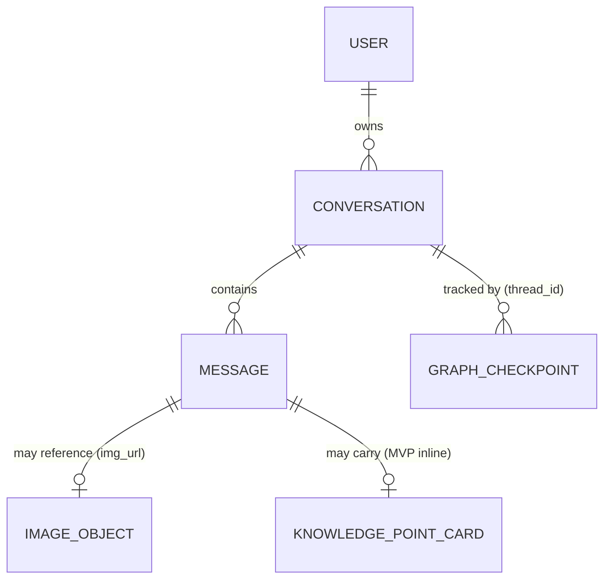
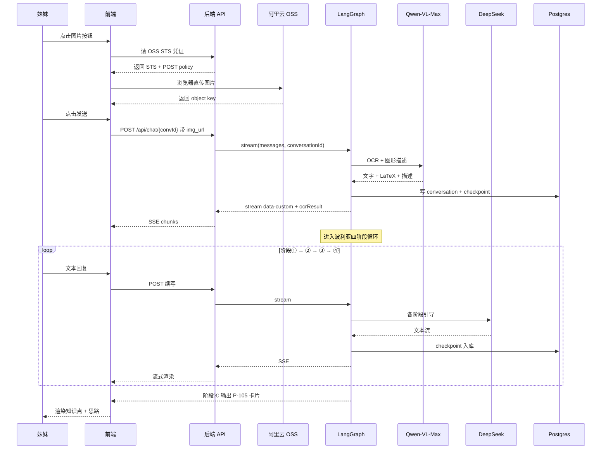
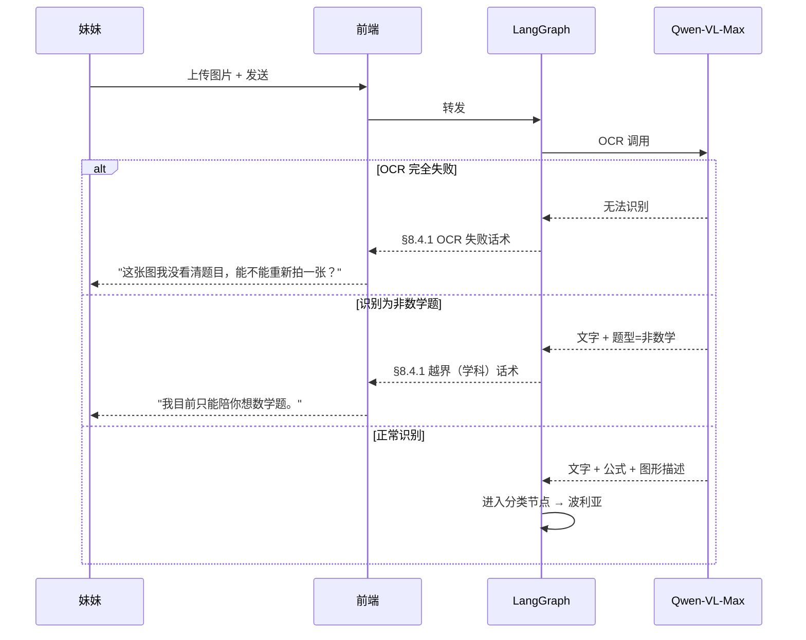
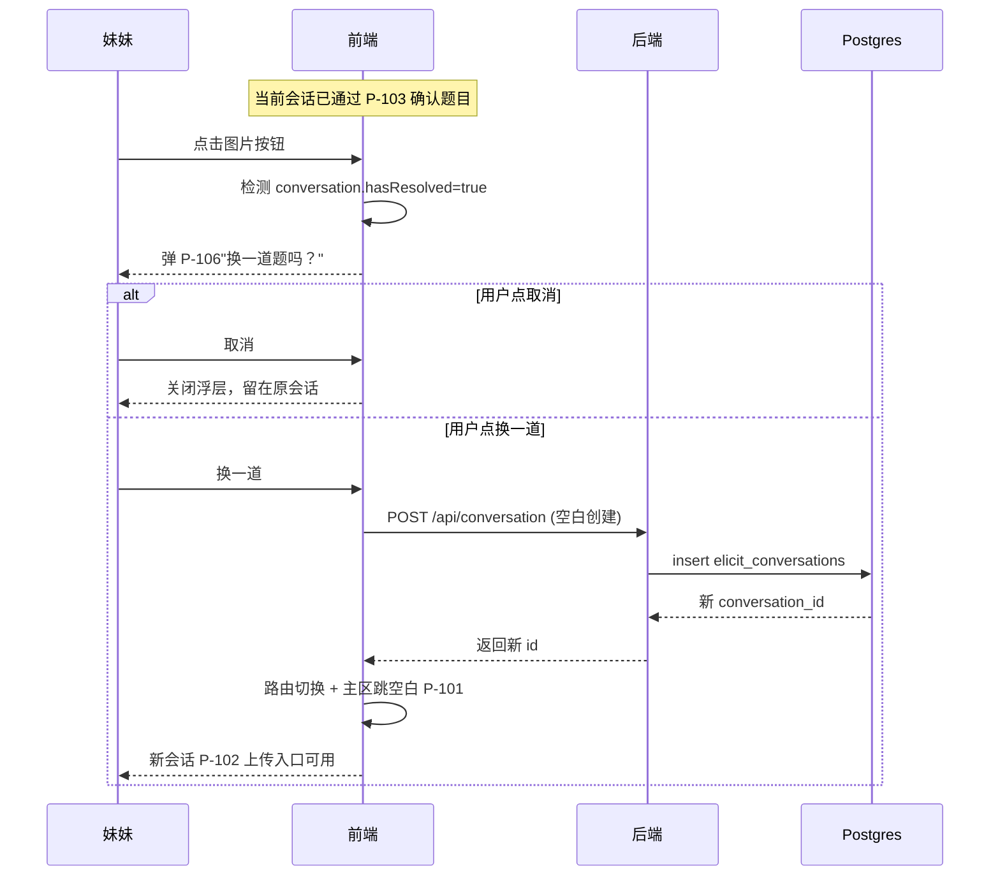

# 需求分析_v0.1_MVP — 引思助手 MVP 版本

## 0. 本文档职责边界

> 本文档把 `PRD_v0.1_MVP.md` 的 17 个 US + 7 项 Agent 行为验收拆解为可估时、可分配、可独立验收的功能点 / 非功能指标 / 测试用例。
> **不做**：模块划分、技术栈选型、数据库字段定义、API 契约、prompt 模板——这些交下游「高层架构 → 概要设计 → 详细设计」。

详见 `需求分析模版.md §0`。

---

## 1. 文档元信息

| 字段 | 值 |
|---|---|
| 文档名称 | 需求分析_v0.1_MVP.md |
| 版本 | v0.1 |
| 状态 | 草稿 |
| 创建日期 | 2026-05-19 |
| 最后更新 | 2026-05-19 |
| 编写人 | muzi |
| 评审人 | muzi |
| **关联文档** | |
| ↑ 上游：PRD | `doc/PRD/PRD_v0.1_MVP.md` |
| → 下游：高层架构设计 | `doc/高层架构/高层架构设计_v0.1_MVP.md` |
| → 下游：概要设计 | `doc/设计/MVP_概要设计.md`（待产出） |
| → 下游：详细设计 | `doc/设计/MVP_详细设计.md`（待产出） |

---

## 2. 拆解方法说明

### 2.1 颗粒度与优先级

- **FR 颗粒度**：每条 FR 控制在 **0.5 ~ 2 天**单人完成
- **优先级**：沿用 PRD MoSCoW（Must / Should / Could）
- **估时方法**：粗略小时（0.5 天 = 4 小时 / 1 天 = 8 小时），按单人独立开发计

### 2.2 编号规则

- **FR**：`FR-[模块]-[三位序号]`，本次涉及 9 个模块：`AUTH` / `UI` / `OSS` / `VISION` / `AGENT` / `FALLBACK` / `OUTPUT` / `CONV` / `ADMIN`
- **NFR**：`NFR-[类别]-[三位序号]`，本次涉及 8 个类别：`PERF` / `SEC` / `PRIVACY` / `OBS` / `QUALITY` / `UX` / `BUSINESS` / `PLATFORM`

---

## 3. 系统边界

| 方向 | 内容 |
|---|---|
| **输入** | 妹妹的注册邮箱 + 密码 / 题目图片（拍照 / 相册）/ 文本对话回复 / 阶段切换信号；家长账号登录态 |
| **输出** | OCR 识别结果（含图形描述）/ LaTeX 渲染的题目 / Agent 流式引导对话 / 阶段切换 UI 提示 / 知识点 + 思路总结卡片 / 会话历史侧边栏 / 家长后台只读列表与详情 |
| **不含** | 错题本 / 知识点图谱 / 复习预习（v0.2+） · 教材作业管理（v0.2+） · 家长可调参后台（不在 MVP 范围） · 非北师大教材 · 非数学学科 · 思路对错强判断（MVP 仅做"方向是否在合理 menu 内"弱判断，强判断推迟 v0.2） · 多人 / 班级视角 |

---

## 4. 关键约束

### 4.1 平台约束

| # | 约束 | 影响范围 | 应对策略 |
|---|---|---|---|
| 1 | Web H5 浏览器拍照需 `getUserMedia` 权限，iOS Safari 仅 HTTPS 下可用 | FR-OSS-001 | 强制 HTTPS 部署；权限拒绝有"改用相册"降级 |
| 2 | Next.js 16 Route Handler 默认超时 30 秒（Vercel Hobby Plan） | FR-VISION-001 / FR-AGENT-* | 流式 SSE 输出绕开整体超时；OCR 调用单独控制时延 |
| 3 | Supabase Postgres 使用 Supavisor 连接池，`prepare: false` 必须 | FR-CONV-* / 所有 Drizzle 调用 | 已在 `src/db/index.ts` 设置；新代码沿用 |
| 4 | LangGraph PostgresSaver `checkpointer.setup()` 当前注释，全新部署需手工执行一次 | FR-AGENT-* | 部署 Runbook 写入详细设计 |
| 5 | 阿里云 OSS POST policy `conditions` 硬编码 bucket=`muzi-elicit` | FR-OSS-001 | 切换 bucket 时需同步修改 `OssService.ts` |
| 6 | 阿里云 STS AssumeRole 1 小时过期 | FR-OSS-001 | 前端拿到凭证即用，不持久化 |
| 7 | DeepSeek 不支持原生多模态——只能处理文本 | FR-AGENT-* | 视觉理解（OCR + 图形描述）由 Qwen-VL-Max 完成；DeepSeek 节点只接文本 |
| 8 | KaTeX 在 iOS Safari < 16 部分宏渲染异常 | FR-VISION-001 | NFR-PLATFORM-001 限定支持版本 |

### 4.2 业务约束

- MVP 仅服务一个学生（妹妹），并发量小；不需要做高可用 SLO
- 一会话 = 一题；多题图片选定一道后其余丢弃
- Agent **始终不直接给出步骤数值答案**——这是产品红线，不可降级
- 含图题（几何 / 函数图像 / 统计图表）不拒答，接受函数图像 / 统计图表题描述质量可能受限（见 R-011）

### 4.3 团队约束

- **开发分工**：
  - **开发主力**：Claude（Anthropic CLI 助手），承担前端 / 后端 / Agent 三层的代码实现、单元测试、调试
  - **产品负责人 / 评审者**：muzi，负责需求决策、PR 评审、架构方向把控、与最终用户（妹妹）的产品验证回路
  - **最终用户**：妹妹，参与 MVP 上线后的真实使用 + 反馈
- **协作模式**：
  - 所有非小改动（>1 文件 / >50 行 / 涉及产品行为）必须走 **plan → muzi 评审 → 执行** 流程
  - 涉及 PRD §8 Agent 行为契约的修改必须先与 muzi 对齐文档，再动代码
  - Claude 在落地过程中产生的"为什么这么写"的决策必须以注释或 PR 描述形式留痕，方便 muzi 后续维护
- **时间**：
  - §5.10 / §15.1 的"单人天"是**抽象工作量计量单位**（按经验估算）
  - Claude + muzi 协同的真实日历时间显著小于纯人工，预计 MVP 主线开发 **3~5 个有效协作日**完成（不含真实使用 2 周的指标验证窗口）
- **技能盲点**：
  - muzi：前端 React / Next.js / LangGraph 多节点编排不熟——依赖 Claude 实现 + 评审时主动质疑"为什么"
  - Claude：本项目专属业务规则（北师大教材知识点 / 妹妹真实使用习惯）需要 muzi 持续输入；Claude 无法独立判断 NFR-BUSINESS 主观指标是否达标

---

## 5. 功能需求 FR

### 5.1 模块 AUTH（用户入口）

| 编号 | 标题 | 描述（产品行为视角） | 源 | 优先级 | 估时 | 依赖 |
|---|---|---|---|---|---|---|
| FR-AUTH-001 | 登录 / 注册页 | 邮箱+密码注册、登录、登出；表单校验；调 Supabase Auth；登录后跳主框架 | F006 / US-001~US-017 通用前置 | Must | 0.5 天 | — |

### 5.2 模块 UI（主框架与对话页）

| 编号 | 标题 | 描述 | 源 | 优先级 | 估时 | 依赖 |
|---|---|---|---|---|---|---|
| FR-UI-001 | 主框架 + 主对话页基础布局 | P-001（顶栏 + 侧边栏容器）+ P-101（消息列表 + 输入框 + 图片按钮 + 发送按钮）的静态布局与登录态包装 | F001 / US-001~US-011 通用 | Must | 1 天 | FR-AUTH-001 |
| FR-UI-002 | 会话历史侧边栏（一会话 = 一题） | 列出本用户会话，标题=题目摘要，按最后更新时间倒序 | F004 / US-010 | Must | 0.5 天 | FR-UI-001 |
| FR-UI-003 | 新建对话 | 「新建对话」按钮 → 跳到空白 P-101；原会话保留侧边栏 | F004 / US-011 | Must | 0.5 天 | FR-UI-002 |

### 5.3 模块 OSS（图片上传）

| 编号 | 标题 | 描述 | 源 | 优先级 | 估时 | 依赖 |
|---|---|---|---|---|---|---|
| FR-OSS-001 | 上传图片浮层 P-102 + OSS 直传 | 「拍照 / 相册」二选一；获取 STS 凭证；浏览器 POST 直传 OSS；上传后产出 `img_url` 写入消息附件区 | F001 / US-001、US-002 | Must | 1 天 | FR-UI-001 |

### 5.4 模块 VISION（视觉理解）

| 编号 | 标题 | 描述 | 源 | 优先级 | 估时 | 依赖 |
|---|---|---|---|---|---|---|
| FR-VISION-001 | 视觉理解节点（OCR + 图形描述）+ LaTeX 渲染 | 后端 OcrNode 调 **qwen-vl-max**（非 OCR 专版）；输出「文字 + 公式 + 图形/图像的自然语言结构化描述」（例：直角三角形 ABC，∠C=90°，AB=10）；前端 KaTeX 渲染数学公式。后续节点（DeepSeek）以此文本+描述为输入，**不再二次看图** | F002 / US-003 | Must | 1.5 天 | FR-OSS-001 |
| FR-VISION-002 | 多题确认浮层 P-103 + 识别错误反馈 | OCR 返回 ≥ 2 题时弹出 P-103 单选；「识别错误」按钮回退到 P-102 重传 | F002 / US-004、US-005 | Must | 0.5 天 | FR-VISION-001 |

### 5.5 模块 AGENT（Agent 引擎）

| 编号 | 标题 | 描述 | 源 | 优先级 | 估时 | 依赖 |
|---|---|---|---|---|---|---|
| FR-AGENT-001 | 题型分类节点 | 题目确认后归类为「代数 / 几何 / 函数」之一，驱动后续阶段使用的方法术语 | F003 / US-012 | Should | 0.5 天 | FR-VISION-002 |
| FR-AGENT-002 | 阶段 ① 理解节点 | 反问已知 / 求什么 / 画图；判定完成 = 妹妹复述出已知 + 求解目标 | F003 / US-007 阶段① | Must | 1 天 | FR-AGENT-001 |
| FR-AGENT-003 | 阶段 ② 拟定节点 | 引导联想方法、类比题、换角度；用对应题型方法术语；判定完成 = 妹妹说出一个方向 | F003 / US-007 阶段② | Must | 1 天 | FR-AGENT-002 |
| FR-AGENT-004 | 阶段 ③ 执行节点 | 逐步反问"下一步怎么走"；不代算；判定完成 = 妹妹说出完整思路链 | F003 / US-007 阶段③ | Must | 1 天 | FR-AGENT-003 |
| FR-AGENT-005 | 阶段 ④ 回顾节点（含元认知问句） | 引导回顾"用了哪些知识点 / 别的解法 / 关键步骤"+ 元认知问句"更短的路 / 条件放宽 / 像哪道题"；产出 P-105 卡片输入 | F003 / US-007 阶段④、Agent 验收 #6 | Must | 1 天 | FR-AGENT-004 |
| FR-AGENT-006 | 阶段切换判据 + P-104 顶栏阶段提示 | 各阶段完成判据评估 + 推进到下一阶段；P-104 顶部细线展示当前阶段名 | F003 / US-013 | Should | 0.5 天 | FR-AGENT-002~005 |
| FR-AGENT-007 | 数学思想唤起反问句生成 | 横切关注点——四阶段引导中至少出现一次「数形结合 / 分类讨论 / 转化化归 / 函数与方程」相关反问句 | Agent 验收 #4 | Should | 0.5 天 | FR-AGENT-001、FR-AGENT-003、FR-AGENT-004 |

### 5.6 模块 FALLBACK（兜底）

| 编号 | 标题 | 描述 | 源 | 优先级 | 估时 | 依赖 |
|---|---|---|---|---|---|---|
| FR-FALLBACK-001 | 卡住两段式兜底（5 问探路 + 知识点兜底） | 检测同阶段连续 3 轮无推进 → 5 问探路（条件用完 / 画图 / 特例 / 等价改写 / 类比）→ 仍无突破抛知识点 + 方法 | F003 / US-009、Agent 验收 #2 | Must | 1 天 | FR-AGENT-006 |
| FR-FALLBACK-002 | 偏离回正兜底 | 检测妹妹回复跨过当前阶段 / 离开当前题目 → 用 §8.4.1 偏离话术拉回，不推进下一阶段 | F003 / US-008、Agent 验收 #3 | Must | 0.5 天 | FR-AGENT-006 |
| FR-FALLBACK-003 | 越界（学科 / 话题）+ OCR 失败兜底 | 三种独立场景统一兜底实现：非数学题礼貌拒答、话题闲聊拉回、OCR 失败提示重拍 | F003 / US-014、Agent 验收 #1 | Must | 0.5 天 | FR-VISION-001、FR-AGENT-001 |

### 5.7 模块 OUTPUT（输出）

| 编号 | 标题 | 描述 | 源 | 优先级 | 估时 | 依赖 |
|---|---|---|---|---|---|---|
| FR-OUTPUT-001 | 知识点 + 思路卡片 P-105 | 题目摘要 / 知识点标签 / 解题思路（步骤 + 方法术语）/「再来一题」+ 灰显「保存到错题本」 | F005 / §8.5、Agent 验收 #5 | Must | 1 天 | FR-AGENT-005 |

### 5.8 模块 CONV（会话管理）

| 编号 | 标题 | 描述 | 源 | 优先级 | 估时 | 依赖 |
|---|---|---|---|---|---|---|
| FR-CONV-001 | 历史会话恢复 | 点击侧边栏会话项 → 加载完整上下文（含 LangGraph checkpoint）→ 落在执行阶段，可继续对话；**进入后图片按钮置灰** | F004 / US-010、US-017 | Must | 0.5 天 | FR-UI-002 |
| FR-CONV-002 | 换题确认浮层 P-106 + 自动新建会话 | 已确认题目的新会话内点图片按钮 → 弹 P-106 →「换一道」触发后端建新会话 + 前端切到新会话 P-101 空白态；「取消」留在原会话。**触发判定**：当前 conversation 是否已通过 P-103 | F001 / US-016 | Must | 0.5 天 | FR-UI-002 |

### 5.9 模块 ADMIN（家长后台）

| 编号 | 标题 | 描述 | 源 | 优先级 | 估时 | 依赖 |
|---|---|---|---|---|---|---|
| FR-ADMIN-001 | `/admin` 路由 + 家长身份校验 | 路由级中间件：仅指定家长账号可访问，其余 403 | F007 / US-015 | Must | 0.5 天 | FR-AUTH-001 |
| FR-ADMIN-002 | 家长后台 P-201 列表 + P-202 详情（只读） | 跨用户会话列表（标题 / 时间 / 轮数）+ 详情含完整对话 + 图片 + 知识点卡片；**页面无任何修改入口** | F007 / US-015 | Must | 1 天 | FR-ADMIN-001 |

### 5.10 估时小计

- **Must 合计**：约 **14 天**（19 个 FR）
- **Should 合计**：约 **1.5 天**（3 个 FR：FR-AGENT-001、FR-AGENT-006、FR-AGENT-007）
- **Could**：无
- **总计**：**~15.5 单人天**（含 30% 缓冲约 20 天）

---

## 6. 非功能需求 NFR

### 6.1 类别 PERF

| 编号 | 指标描述 | 量化目标 | 验证方法 | 源 |
|---|---|---|---|---|
| NFR-PERF-001 | 流式首字时延（发送到首字出现） | ≤ 2 秒 | 手测 10 次平均；后端日志辅助 | PRD §9 时延感知 |
| NFR-PERF-002 | OCR 时延（图片到达后端到结果返回） | ≤ 5 秒 | 手测 20 张作业图平均 | PRD §9 时延感知 |

### 6.2 类别 SEC

| 编号 | 指标描述 | 量化目标 | 验证方法 | 源 |
|---|---|---|---|---|
| NFR-SEC-001 | RLS：妹妹会话与消息仅本人可读 | 100%（其他 user 查询返回空） | 用第二个测试账号尝试越权读 | PRD §10 隐私 |
| NFR-SEC-002 | 家长后台只读：`/admin` 页面无任何编辑 / 删除 / 配置入口；后端无对应写接口 | 0 个写入接口 | 代码审查 + 黑盒尝试 POST | PRD §10 隐私 |

### 6.3 类别 PRIVACY

| 编号 | 指标描述 | 量化目标 | 验证方法 | 源 |
|---|---|---|---|---|
| NFR-PRIVACY-001 | 上传图片仅本人 + 家长可见；不外发 / 不参与训练 | 0 处数据外泄链路 | 代码审查外发出站 | PRD §9 安全 / 隐私 |

### 6.4 类别 OBS

| 编号 | 指标描述 | 量化目标 | 验证方法 | 源 |
|---|---|---|---|---|
| NFR-OBS-001 | 家长能在 `/admin` 看到所有妹妹会话的完整原始内容 | 100% 会话可见 | 妹妹发起 5 个会话 → 家长后台必须能看到全 5 个 | PRD §10 可观察性 |

### 6.5 类别 QUALITY

| 编号 | 指标描述 | 量化目标 | 验证方法 | 源 |
|---|---|---|---|---|
| NFR-QUALITY-001 | 单条 Agent 回复字数（除 P-105 卡片外） | ≤ 200 字 | 抽检 20 条 Agent 消息长度 | PRD §9 用户年龄认知 |

### 6.6 类别 UX

| 编号 | 指标描述 | 量化目标 | 验证方法 | 源 |
|---|---|---|---|---|
| NFR-UX-001 | 错误提示用非技术语言；不暴露 stack trace | 0 处技术语 / 堆栈泄漏 | 故意触发 OCR 失败 / 网络异常 / Agent 异常 | PRD §10 容错 |

### 6.7 类别 BUSINESS

| 编号 | 指标描述 | 量化目标 | 验证方法 | 源 |
|---|---|---|---|---|
| NFR-BUSINESS-001 | 题目识别成功率 | ≥ 90% | 主观抽检 20 张作业图 | PRD §2.3 |
| NFR-BUSINESS-002 | 解题成功率（妹妹最终说出完整正确思路） | ≥ 70% | 主观抽检 10 次会话 | PRD §2.3 |
| NFR-BUSINESS-003 | 平均引导轮数 / 题 | ≤ 10 轮 | 同上 10 次会话总轮数 ÷ 10 | PRD §2.3 |

### 6.8 类别 PLATFORM

| 编号 | 指标描述 | 量化目标 | 验证方法 | 源 |
|---|---|---|---|---|
| NFR-PLATFORM-001 | 现代浏览器 H5 + 相机权限 | Chrome / Safari 最近两个大版本可用 | 手测两个浏览器 | PRD §9 平台限制 |

---

## 7. 数据实体识别

### 7.1 实体清单

| 实体 | 中文 | 关键属性（产品语义） | 持久化位置 |
|---|---|---|---|
| **User** | 用户 | id / email / 是否家长（hardcoded ALLOWLIST） | Supabase `auth.users` |
| **Conversation** | 会话 | conversation_id / title（题目摘要）/ user_id / 最后更新时间 / 当前阶段（理解 / 拟定 / 执行 / 回顾） | Drizzle `elicit_conversations` |
| **Message** | 消息 | message_id / role / content / img_url / 阶段标签 | Supabase `elicit_messages` |
| **ImageObject** | 图片对象 | object key / bucket（=`muzi-elicit`）/ 上传者 / 关联 message | 阿里云 OSS |
| **GraphCheckpoint** | 流程检查点 | thread_id（= conversation_id）/ checkpoint payload | Postgres `checkpoints` 系列表 |
| **KnowledgePointCard** | 知识点卡片（MVP 内联） | 题目摘要 / 知识点标签数组 / 解题思路步骤数组 / 涉及的方法术语数组 | MVP：`elicit_messages.content` 内嵌；v0.2：独立表 |
| **ProblemType** | 题型分类（运行时 state） | 「代数 / 几何 / 函数」之一 | LangGraph state |
| **PhaseTracker** | 阶段追踪（运行时 state） | 当前阶段名 / 各阶段 stuck 计数 / 已尝试的 5 问编号集合 | LangGraph state |

### 7.2 实体关系

- **`Conversation.user_id` → `User.id`**：N:1，RLS 强约束
- **`Conversation` ↔ `GraphCheckpoint`**：1:N，`thread_id == conversation_id` 是契约
- **`Message` ↔ `ImageObject`**：1:0..1，仅用户上传题目消息携带图片
- **`KnowledgePointCard`**：MVP 内嵌在 reviewNode 输出的 assistant message；v0.2 拆出独立表（PRD §12 #3）

---

## 8. 外部依赖盘点

| 依赖 | 用途 | 调用方向 | SLA 期望 | 失败模式 | 降级方案 |
|---|---|---|---|---|---|
| **Supabase Auth** | 邮箱密码注册 / 登录 | 前端 → Supabase | 本地栈持续可用 | 401 / 服务不可达 | 表单显示非技术错误；不缓存凭证 |
| **Supabase Postgres** | 业务数据 + LangGraph checkpoint | 后端 → Postgres | 本地栈持续可用 | 连接断 / 慢查询 | 会话发送报"稍后再试"；后端日志记录 |
| **Aliyun OSS** | 题目图片对象存储 | 浏览器 → OSS | 99.9% | 上传失败 / 预览超时 | 上传失败提示重传；预览失败展示占位图 |
| **Aliyun STS** | OSS 临时凭证签发 | 后端 → STS | 99.9% | AssumeRole 失败 | 上传按钮置灰 5 秒重试 |
| **DeepSeek (chat)** | 通用对话 + 引导生成（纯文本） | 后端 → DeepSeek API | 99% | 5xx / 超时 / 限流 | 友好提示"再试一次"；不暴露错误细节 |
| **Qwen-VL-Max (Dashscope)** | 图片视觉理解：OCR + LaTeX 公式 + 图形/图像结构化自然语言描述 | 后端 → Dashscope API | 99% | 视觉理解失败 / 描述漏关键信息 / 误识别 | §11 异常表"OCR 失败" / "视觉描述漏关键信息"两条独立兜底 |
| **LangGraph PostgresSaver** | checkpoint 持久化 | 后端 ↔ Postgres | 与 Postgres 等同 | 写入失败 | 本轮失败，下次会话从上一 checkpoint 恢复 |
| **KaTeX**（前端库） | 浏览器端 LaTeX 渲染 | 前端内部 | N/A | 渲染异常 | 退回纯文本展示 LaTeX 源码 |

---

## 9. 关键时序图

### 9.1 主流程：拍题 → 波利亚循环 → 知识点卡片

### 9.2 异常流程：OCR 失败 / 学科越界

### 9.3 换题分支：已确认题目后点图片按钮

---

## 10. 用例描述 UC

### UC-001 学生拍题获得引导（核心主流程）

- **主要参与者**：学生（妹妹）
- **前置条件**：已注册并登录；浏览器允许相机权限
- **触发**：在 P-101 主对话页点击图片按钮
- **主流程**：
  1. 弹出 P-102，选择「拍照」或「相册」
  2. 浏览器获取图片 → 后端请 STS → 直传 OSS → 拿到 `img_url`
  3. 妹妹点发送 → 后端收到带 `img_url` 的 user message
  4. 视觉理解节点调 Qwen-VL-Max → 返回文字 + 公式 + 图形描述
  5. **分支 A1**：若 ≥ 2 题，弹 P-103 让妹妹选一道；其余忽略
  6. **分支 A2**：若识别错误，妹妹点「识别错误」→ 回到步骤 2
  7. 进入题型分类节点 → 归类题型
  8. 进入波利亚循环：阶段 ① → ② → ③ → ④，P-104 顶栏显示当前阶段
  9. 阶段 ④ 完成 → 输出 P-105 知识点 + 思路卡片
- **后置条件**：会话以题目摘要为标题保留在侧边栏；checkpoint 入库
- **关联 FR**：FR-UI-001、FR-OSS-001、FR-VISION-001/002、FR-AGENT-001~006、FR-OUTPUT-001

### UC-002 学生切换 / 新建会话

- **主要参与者**：学生
- **前置条件**：已登录
- **触发**：点侧边栏会话项 /「新建对话」按钮 / 在已确认题目的会话内点图片按钮
- **主流程**：
  1. **A: 历史会话**：点击侧边栏某项 → 加载 LangGraph checkpoint → 落到执行阶段 → 可继续输入；**图片按钮置灰**
  2. **B: 新建对话**：点「新建对话」→ 主区清空 → 跳 P-101 空白态；侧边栏原会话保留
  3. **C: 通过图片按钮换题**：在已确认题目的新会话点图片按钮 →弹 P-106 →「换一道」自动建新会话并切过去；「取消」留在原会话
- **关联 FR**：FR-UI-002、FR-UI-003、FR-CONV-001、FR-CONV-002

### UC-003 学生拍了非数学题被礼貌拒答

- **主要参与者**：学生
- **前置条件**：已登录
- **触发**：上传英语 / 物理 / 闲谈截图
- **主流程**：
  1. 步骤 1~4 同 UC-001
  2. 视觉理解 / 分类判定非数学题
  3. Agent 用 §8.4.1「越界（学科）」话术拒答："我目前只能陪你想数学题。要不要拍一道数学题，我们继续？"
  4. 不进入波利亚循环
- **关联 FR**：FR-FALLBACK-003

### UC-004 家长访问只读后台

- **主要参与者**：家长开发者
- **前置条件**：家长用自己账号登录
- **触发**：浏览器访问 `/admin`
- **主流程**：
  1. 路由中间件校验家长身份（命中 allowlist）→ 通过
  2. 进入 P-201 列表，按时间倒序展示妹妹所有会话
  3. 点击任意会话进入 P-202，看完整原始对话 + 图片 + 知识点卡片
  4. **页面上无任何编辑 / 删除 / 配置入口**
- **分支 A1**：非家长账号访问 `/admin` → 403
- **关联 FR**：FR-ADMIN-001、FR-ADMIN-002

---

## 11. 异常场景与降级

| # | 异常场景 | 触发条件 | 降级策略 | 用户提示话术 | 关联 FR / NFR |
|---|---|---|---|---|---|
| 1 | 相机权限被拒 | 浏览器拒绝 `getUserMedia` | 引导改用相册；不强制 | "无法访问相机，可改用相册上传题目图片" | FR-OSS-001 |
| 2 | OSS 上传失败 | 网络错误 / STS 过期 / OSS 5xx | 自动重试 1 次；失败提示重传 | "网络有点慢，上传失败了，再试一次？" | FR-OSS-001 |
| 3 | OCR 完全失败 | Qwen-VL-Max 5xx / 超时 / 返回空 | 走 §8.4.1 OCR 失败兜底 | "这张图我没看清题目，能不能重新拍一张，把字拍得清楚一点？" | FR-VISION-001、FR-FALLBACK-003 |
| 4 | 视觉描述漏关键特征 | 函数图像 / 统计图表题 Qwen-VL-Max 描述不全 | MVP 接受，引导可能偏离；v0.2 升级 | （透明流转，不主动提示） | FR-VISION-001、R-011 |
| 5 | 学科越界 | OCR 识别后判定非数学题 | §8.4.1 越界（学科）话术，不进入波利亚 | "我目前只能陪你想数学题。要不要拍一道数学题，我们继续？" | FR-FALLBACK-003 |
| 6 | 话题越界 | 妹妹聊天气 / 闲谈 / 问 Agent 身份 | §8.4.1 越界（话题）话术，拉回 | "这个我们等会再聊，先把这题搞定？你刚才在【当前阶段名】这一步。" | FR-FALLBACK-003 |
| 7 | DeepSeek 5xx / 超时 | API 异常 | 提示再试 | "我有点没跟上，再说一次好吗？" | FR-AGENT-*、NFR-UX-001 |
| 8 | LangGraph checkpoint 加载失败 | 历史会话恢复时 checkpoint 不可用 | 提示无法恢复，建议新建对话 | "这条对话暂时打不开，要不点左侧『新建对话』重新开始？" | FR-CONV-001 |
| 9 | 同阶段卡住（无推进迹象 ≥ 3 轮） | Agent 判定 stuck | §8.4.2 两段式升级（5 问探路 → 知识点兜底） | （多轮话术，见 PRD §8.4.2） | FR-FALLBACK-001 |
| 10 | 偏离当前阶段 | 妹妹回复跨过阶段 | §8.4.1 偏离话术 | "等等，我们先回到【当前阶段名】这一步，你刚才说的【片段】是怎么想到的？" | FR-FALLBACK-002 |
| 11 | RLS 越权读 | 第二账号查询不属于自己的 conversation_id | 数据库 RLS 直接拦截，返回空 | （前端：会话不存在，建议新建） | NFR-SEC-001 |
| 12 | 非家长访问 `/admin` | 普通账号访问 `/admin` 路径 | 路由中间件 403 / 重定向到主页 | "这个页面你没有权限进入哦" | FR-ADMIN-001、NFR-SEC-002 |
| 13 | KaTeX 渲染异常 | 老 iOS Safari / 公式格式问题 | 退化为纯文本展示 LaTeX 源码 | （透明降级，不主动提示） | FR-VISION-001、NFR-PLATFORM-001 |

---

## 12. 验收测试用例 TC

### 12.1 拍题 / 视觉理解

#### TC-001 相册选图主路径 ⟵ US-001 / FR-OSS-001
- **前置**：登录态，处于 P-101
- **步骤**：点图片按钮 → 选「相册」→ 选一张图
- **预期**：缩略图出现在输入区；发送按钮可用
- **优先级**：P0

#### TC-002 拍照主路径 ⟵ US-002 / FR-OSS-001
- **前置**：登录态，相机权限已授予
- **步骤**：点图片按钮 → 选「拍照」→ 完成拍摄
- **预期**：照片缩略图出现在输入区；发送按钮可用
- **优先级**：P0

#### TC-003 拍照权限拒绝边界 ⟵ FR-OSS-001 / §11 #1
- **前置**：浏览器拒绝相机权限
- **步骤**：点图片按钮 → 选「拍照」
- **预期**：友好提示"无法访问相机，可改用相册"
- **优先级**：P1

#### TC-004 OCR + LaTeX 渲染 ⟵ US-003 / FR-VISION-001
- **前置**：已上传含一道数学题的图片
- **步骤**：点发送
- **预期**：5 秒内出现 OCR 结果；公式用 KaTeX 渲染（非纯文本）
- **优先级**：P0

#### TC-005 几何题图形描述 ⟵ FR-VISION-001 / R-011
- **前置**：上传一道含三角形的几何题
- **步骤**：点发送
- **预期**：OCR 输出包含图形结构化描述（如"直角三角形 ABC，∠C=90°，AB=10"），不只是题面文字
- **优先级**：P1

#### TC-006 多题选一 ⟵ US-004 / FR-VISION-002
- **前置**：上传含 3 道题的图片
- **步骤**：发送 → P-103 弹出
- **预期**：P-103 列出 3 道题，单选其一 → 点「确认」→ 其余两道本会话内不再出现
- **优先级**：P0

#### TC-007 识别错误反馈 ⟵ US-005 / FR-VISION-002
- **前置**：OCR 结果显示错误
- **步骤**：点「识别错误」
- **预期**：回到 P-102，不带入旧图，妹妹可重拍 / 重选
- **优先级**：P0

#### TC-008 OCR 失败兜底 ⟵ FR-FALLBACK-003 / §11 #3
- **前置**：上传模糊图（识别不出任何题）
- **步骤**：发送
- **预期**：Agent 用 §8.4.1 OCR 失败话术回复，不进入波利亚循环
- **优先级**：P1

### 12.2 波利亚四阶段

#### TC-009 阶段①完成判据 ⟵ US-013 / FR-AGENT-002、FR-AGENT-006
- **前置**：已确认题目（如鸡兔同笼问题）
- **步骤**：妹妹回复"已知头 35 个、脚 94 个，求鸡兔各几只"
- **预期**：Agent 下一条消息进入阶段②风格；P-104 顶栏从「理解」切到「拟定计划」
- **优先级**：P0

#### TC-010 阶段②方法术语命中 ⟵ US-012 / FR-AGENT-001、FR-AGENT-003
- **前置**：阶段②，鸡兔同笼（代数题）
- **步骤**：与 Agent 来回 2~3 轮
- **预期**：Agent 引导问句中至少出现「设元 / 列方程 / 因式分解 / 配方 / 换元 / 待定系数」之一
- **优先级**：P1

#### TC-011 阶段③不代算 ⟵ FR-AGENT-004
- **前置**：阶段③，妹妹已选方向
- **步骤**：连续追问 Agent 答案数值
- **预期**：Agent 一次都不直接给数值答案；始终反问"下一步你怎么走"
- **优先级**：P0

#### TC-012 阶段④回顾产出卡片 + 元认知问句 ⟵ Agent 验收 #5/#6 / FR-AGENT-005、FR-OUTPUT-001
- **前置**：阶段③完成（妹妹说出完整思路链）
- **步骤**：跟着 Agent 引导回顾
- **预期**：a) 出现「更短的路 / 条件放宽 / 像哪道题」中至少一句元认知问句；b) 最终生成 P-105 卡片
- **优先级**：P0

### 12.3 兜底

#### TC-013 卡住两段式 - 第一段 5 问 ⟵ US-009 / FR-FALLBACK-001
- **前置**：阶段②或③，妹妹连续 3 轮回复"不知道"
- **步骤**：第 3 轮 Agent 应触发卡住兜底
- **预期**：接下来 ≤ 5 轮 Agent 选用「条件用完 / 画图 / 特例 / 等价改写 / 类比」中的问句，**不直接抛知识点**
- **优先级**：P0

#### TC-014 卡住两段式 - 第二段 知识点 ⟵ US-009 / FR-FALLBACK-001
- **前置**：5 问探路后妹妹仍无突破
- **步骤**：第 8 轮（3+5）
- **预期**：Agent 抛"这一步涉及【XX 知识点】，常见做法是【YY 方法】"；**不给数值答案**
- **优先级**：P0

#### TC-015 偏离回正 ⟵ US-008 / FR-FALLBACK-002
- **前置**：阶段①，Agent 还在确认妹妹是否理解题目
- **步骤**：妹妹直接回复"答案是 23"
- **预期**：Agent 用 §8.4.1 偏离话术拉回；阶段不推进
- **优先级**：P0

#### TC-016 学科越界拒答 ⟵ US-014 / FR-FALLBACK-003
- **前置**：登录态
- **步骤**：上传英语题图片，发送
- **预期**：Agent 不进入波利亚循环，回复"我目前只能陪你想数学题。要不要拍一道数学题，我们继续？"
- **优先级**：P0

#### TC-017 话题越界拉回 ⟵ Agent 验收 #1 / FR-FALLBACK-003
- **前置**：正在波利亚循环中
- **步骤**：妹妹问"今天天气怎么样"
- **预期**：Agent 拉回"这个我们等会再聊，先把这题搞定？你刚才在【当前阶段名】这一步。"
- **优先级**：P1

### 12.4 数学思想唤起

#### TC-018 数学思想反问句出现 ⟵ Agent 验收 #4 / FR-AGENT-007
- **前置**：一道含分类讨论或数形结合特征的题
- **步骤**：完成一次完整波利亚循环
- **预期**：在阶段②~④中至少出现一次「数形结合 / 分类讨论 / 转化化归 / 函数与方程」相关反问句
- **优先级**：P1

### 12.5 历史与新建

#### TC-019 历史会话恢复 ⟵ US-010 / FR-CONV-001
- **前置**：已有 2 个历史会话
- **步骤**：点击第二条
- **预期**：主区切换到 P-104，加载完整上下文，输入框可继续；P-104 阶段提示与 checkpoint 一致
- **优先级**：P0

#### TC-020 新建对话 ⟵ US-011 / FR-UI-003
- **前置**：在某历史会话中
- **步骤**：点击「新建对话」
- **预期**：主区跳到空白 P-101；原会话保留侧边栏
- **优先级**：P0

#### TC-021 换题浮层 → 取消 ⟵ US-016 / FR-CONV-002
- **前置**：新建会话已通过 P-103，进入阶段②，对话进行了 2 轮
- **步骤**：点图片按钮 → P-106 弹出 → 点「取消」
- **预期**：P-106 关闭；停在原会话原阶段；侧边栏数量未增加
- **优先级**：P0

#### TC-022 换题浮层 → 换题 ⟵ US-016 / FR-CONV-002
- **前置**：同 TC-021
- **步骤**：点图片按钮 → P-106 弹出 → 点「换一道」→ 后端建新会话 → 前端切到新会话 P-101 空白态
- **预期**：主区是新会话空白态；原会话仍在侧边栏顶部；继续点图片按钮直接进 P-102（不再弹 P-106）
- **优先级**：P0

#### TC-023 历史会话图片按钮置灰 ⟵ US-017 / FR-CONV-001
- **前置**：有至少 1 个历史会话
- **步骤**：从侧边栏点入该历史会话 → 尝试点图片按钮
- **预期**：图片按钮视觉上置灰；点击无响应；hover tooltip"换题请点左侧『新建对话』"
- **优先级**：P0

### 12.6 家长后台

#### TC-024 家长查会话列表 ⟵ US-015 / FR-ADMIN-001、FR-ADMIN-002
- **前置**：家长账号登录
- **步骤**：访问 `/admin`
- **预期**：P-201 显示所有妹妹会话；点入任意 → P-202 显示完整原始对话 + 图片 + 知识点卡片；**0 个编辑 / 删除 / 配置按钮**
- **优先级**：P0

#### TC-025 非家长越权访问 `/admin` ⟵ NFR-SEC-002 / FR-ADMIN-001
- **前置**：用妹妹账号登录
- **步骤**：手动访问 `/admin`
- **预期**：返回 403 或重定向到主页
- **优先级**：P0

### 12.7 安全 / RLS

#### TC-026 RLS 越权读 ⟵ NFR-SEC-001
- **前置**：A、B 两个学生账号都有自己会话
- **步骤**：以 B 账号尝试查询 A 的 `conversation_id` 对应记录
- **预期**：返回空（RLS 拦截）
- **优先级**：P0

### 12.8 内容质量与性能

#### TC-027 Agent 回复字数限制 ⟵ NFR-QUALITY-001 / Agent 验收 #7
- **前置**：任意波利亚循环中
- **步骤**：抽取 20 条 Agent 消息（除 P-105 卡片外）
- **预期**：每条 ≤ 200 字
- **优先级**：P1

#### TC-028 流式首字延迟 ⟵ NFR-PERF-001
- **前置**：任意会话
- **步骤**：发送 10 条消息，记录每条按发送到首字出现时间
- **预期**：均值 ≤ 2 秒；P95 ≤ 3 秒
- **优先级**：P1

#### TC-029 OCR 时延 ⟵ NFR-PERF-002
- **前置**：20 张作业图
- **步骤**：依次上传，记录从图片到达后端到 OCR 结果返回时间
- **预期**：均值 ≤ 5 秒
- **优先级**：P1

---

## 13. PRD US ↔ F-REQ 覆盖核对

| US 编号 | US 标题 | 覆盖 FR | 备注 |
|---|---|---|---|
| US-001 | 从相册选题目图片上传 | FR-OSS-001 | — |
| US-002 | 拍照上传题目图片 | FR-OSS-001 | — |
| US-003 | Agent 自动 OCR 识别题目并按 LaTeX 渲染 | FR-VISION-001 | — |
| US-004 | 多题图片中选定一道作为本会话焦点 | FR-VISION-002 | — |
| US-005 | 识别错误时反馈给 Agent 重识别 | FR-VISION-002 | — |
| US-006 | 没有思路时获得方向 / 涉及知识点提示 | FR-AGENT-003、FR-FALLBACK-001 | 弱信号触发拟定阶段引导；强信号触发卡住兜底 |
| US-007 | Agent 拆步骤引导思考每一步关键点 | FR-AGENT-002~005 | 跨四阶段 |
| US-008 | 妹妹回答偏离当前阶段时被引回 | FR-FALLBACK-002 | — |
| US-009 | 同一阶段连续 3 轮无进展时获得方法论 + 知识点提示 | FR-FALLBACK-001 | 两段式升级 |
| US-010 | 从侧边栏选择历史对话继续 | FR-UI-002、FR-CONV-001 | — |
| US-011 | 新建空白对话 | FR-UI-003 | — |
| US-012 | Agent 能识别题型并使用对应方法术语引导 | FR-AGENT-001、FR-AGENT-003 | — |
| US-013 | 当前阶段判据满足时 Agent 主动推进到下一阶段 | FR-AGENT-006 | — |
| US-014 | 上传非数学题目时 Agent 礼貌拒答 | FR-FALLBACK-003 | — |
| US-015 | 家长登录后通过 `/admin` 只读查看所有会话 | FR-ADMIN-001、FR-ADMIN-002 | — |
| US-016 | 在已确认题目的新会话里点图片按钮 → 弹换题浮层 → 确认后自动新建 | FR-CONV-002 | — |
| US-017 | 在恢复的历史会话里图片按钮置灰不可点击 | FR-CONV-001 | 在 FR-CONV-001 描述中明确 |

> ✅ 17 个 US 全部覆盖，无遗漏。

---

## 14. 风险登记

| 编号 | 风险描述 | 影响 FR / NFR | 严重度 | 概率 | 缓解 / 决策 | 决策时点 |
|---|---|---|---|---|---|---|
| R-001 | **题型分类不稳定**：classifyNode 把代数题误归为几何题 → 引导锚点漂移、TC-010 不可靠 | FR-AGENT-001、FR-AGENT-007 | 高 | 中 | 详细设计阶段用规则 + LLM 双通道；fallback 到"通用"题型；评估测试集 ≥ 20 题 | 详细设计完成前 |
| R-002 | **「无推进迹象」工程化定义模糊**：FR-FALLBACK-001 卡住判据何时触发难以量化 | FR-FALLBACK-001 | 高 | 高 | 详细设计阶段定义可量化信号（关键词命中 / 嵌入相似度 / LLM-as-judge），3 选 1；先用最简单的关键词命中跑通 | 详细设计完成前 |
| R-003 | **视觉理解准确率不达 NFR-BUSINESS-001 (90%)**：既包含 OCR 文字 / 公式，也包含图形描述的结构性正确性 | FR-VISION-001、NFR-BUSINESS-001 | 中 | 中 | Qwen-VL-Max 表现不达预期时备选：a) 切 GPT-4o / Claude Vision；b) 引入专门图像解析器辅助 | MVP 上线前 2 周抽检 |
| R-004 | **北师大教材知识点覆盖盲区 + 贵阳考纲对齐**：Agent 输出的知识点标签与北师大目录不对齐，或方法术语 menu 未按贵阳中考高频考点加权 | FR-OUTPUT-001、FR-AGENT-001 | 中 | 中 | 详细设计阶段编一份「北师大初中数学知识点术语对照表 + 贵阳中考近 3 年高频考点标注」→ 嵌入 reviewNode + classifyNode prompt | 详细设计完成前 |
| R-005 | **阿里云 STS 角色信任策略**：smoke 测试未真正点击上传，可能存在角色 ARN 信任不全 | FR-OSS-001 | 中 | 中 | MVP 开发首日跑端到端上传一次，发现问题尽早调整 RAM 策略 | MVP 启动后 D1 |
| R-006 | **LaTeX 渲染浏览器兼容**：KaTeX 在某些 iOS Safari 旧版本渲染异常 | FR-VISION-001 | 低 | 低 | NFR-PLATFORM-001 已限定浏览器版本；详细设计阶段选 KaTeX 而非 MathJax（更轻） | 详细设计 |
| R-007 | **"妹妹说出完整思路"主观判定**：NFR-BUSINESS-002 解题成功率衡量主观性强 | NFR-BUSINESS-002 | 中 | 高 | MVP 阶段接受主观抽检；v0.2 引入对照解答比对 | v0.2 规划 |
| R-008 | **数学思想反问句频率难以量化**：TC-018 的"至少出现一次"难以自动化验收 | FR-AGENT-007 | 低 | 中 | 详细设计阶段引入关键词探针自动抽检；MVP 阶段手测 | 详细设计 |
| R-009 | **`qianwen-model.ts` 实验代码污染**：现有模块顶层调用 `main()` + 硬编码 URL，导入即副作用 | FR-VISION-001 | 中 | 高（已存在） | FR-VISION-001 启动时清理该文件顶层副作用 | MVP 启动 D1 |
| R-010 | **`checkpointer.setup()` 已被注释**：迁移已经手工建好 checkpoint 表，但未来全新部署时易遗漏 | FR-AGENT-002~005 | 低 | 低 | 详细设计明确部署 Runbook | 详细设计 |
| R-011 | **重视觉依赖题型引导偏离**：函数图像 / 统计图表题，Qwen-VL-Max 描述可能漏关键视觉特征，导致 DeepSeek 后续引导偏离题意 | FR-VISION-001、FR-AGENT-003、FR-AGENT-004、NFR-BUSINESS-002 | 高 | 中 | MVP 接受该风险（用户已确认不拒答含图题）；详细设计阶段为图形描述设计"关键视觉特征 checklist" prompt 框架；v0.2 评估升级路径 | v0.2 规划 |

---

## 15. 估时与关键路径

### 15.1 工作量分布

| 优先级 | FR 数 | 估时（单人天） |
|---|---|---|
| Must | 19 | 14 天 |
| Should | 3 | 1.5 天 |
| Could | 0 | 0 |
| **合计** | 22 | **15.5 天**（含 30% 缓冲约 20 天） |

### 15.2 关键路径

**FR-AUTH-001 → FR-UI-001 → FR-OSS-001 → FR-VISION-001 → FR-VISION-002 → FR-AGENT-001~005 → FR-OUTPUT-001**

最长依赖链 11 步，任何节点 delay 都会传导到 MVP 上线日。

> 📐 **关于"D 编号"的语义**：下面的 D1 ~ D14 是**抽象的开发顺序步骤**（基于"单人天"的传统估算），**不是日历日**。Claude + muzi 协同的真实日历进度通常 2 ~ 3 个 D-step 压缩到 1 个真实日。

**抽象开发顺序**：
- **D1-2**：FR-AUTH-001、FR-UI-001 并行（前端骨架）
- **D2-3**：FR-OSS-001、FR-VISION-001（拍题 + OCR，先打通端到端）—— 联动 R-005 / R-009 当天消化
- **D4**：FR-VISION-002（多题确认浮层 + 识别错误）
- **D5-7**：FR-AGENT-001~005（题型分类 + 波利亚 4 节点，每天一个）
- **D8**：FR-AGENT-006（阶段切换 + P-104）
- **D9**：FR-FALLBACK-001（卡住兜底，最复杂）
- **D10**：FR-FALLBACK-002、FR-FALLBACK-003、FR-AGENT-007（兜底 + 横切）
- **D11**：FR-OUTPUT-001（输出卡片）
- **D12**：FR-UI-002、FR-UI-003、FR-CONV-001、FR-CONV-002（侧边栏 + 换题）
- **D13-14**：FR-ADMIN-001、FR-ADMIN-002（家长后台）

### 15.3 旁路工作 / 真实日历窗口

- **联调 + 测试 + 改 bug**（Claude 主力，muzi 评审）：约 5 抽象单人天，真实日历约 1~2 日
- **真实使用验证窗口**（妹妹实际用，muzi 主观抽检）：**2 周日历时间**——这是不可压缩的部分，因为 NFR-BUSINESS-001/002/003 必须靠真实样本测得
- **总日历预期**：主线开发 3~5 个有效协作日 + 验证窗口 2 周 ≈ **3 周日历完成 MVP 全验收**

---

## 16. 概要设计准入检查表

> **硬门控**：全部 ✅ 才可进入概要设计阶段，不完整退回补充。

| # | 检查项 | 状态 | 备注 |
|---|---|---|---|
| 1 | 所有 FR 来源均可追溯到 PRD US 编号 | ⬜ | §13 已做覆盖核对 |
| 2 | 所有 NFR 指标已量化（无模糊描述） | ⬜ | §6 全部有量化值 + 验证方法 |
| 3 | 系统边界「不含」项已明确列出 | ⬜ | §3 |
| 4 | 平台 / 业务 / 团队 三类约束已列出 | ⬜ | §4 |
| 5 | 数据实体名 + 关键属性 + 关系已明确（基数标注） | ⬜ | §7 |
| 6 | 外部依赖已列出（含失败模式 + 降级方案） | ⬜ | §8 |
| 7 | 关键时序图已覆盖主流程 | ⬜ | §9.1 |
| 8 | 关键时序图已覆盖至少一条异常 / 降级流程 | ⬜ | §9.2、§9.3 |
| 9 | 异常场景清单含用户提示话术 | ⬜ | §11，13 条 |
| 10 | PRD US ↔ F-REQ 覆盖核对表完成（无遗漏 US） | ⬜ | §13，17 条 US 全覆盖 |
| 11 | 所有 Must 优先级 FR 至少有 1 个 TC | ⬜ | §12，29 个 TC |
| 12 | 风险登记每条有缓解 / 决策方案 | ⬜ | §14，11 条 |
| 13 | 下游开放问题已分配负责文档与截止日 | ⬜ | §17 |
| 14 | 编写人 + 评审人确认可进入概要设计 | ⬜ | — |

---

## 17. 输出清单（下游文档需要回答的问题）

| # | 问题 | 由谁回答 | 截止日 |
|---|---|---|---|
| 1 | LangGraph 节点拓扑：现有 4 节点（Ocr / Conversation / Chat / StartFinout）如何演化为 MVP 8 节点（+ Classify / Understand / Plan / Execute / Review）？替换 ChatNode 还是并存？ | 高层架构设计 | 架构 D1 |
| 2 | state schema 扩展：在 `ElicitGraphStateSchema` 上新增 `currentPhase / problemType / methodologyMenu / stuckCountPerPhase / probedQuestionIds` 的具体字段类型 | 概要设计 | 概要 D1 |
| 3 | `elicit_messages` 表是否新增字段以承载阶段标签和方法术语标签？还是用 metadata JSON 字段？ | 概要设计 | 概要 D1 |
| 4 | 家长身份判定方式：ENV 配置 allowlist 邮箱 / Supabase user metadata / 独立 admin 表？ | 概要设计 | 概要 D1 |
| 5 | 卡住判据具体算法：关键词命中 / 嵌入相似度 / LLM-as-judge？详细设计阶段给出可执行规则 | 详细设计 | 详细 D1（与 R-002 联动） |
| 6 | 5 问探路顺序：固定顺序 / Agent 自选 / 已尝试集合记忆？ | 详细设计 | 详细 D1 |
| 7 | 每个节点的 prompt 模板（含波利亚阶段指令、题型 menu、数学思想清单、兜底话术）| 详细设计 | 详细 D2 |
| 8 | `qianwen-model.ts` 顶层 `main()` + 硬编码 URL 清理方案；同时把模型 ID 从 `qwen-vl-ocr-latest` 切到 `qwen-vl-max`（与 R-009、FR-VISION-001 联动） | 详细设计 | 详细 D1 |
| 9 | OSS STS 角色 ARN `acs:ram::<ALIYUN_ACCOUNT_ID>:role/elicitossmanagerrole` 的信任策略是否完备 | 高层架构（运维段） | 架构 D2 |
| 10 | P-105 卡片在数据库里的存储形式（assistant message JSON 字段 / 独立表 / 仅 client 重渲染） | 概要设计 | 概要 D1 |
| 11 | 北师大初中数学知识点术语对照表（标签库）+ 贵阳中考近 3 年高频考点标注（联动 R-004） | 详细设计 + 资源准备 | 详细 D3 |
| 12 | **视觉理解 prompt 设计**：单 prompt 内同时让 Qwen-VL-Max 输出 a) 文字 OCR；b) LaTeX 公式；c) 几何题图形结构化描述；d) 函数图像题关键视觉特征 checklist。Few-shot 还是 zero-shot？输出 JSON 还是 Markdown？ | 详细设计 | 详细 D2 |
| 13 | 视觉理解的「描述质量评估」自动化：详细设计阶段是否引入抽检流程（如对照人工标注的几何 / 图像题描述）便于持续监控 R-011 | 详细设计 + 评估方法 | v0.2 之前 |
| 14 | 「conversation.hasResolved」状态由谁权威维护：LangGraph state 还是数据库标志位？前端如何感知此状态以决定图片按钮是否触发 P-106 | 高层架构 / 概要设计 | 架构 D1 |
