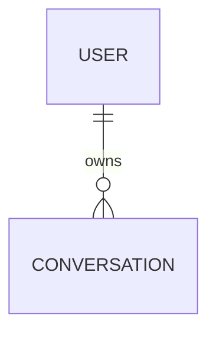
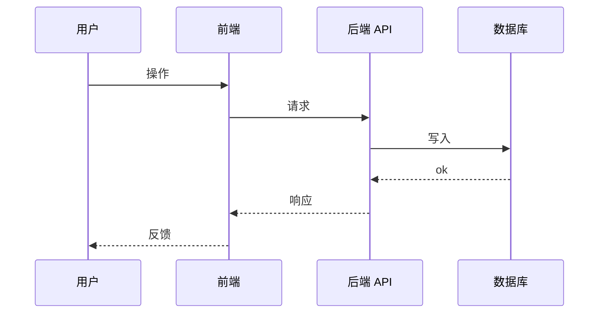
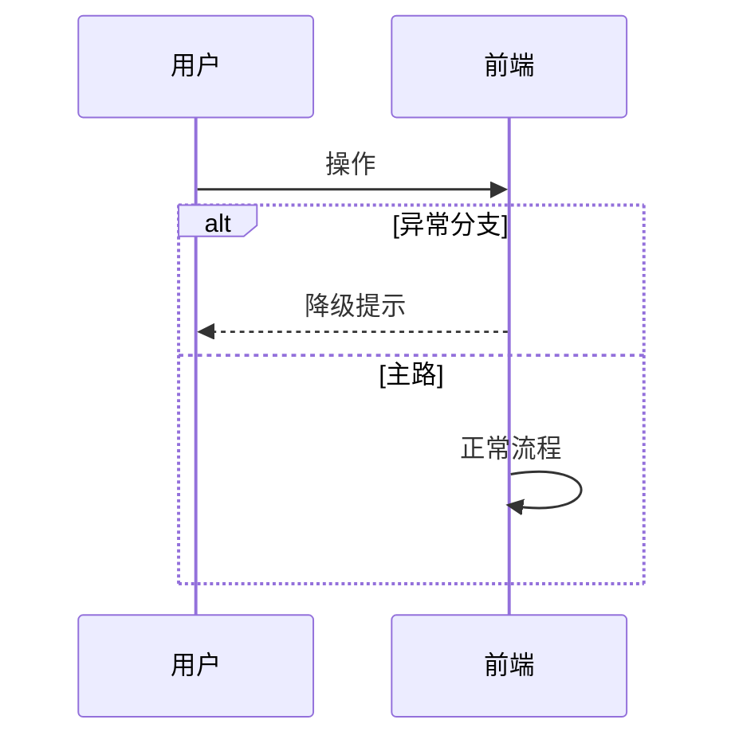

# 引思助手 需求分析模版

> **使用说明**
> - 每份需求分析对应一个版本，命名规则：`需求分析_v[版本号]_[功能名].md`（如 `需求分析_v0.1_MVP.md`）
> - 上游 = 同版本 PRD（PRD_v[X.X]_[功能名].md）；下游 = 高层架构设计
> - **F-REQ 编号规则**：`FR-[模块]-[三位序号]`（如 `FR-OCR-001`、`FR-AGENT-001`）
> - **NFR 编号规则**：`NFR-[类别]-[三位序号]`（如 `NFR-PERF-001`、`NFR-SEC-001`）
> - **NFR 必须量化**：不接受"响应要快"，要写"流式首字 ≤ 2 秒"
> - 所有 FR / NFR / TC 必须可在 PRD 中找到源 US 或 Agent 行为规约项

---

## 0. 本文档职责边界

> 需求分析是 PRD 到技术设计之间的**桥梁**——把"产品想要什么"翻译为"系统需要做哪些功能、达成哪些非功能指标、识别哪些数据实体、依赖哪些外部服务、组件之间如何对话"。
> **不规定如何实现**，那是高层架构与概要 / 详细设计的事。

### 0.1 本文档写什么

- 把 PRD 的 US 拆解为可估时、可分配的**功能点** FR（按模块分组）
- 提炼**非功能需求** NFR（按类别分组，可度量）
- 列出**系统边界**（输入 / 输出 / 不含）
- 盘点**关键约束**（平台 / 业务 / 团队）
- 识别**数据实体**与实体间关系（实体名 + 关键属性 + 关系，**不写**字段类型 / 索引）
- 盘点**外部依赖**与集成边界（接哪些第三方 / 自有服务、失败模式）
- 画**关键时序图**（系统组件视角，主流程 + 异常分支）
- 写**用例 UC**（主参与者 + 主流程 + 分支流）
- 列**异常场景与降级**（触发条件 + 降级策略 + 用户提示话术）
- 把 PRD 的 Given/When/Then **用例化为可执行测试用例** TC
- 做 **PRD US ↔ F-REQ 双向覆盖核对**
- **风险登记**、**估时汇总**
- **概要设计准入检查表**（硬门控）+ **下游开放问题清单**

### 0.2 本文档不写什么

| 不写 | 写在哪里 |
|---|---|
| 系统模块如何切分、模块依赖图 | 高层架构设计 |
| 技术栈选型与备选方案对比 | 高层架构设计 |
| 数据表字段类型 / 索引 / 外键 / RLS 策略 | 概要设计 |
| API 端点的字段契约 / 错误码 | 概要设计 |
| 节点 / 类 / 函数级接口定义 | 概要设计 |
| Prompt 模板、算法实现、错误处理路径 | 详细设计 |
| 产品 UI 元素 / 页面规约 | PRD §6 |
| 业务目标、量化成功指标、用户角色 | PRD §2、§3 |

### 0.3 与上下游文档的衔接

| 关系 | 文档 | 衔接点 |
|---|---|---|
| ↑ | PRD | 每条 FR 必须有源 US 编号；**不能引入 PRD 未规约的产品行为** |
| ↑ | PRD §8 Agent 行为规约 | 拆为多个 FR + 对应 TC，可单独验收 |
| ↓ | 高层架构设计 | 本文档的 §3 系统边界 / §5 FR 模块分组 / §8 外部依赖 → 模块划分输入 |
| ↓ | 概要设计 | 本文档的 §6 NFR / §7 实体 → 接口契约 + 表设计 |
| ↓ | 详细设计 | 本文档的 §11 异常降级 / §12 TC → 详细测试用例 + prompt 测试集 |

---

## 1. 文档元信息

| 字段 | 值 |
|---|---|
| 文档名称 | 需求分析_v[X.X]_[功能名].md |
| 版本 | v[X.X] |
| 状态 | 草稿 / 评审中 / 已签发 |
| 创建日期 | YYYY-MM-DD |
| 最后更新 | YYYY-MM-DD |
| 编写人 | [姓名] |
| 评审人 | [开发负责人 / 架构负责人] |
| **关联文档** | |
| ↑ 上游：PRD | doc/PRD/PRD_v[X.X]_[功能名].md |
| → 下游：高层架构设计 | doc/高层架构/高层架构设计_v[X.X]_[功能名].md |
| → 下游：概要设计 | doc/设计/[功能]_概要设计.md |
| → 下游：详细设计 | doc/设计/[功能]_详细设计.md |

---

## 2. 拆解方法说明

### 2.1 颗粒度与优先级

- **FR 颗粒度**：每条 FR 控制在 **0.5 ~ 2 天**单人完成；超出此颗粒应进一步拆分
- **优先级体系**：沿用 PRD MoSCoW
  - **Must**：MVP 上线必需，不做不能验收
  - **Should**：强烈建议；时间允许补
  - **Could**：可选；推迟到下个版本
- **估时方法**：粗略小时（0.5 天 = 4 小时 / 1 天 = 8 小时），按单人独立开发计

### 2.2 编号规则

#### F-REQ 编号 — `FR-[模块]-[三位序号]`

模块前缀按系统职责切分，例：
- `AUTH` — 用户注册 / 登录 / 鉴权
- `UI` — 主框架、对话页、侧边栏等前端骨架
- `OSS` — 图片对象存储 / 上传链路
- `VISION` — 视觉理解（OCR + 图形描述）
- `AGENT` — Agent 引擎（节点、阶段、判据）
- `FALLBACK` — Agent 兜底（卡住 / 偏离 / 越界）
- `OUTPUT` — 知识点 / 思路输出
- `CONV` — 会话生命周期（恢复 / 新建 / 切换）
- `ADMIN` — 家长后台

新增模块需补到本规约。

#### NFR 编号 — `NFR-[类别]-[三位序号]`

类别前缀按质量属性切分：
- `PERF` — 性能 / 时延
- `SEC` — 安全 / RLS / 鉴权
- `PRIVACY` — 隐私 / 数据可见性
- `OBS` — 可观察性 / 日志 / 监控
- `QUALITY` — 内容质量 / UX
- `UX` — 容错友好 / 错误提示
- `BUSINESS` — 业务量化指标（来自 PRD §2.3）
- `PLATFORM` — 平台 / 浏览器兼容

### 2.3 TC 验收基准

每条 FR 至少 1 个 TC；每条 TC 必须三段式可执行：**前置条件 → 操作步骤 → 预期结果**。

---

## 3. 系统边界

> 给架构师一张「I/O 速查表」，防止范围蔓延。

| 方向 | 内容 |
|---|---|
| **输入** | [外部进入系统的数据 / 事件] |
| **输出** | [系统产出的数据 / 反馈] |
| **不含** | [明确排除项；每条标注是依赖哪份文档 / 哪个版本] |

---

## 4. 关键约束

### 4.1 平台约束

> Web H5 / Next.js / Supabase / 第三方服务的硬性限制。

| # | 约束 | 影响范围 | 应对策略 |
|---|---|---|---|
| 1 | [约束描述] | [影响哪些 FR] | [应对] |

### 4.2 业务约束

> 产品业务规则带来的约束。

- [约束 1]
- [约束 2]

### 4.3 团队约束

> 人力 / 时间 / 技能 / 预算的边界。

- [约束 1]
- [约束 2]

---

## 5. 功能需求 FR

> 按模块分组。每条 FR：编号 / 标题 / 描述 / 源 US 或 Agent 项 / 优先级 / 估时 / 依赖 FR。

### 5.1 模块 [MOD-A]

| 编号 | 标题 | 描述（产品行为视角） | 源 | 优先级 | 估时 | 依赖 |
|---|---|---|---|---|---|---|
| FR-[MOD-A]-001 | [标题] | [描述] | US-XXX | Must | 1 天 | — |

### 5.2 模块 [MOD-B]

| 编号 | 标题 | 描述 | 源 | 优先级 | 估时 | 依赖 |
|---|---|---|---|---|---|---|

### 5.3 估时小计

- **Must 合计**：[N] 天（[N] 个 FR）
- **Should 合计**：[N] 天
- **Could 合计**：[N] 天
- **总计**：[N] 单人天（含 30% 缓冲约 [N] 天）

---

## 6. 非功能需求 NFR

> 按类别分组。每条 NFR：编号 / 维度 / 指标描述 / 量化目标 / 验证方法 / 源 PRD。

### 6.1 类别 PERF

| 编号 | 指标描述 | 量化目标 | 验证方法 | 源 |
|---|---|---|---|---|
| NFR-PERF-001 | [描述] | [量化] | [验证] | [来源] |

### 6.2 类别 SEC / PRIVACY / OBS / QUALITY / UX / BUSINESS / PLATFORM

[按需扩展]

---

## 7. 数据实体识别

> 只列**实体名 + 关键属性 + 实体间关系**。不写字段类型 / 索引 / 外键 / RLS。

### 7.1 实体清单

| 实体 | 中文 | 关键属性（产品语义） | 持久化位置 |
|---|---|---|---|
| [Entity1] | [中文] | [关键属性] | [位置] |

### 7.2 实体关系

[或文字描述关系]

---

## 8. 外部依赖盘点

> 每条标注：用途、SLA 期望、失败模式、降级方案、调用方向。

| 依赖 | 用途 | 调用方向 | SLA 期望 | 失败模式 | 降级方案 |
|---|---|---|---|---|---|
| [服务] | [用途] | [方向] | [SLA] | [失败] | [降级] |

---

## 9. 关键时序图

> 系统组件视角，**不是用户旅程**（用户旅程见 PRD §5）。
> 参与者：用户 / 前端 / 后端 API / 节点 / 数据库 / 外部服务。
> 至少包含主流程 + 一条异常 / 降级流程。

### 9.1 主流程：[路径名]

### 9.2 异常流程：[降级路径名]

---

## 10. 用例描述 UC

> 把 PRD 用户故事按主要参与者 + 触发场景组织为用例。每个用例至少含主流程；有分支的写 alt flow。

### UC-XXX [用例标题]

- **主要参与者**：[Actor]
- **前置条件**：[Preconditions]
- **触发**：[Trigger]
- **主流程**：
  1. ...
- **可选 / 分支流**：
  - **A1**：[条件] → [步骤]
- **后置条件**：[Postconditions]
- **关联 FR**：FR-[MOD]-XXX

---

## 11. 异常场景与降级

> 运行时异常的统一清单。**每条必须给用户提示话术**（不是技术错误码）。

| # | 异常场景 | 触发条件 | 降级策略 | 用户提示话术 | 关联 FR / NFR |
|---|---|---|---|---|---|
| 1 | [异常名] | [触发条件] | [降级] | "[完整话术]" | [关联编号] |

---

## 12. 验收测试用例 TC

> 由 PRD US Given/When/Then 派生；一条 US 可派生多条 TC（主路径 + 边界 + 异常）。

### 12.X [按模块或场景分小节]

#### TC-XXX [测试用例标题] ⟵ US-XXX / FR-[MOD]-XXX

- **前置条件**：[数据状态 / 用户状态 / 系统状态]
- **测试步骤**：
  1. [可重复执行的操作]
- **预期结果**：[可观察、可验证]
- **优先级**：P0 / P1 / P2

---

## 13. PRD US ↔ F-REQ 覆盖核对

> 反向核对：每条 PRD US 必须对应到至少一条 FR。**没覆盖的 US 视为遗漏**。

| US 编号 | US 标题 | 覆盖 FR | 备注 |
|---|---|---|---|
| US-XXX | [标题] | FR-[MOD]-XXX | — |

> ⚠️ 若有 US 未对应 FR，记录于本表"备注"列；同步登记到 §17 输出清单。

---

## 14. 风险登记

> 技术风险、依赖风险、不确定性。

| 编号 | 风险描述 | 影响范围 | 严重度 | 概率 | 缓解 / 决策 | 决策时点 |
|---|---|---|---|---|---|---|
| R-001 | [描述] | [影响 FR/NFR] | 高 / 中 / 低 | 高 / 中 / 低 | [应对] | YYYY-MM-DD |

---

## 15. 估时与关键路径

### 15.1 工作量分布

| 优先级 | FR 数 | 估时（单人天） |
|---|---|---|
| Must | [N] | [合计] |
| Should | [N] | [合计] |
| Could | [N] | [合计] |
| **合计** | [N] | **[合计]**（含 30% 缓冲约 [N] 天） |

### 15.2 关键路径

[列出存在阻塞依赖的 FR 链路，便于识别先做什么]

### 15.3 旁路工作

[联调、测试、灰度验证等不计入开发主线但要预留的时间]

---

## 16. 概要设计准入检查表

> **硬门控**：全部 ✅ 才可进入概要设计阶段，不完整退回补充。

| # | 检查项 | 状态 | 备注 |
|---|---|---|---|
| 1 | 所有 FR 来源均可追溯到 PRD 中的 US 编号 | ⬜ | — |
| 2 | 所有 NFR 指标已量化（无模糊描述） | ⬜ | — |
| 3 | 系统边界「不含」项已明确列出 | ⬜ | — |
| 4 | 平台 / 业务 / 团队 三类约束已列出 | ⬜ | — |
| 5 | 数据实体名 + 关键属性 + 关系已明确（基数标注） | ⬜ | — |
| 6 | 外部依赖已列出（含失败模式 + 降级方案） | ⬜ | — |
| 7 | 关键时序图已覆盖主流程 | ⬜ | — |
| 8 | 关键时序图已覆盖至少一条异常 / 降级流程 | ⬜ | — |
| 9 | 异常场景清单含用户提示话术 | ⬜ | — |
| 10 | PRD US ↔ F-REQ 覆盖核对表完成（无遗漏 US） | ⬜ | — |
| 11 | 所有 Must 优先级 FR 至少有 1 个 TC | ⬜ | — |
| 12 | 风险登记每条有缓解 / 决策方案 | ⬜ | — |
| 13 | 下游开放问题已分配负责文档与截止日 | ⬜ | — |
| 14 | 编写人 + 评审人确认可进入概要设计 | ⬜ | — |

---

## 17. 输出清单（下游文档需要回答的问题）

> 本文档无法决策但下游文档必须回答的问题。每条转给对应的下游文档负责人。

| # | 问题 | 由谁回答（文档） | 截止日 |
|---|---|---|---|
| 1 | [开放问题] | 高层架构设计 / 概要设计 / 详细设计 | YYYY-MM-DD |
