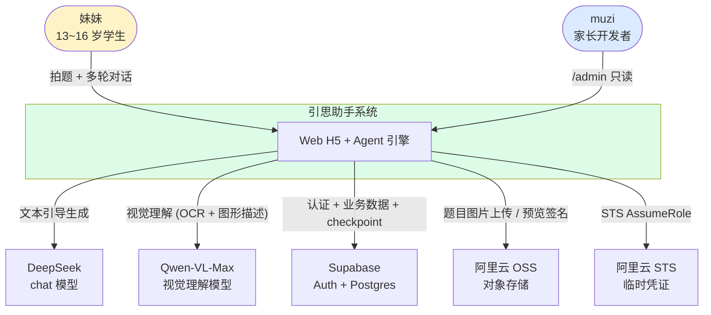
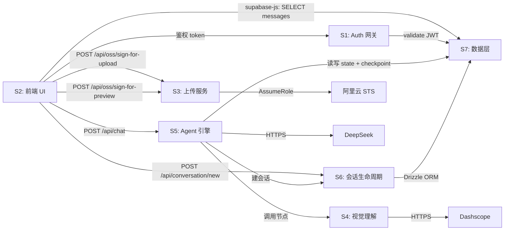
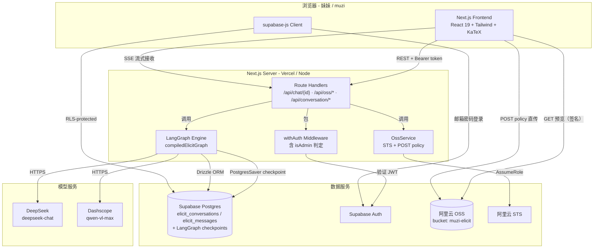
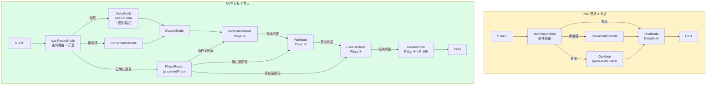
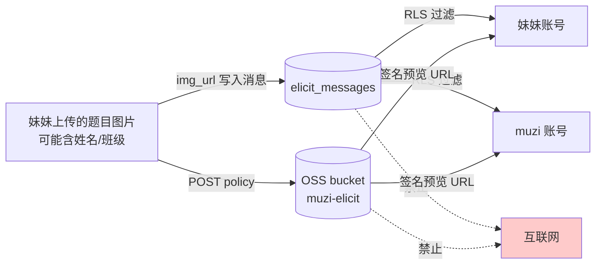
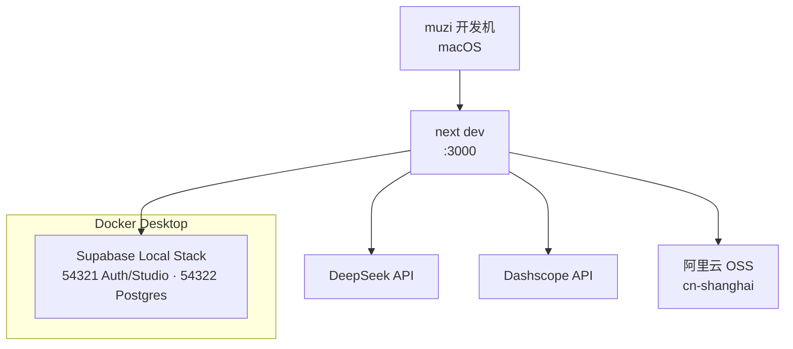
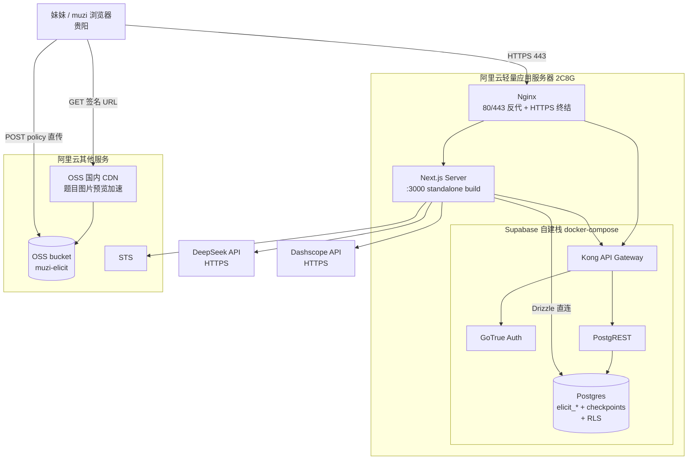

# 高层架构设计_v0.1_MVP — 引思助手 MVP 版本

## 0. 本文档职责边界

本文档把 `需求分析_v0.1_MVP.md` 的 22 个 FR / 12 个 NFR / 8 个实体 / 8 个外部依赖，组织为可独立实现的子系统与它们之间的通信协议。
**不做**：模块内部接口签名、表字段类型、prompt 模板——交下游「概要设计 / 详细设计」。

详见 `高层架构设计模版.md §0`。

---

## 1. 文档元信息

| 字段 | 值 |
|---|---|
| 文档名称 | 高层架构设计_v0.1_MVP.md |
| 版本 | v0.1 |
| 状态 | 草稿 |
| 创建日期 | 2026-05-19 |
| 最后更新 | 2026-05-19 |
| 编写人 | Claude（开发主力）|
| 评审人 | muzi（产品负责人 + 架构方向把控）|
| **关联文档** | |
| ↑ 上游：PRD | `doc/PRD/PRD_v0.1_MVP.md` |
| ↑ 上游：需求分析 | `doc/需求分析/需求分析_v0.1_MVP.md` |
| → 下游：概要设计 | `doc/概要设计/概要设计_v0.1_MVP.md`（待产出）|
| → 下游：详细设计 | `doc/详细设计/详细设计_v0.1_MVP.md`（待产出）|

---

## 2. 架构目标与决策原则

### 2.1 架构目标

- **G1 — 妹妹端体验稳定**：满足 NFR-PERF-001（首字 ≤ 2s）+ NFR-PERF-002（OCR ≤ 5s）+ NFR-QUALITY-001（单条 ≤ 200 字）
- **G2 — 单人可维护**：muzi 后端经验丰富但前端 / LangGraph 不熟，架构必须让 muzi 能在 Claude 不在场时**单人改一个 bug 不被代码淹没**
- **G3 — 月度成本可控**：API 账单 ≤ ¥50 / 月，不应该为 MVP 烧钱

### 2.2 决策原则（按重要性排序）

| # | 原则 | 含义 / 应用 |
|---|---|---|
| 1 | **可读性 > 性能** | 单用户场景不需要榨干性能；任何"为了快而牺牲可读性"的优化都默认不做 |
| 2 | **就近迭代 > 完美重构** | POC 已有的代码尽量增量演化，不大改；保留 `chatNode` 文件名等是因为重构 import 链路成本高于收益 |
| 3 | **显式 > 隐式** | 状态、决策、流转都写在代码字面，不用魔法（如不用 reflection 自动注册节点）|
| 4 | **拒绝早优化** | 没用户压力前不引入 Redis / 队列 / 分布式锁；先跑通主流程 |
| 5 | **文档化决策** | 每个"非显然选择"在代码注释或 PR 描述中点明理由（"为什么用 X 而不用 Y"），方便 muzi 后续维护 |

---

## 3. 系统上下文（C4 L1）

### 3.1 上下文图

### 3.2 外部参与者

| 参与者 | 与系统的交互 |
|---|---|
| **妹妹（学生）** | 注册登录 / 拍题上传 / 多轮对话 / 查看历史会话 / 查看知识点卡片 |
| **muzi（家长开发者）** | 注册登录 / `/admin` 只读查看妹妹所有会话 / 在终端做代码维护与部署 |

### 3.3 外部系统

| 外部系统 | 用途 | 通信方式 |
|---|---|---|
| DeepSeek API | `deepseek-chat` 模型完成文本对话生成 | HTTPS REST（OpenAI 兼容协议）|
| Dashscope（阿里云）| `qwen-vl-max` 模型完成图片视觉理解 | HTTPS REST（OpenAI 兼容协议）|
| Supabase | 邮箱密码认证 + Postgres 数据库 + Row Level Security | HTTPS REST + supabase-js SDK + postgres-js（服务端 Drizzle）|
| 阿里云 OSS | 题目图片对象存储；浏览器直传 + 服务端预览签名 | POST policy（浏览器 → OSS）+ ali-oss SDK（服务端）|
| 阿里云 STS | RAM AssumeRole 签发 OSS 临时凭证 | ali-oss SDK |

---

## 4. 服务 / 子系统拆分

### 4.1 子系统清单

> 7 个子系统，按职责单一原则切分。每个子系统对外职责清晰、内部实现可被替换。

| 子系统 | 职责 | 包含的 FR 模块 | 物理位置 |
|---|---|---|---|
| **S1: Auth 网关** | 邮箱密码注册 / 登录 / 鉴权中间件 / 家长身份判定 | FR-AUTH, FR-ADMIN-001 | `src/lib/auth.ts`、`src/app/(auth)/*` |
| **S2: 前端 UI** | 主框架、对话页、侧边栏、上传 / 多题 / 换题 / 历史浮层、知识点卡片渲染、家长后台只读页面 | FR-UI, FR-OSS-001 (前端部分), FR-VISION-002 (浮层), FR-OUTPUT-001 (渲染), FR-CONV-002, FR-ADMIN-002 | `src/app/**` + `src/features/**` |
| **S3: 上传 / 预览服务** | OSS STS 凭证签发、POST policy 构造、预览 URL 签名 | FR-OSS-001 (后端部分) | `src/services/OssService.ts` + `src/app/api/oss/**` |
| **S4: 视觉理解** | qwen-vl-max 调用、OCR + 图形描述、LaTeX 输出标准化 | FR-VISION-001 | `src/agents/nodes/VisionNode.ts`（原 OcrNode 改造）+ `src/agents/models/qianwen-model.ts` |
| **S5: Agent 引擎** | LangGraph 节点编排、波利亚四阶段、阶段切换、守卫机制 | FR-AGENT-*, FR-FALLBACK-* | `src/agents/graphs/ChatGraph.ts` + `src/agents/nodes/**` + `src/agents/schemas/**` |
| **S6: 会话生命周期** | 会话创建 / 历史恢复 / 换题判定 / hasResolved 状态维护 | FR-CONV-*, FR-UI-002/003, FR-ADMIN-002 (会话列表) | `src/agents/nodes/ConversationNode.ts` + `src/db/mappers/ConversationMapper.ts` + `src/app/api/conversation/**`（新增）|
| **S7: 数据层** | Drizzle ORM（elicit_conversations）+ Supabase Client（elicit_messages）+ LangGraph PostgresSaver | 所有 FR 的存储依赖 | `src/db/**` |

### 4.2 子系统间的依赖关系

### 4.3 FR 模块 → 物理位置映射

| FR 模块 | 物理位置 | 备注 |
|---|---|---|
| `FR-AUTH-*` | `src/lib/auth.ts` + `src/app/(auth)/login/page.tsx` | 复用 `withAuth` 已有逻辑 |
| `FR-UI-*` | `src/app/page.tsx` + `src/features/chat/**` + `src/features/sidebar/**` | shadcn/ui + Tailwind |
| `FR-OSS-*` | `src/services/OssService.ts` + `src/app/api/oss/**` | POC 已有，保留 |
| `FR-VISION-*` | `src/agents/nodes/VisionNode.ts`（重命名）+ `src/agents/models/qianwen-model.ts`（清理） | 升级模型 ID + 清理顶层副作用 |
| `FR-AGENT-*` | `src/agents/nodes/{Classify,Understand,Plan,Execute,Review}Node.ts` + `src/agents/graphs/ChatGraph.ts` | 现有 ChatNode 拆解；详见 §6 |
| `FR-FALLBACK-*` | `src/agents/nodes/guards/{StuckGuard,DeviationGuard,OutOfScopeGuard}.ts` | 详细设计决定独立节点 vs pre-check |
| `FR-OUTPUT-*` | `src/agents/nodes/ReviewNode.ts`（输出端）+ `src/features/chat/KnowledgeCard.tsx`（渲染端）| Inline JSON 协议 |
| `FR-CONV-*` | `src/agents/nodes/ConversationNode.ts` + `src/app/api/conversation/new/route.ts`（新增）| §8 D3 决策 |
| `FR-ADMIN-*` | `src/app/admin/**` + `src/lib/auth.ts::isAdmin` | §8 D4 决策 |

---

## 5. 整体技术架构图（C4 L2）

### 5.1 Container 图

### 5.2 跨模块通信协议

| 起点 | 终点 | 协议 | 用途 |
|---|---|---|---|
| 前端 FE | Route Handler | **SSE**（AI SDK UI message 协议） | `/api/chat/[conversationId]` 流式对话 |
| 前端 FE | Route Handler | **REST + Bearer JWT** | OSS 签名、新建会话、admin 列表 |
| 前端 FE | OSS Bucket | **POST policy（HTML form）** | 题目图片直传，不经过后端中转 |
| 前端 FE | OSS Bucket | **GET（签名 URL）** | 预览图片 |
| supabase-js（前端）| Supabase DB | **PostgREST + RLS** | 读 `elicit_messages` 列表 |
| supabase-js（前端）| Supabase Auth | **Supabase Auth API** | 邮箱密码登录 / 登出 |
| Route Handler | LangGraph | **进程内函数调用** | `compiledElicitGraph.stream(...)` |
| LangGraph 节点 | Postgres | **postgres-js 连接 + Drizzle ORM** | 业务表读写（`prepare: false` 适配 Supavisor）|
| LangGraph 引擎 | Postgres | **PostgresSaver SDK** | checkpoint 持久化 |
| LangGraph 节点 | DeepSeek | **HTTPS（OpenAI 兼容）** | 通过 `@langchain/openai::ChatOpenAI` |
| VisionNode | Dashscope | **HTTPS（OpenAI 兼容）** | 通过 `@langchain/openai::ChatOpenAI` (configBase) |
| OssService | 阿里云 STS | **ali-oss SDK** | AssumeRole 签发 |

---

## 6. LangGraph 节点拓扑

> 本章是 AI Agent 项目专属，回答需求分析 §17 #1（节点拓扑演化）+ #2（state 字段语义）。
> 仅写节点的**对外行为**和**state 字段语义**；**不写** prompt 模板、字段类型——交详细 / 概要设计。

### 6.1 拓扑演化：POC → MVP

### 6.2 节点清单（MVP）

| 节点 | 触发条件 | 主要职责 | 输出（写入 state）|
|---|---|---|---|
| **startFanoutNode**（升级） | START 边 | 根据 `conversationId 是否存在` / `是否有图片` / `currentPhase 是否设置` 决定路由 | 路由数组（fan-out）|
| **ConversationNode**（保留）| 新会话 | 通过 Drizzle 创建 `elicit_conversations` 行；通过 `data-custom` chunk 把 `{conversationId, title}` 流式回传 | `conversationId` 写入 DB |
| **VisionNode**（升级原 OcrNode）| 含 `questionImgUrl` | 调 qwen-vl-max；输出文字 + 公式 + 图形描述 | `ocrResult`（含 `subject` / `latex` / `visualDescription` / `multiQuestion`）|
| **ClassifyNode**（新）| 题目已确认且未分类 | 归类为 `代数 / 几何 / 函数 / 其他` | `problemType` |
| **UnderstandNode**（新）| `currentPhase=understand` | Pólya ① 引导反问；判定是否进入下一阶段 | `currentPhase`（推进后切到 `plan`）；`stuckCount.understand++` |
| **PlanNode**（新）| `currentPhase=plan` | Pólya ② 引导联想方法；触发 §8.3 题型术语 + 数学思想反问句 | `currentPhase`；`stuckCount.plan++` |
| **ExecuteNode**（新）| `currentPhase=execute` | Pólya ③ 步骤反问；不代算 | `currentPhase`；`stuckCount.execute++` |
| **ReviewNode**（新）| `currentPhase=review` | Pólya ④ 回顾 + 元认知问句 + 输出 P-105 卡片 | `currentPhase=done`；P-105 JSON 嵌入 assistant message |
| **PhaseRouter**（新条件边）| 历史会话恢复时 | 读 `currentPhase` 决定从哪个节点继续 | （仅路由，不改 state）|

### 6.3 State 字段语义（在现 `ElicitGraphStateSchema` 上增量）

> 仅语义级。具体 TypeScript 类型、默认值、Zod 校验由概要设计回答。

| 字段名 | 语义 | 谁写 | 谁读 |
|---|---|---|---|
| `messages` *（已有）* | LangChain 对话历史 | 所有阶段节点 | 所有节点 |
| `userId` *（已有）* | Supabase auth.users.id | startFanout | 所有节点 |
| `conversationId` *（已有）* | 业务 UUID（前端生成 / 服务端创建后回写）| ConversationNode | 所有节点 |
| `questionImgUrl` *（已有）* | 当前轮上传的题目图片 URL | startFanout | VisionNode |
| `hasResolved` *（已有，语义升级）* | 题目是否已通过 P-103 确认；前端图片按钮判定的权威源 | VisionNode（多题：false 等用户选）/ ClassifyNode（单题：true 进 Pólya）| 前端 / startFanout |
| `ocrResult` *（已有，结构升级）* | 视觉理解结构化结果（文字 + 公式 + 图形描述 + 多题列表）| VisionNode | ClassifyNode / 前端 |
| `currentPhase` **新** | 当前所处波利亚阶段：`understand / plan / execute / review / done` | 各阶段节点 | PhaseRouter / 前端 P-104 |
| `problemType` **新** | 题型分类：`algebra / geometry / function / other` | ClassifyNode | PlanNode / ExecuteNode |
| `stuckCountPerPhase` **新** | 各阶段无推进迹象的连续计数 | 各阶段节点 | StuckGuard |
| `probedQuestionIds` **新** | 已在卡住兜底中抛出过的 5 问编号集合 | StuckGuard | StuckGuard（避免重复）|
| `lastDeviationAt` **新** | 上一次偏离回正的轮次（避免连续两轮都拉回，影响体验）| DeviationGuard | DeviationGuard |

### 6.4 守卫机制

> 守卫不是独立顺序节点，而是**每个 Pólya 节点入口的 pre-check 函数**——这避免拓扑爆炸，也让卡住 / 偏离逻辑可重用。详细设计阶段决定物理形态（pre-check 函数 vs subgraph）。

| 守卫 | 触发条件 | 行为 |
|---|---|---|
| **StuckGuard** | `stuckCountPerPhase[currentPhase] ≥ 3` | 第一段：从 5 问 menu（条件用完 / 画图 / 特例 / 等价 / 类比）选未尝试的一条；若 5 问已用尽进第二段（抛知识点 + 方法，**不给数值答案**）|
| **DeviationGuard** | 用户回复跨过当前阶段语义空间 | 用 §8.4.1 偏离话术拉回；不推进 `currentPhase`；`lastDeviationAt` 写当前轮 |
| **OutOfScopeGuard** | 用户回复或图片识别为非数学 / 非学科话题 | 用 §8.4.1 越界话术；END（不进入 Pólya 循环）|
| **VisionFailureGuard** | VisionNode 返回空 / 异常 | 用 §8.4.1 OCR 失败话术；END |

---

## 7. 成本估算

### 7.1 使用强度假设

| 维度 | 估算值 | 依据 |
|---|---|---|
| 每日题数 | 5 道 | 妹妹晚上做作业，每晚 3~7 道不会的 |
| 每题平均轮数 | 10 轮 | NFR-BUSINESS-003 目标 |
| 每轮 input token | ~2,500 | 历史上下文（含 system prompt + 累积对话）|
| 每轮 output token | ~200 | NFR-QUALITY-001 限定单条 ≤ 200 字 |
| 每题 OCR input token | ~3,000 | 图片 token 化 + system prompt |
| 每题 OCR output token | ~500 | 文字 + 公式 + 图形描述 |
| 月活跃天数 | 25 | 周末 / 假期 / 不做作业的日子 |

### 7.2 月度成本分解

| 项目 | 单价 | 月用量 | 月费用 |
|---|---|---|---|
| DeepSeek-chat input | ¥1 / 1M tokens | 5 × 10 × 25 × 2.5K = **3.13M** | **¥3.13** |
| DeepSeek-chat output | ¥2 / 1M tokens | 5 × 10 × 25 × 200 = **0.25M** | **¥0.50** |
| Qwen-VL-Max input | ¥20 / 1M tokens（视觉版本溢价）| 5 × 25 × 3K = **0.375M** | **¥7.50** |
| Qwen-VL-Max output | ¥60 / 1M tokens | 5 × 25 × 500 = **0.063M** | **¥3.75** |
| 阿里云 OSS 存储 | ¥0.12 / GB / 月 | 5 × 25 × 200KB ≈ 25 MB | **¥0** |
| 阿里云 OSS 流量 | ¥0.5 / GB（外网下行）| ~50 MB / 月 | **¥0.03** |
| **阿里云轻量应用服务器**（2C8G + 4M 带宽，跑 Next.js + Supabase 自建栈）| ¥104 / 月 | 1 台（华东 / 华南机房）| **¥104** |
| Supabase（自建于上述 ECS）| 0 | 与 ECS 合并计费 | **¥0** |
| 域名（`.com`，可选）| ~¥60 / 年 | 1 个 | **¥5** |
| **MVP 月度总计** | — | — | **~¥124 / 月** |

> 估算偏保守。若 prompt engineering 阶段试错频繁、或妹妹晚上突击做作业，单月 API 部分最高可能到 ¥30~50；总计上限约 **¥160 / 月**。

### 7.3 总览

- **MVP 月度总成本预估**：**¥120 ~ ¥160**
- **超出预算的报警阈值**：API 部分单月 > ¥80 → 检查是否 prompt 失控 / 调用循环（详细设计阶段加 daily cost log）
- **基础设施部分（ECS + 域名）**：固定支出 ¥109 / 月，不会因使用强度波动
- **为什么不用 Vercel + Supabase Cloud**：妹妹在贵阳（大陆），Vercel 主域名被 DNS 污染 / 无 ICP，Supabase Cloud 大陆访问延迟 200-500ms 且偶发断连。详见 §10.2、§12 AR-008

---

## 8. 技术选型与关键决策

### 8.1 决策清单总览

| ID | 议题 | 采纳方案 | 影响 FR / 上游 |
|---|---|---|---|
| D1 | 模型分工：视觉 vs 文本 | Qwen-VL-Max（视觉）+ DeepSeek（文本引导） | FR-VISION-*、FR-AGENT-* |
| D2 | LangGraph 节点演化策略 | ChatNode 拆为 5 个 Pólya 阶段节点 + 保留 Conversation/Vision；守卫作为 pre-check 函数 | §17 #1 |
| D3 | `hasResolved` 状态权威源 | LangGraph state 为权威；DB `elicit_conversations.has_resolved` 镜像，每次 checkpoint 落库时同步 | §17 #14 / FR-CONV-002 |
| D4 | 家长身份判定 | ENV `ADMIN_EMAILS` 逗号分隔 allowlist；启动时载入；`withAuth` 扩展 `isAdmin` | §17 #4 / FR-ADMIN-001 |
| D5 | P-105 卡片持久化形态 | assistant message `content` 内嵌结构化 JSON（前端解析渲染）；不独立表 | §17 #10 / FR-OUTPUT-001 |
| D6 | state 扩展位置 | 沿用现 `ElicitGraphStateSchema`，加 5 个字段（详见 §6.3） | §17 #2 |
| D7 | 阶段判据实现策略 | MVP 用关键词命中 + 简单计数；prompt 内要求模型输出 `phase_signal:"COMPLETED"` 字符串，框架解析 | §17 #5 / R-002 |
| D8 | OSS STS 角色信任策略 | 沿用现 `acs:ram::<ALIYUN_ACCOUNT_ID>:role/elicitossmanagerrole`；MVP D1 跑端到端上传一次验证完备性 | §17 #9 / R-005 |
| D9 | 前端状态管理 | Zustand（已 POC，沿用）+ React 19 Compiler（自动 memo）| FR-UI-* |
| D10 | LaTeX 渲染库 | KaTeX（比 MathJax 轻 80%）；fallback 为纯文本 | FR-VISION-001 / R-006 |

### 8.2 决策详情

#### D1 模型分工：视觉 vs 文本

- **问题陈述**：DeepSeek 不支持原生多模态。如何处理带图题？
- **候选方案**：
  - A: 全链路单一多模态模型（Qwen-VL-Max / GPT-4o），每轮都把原图带上 — 成本高 ~5x、延迟大
  - B: Qwen-VL-Max 一次性输出"文字+图形描述"，后续 DeepSeek 处理 — 改动小、成本可控、保留 DeepSeek 中文数学推理优势
  - C: Hybrid 路由（含图走多模态，纯文本走 DeepSeek） — 两套链路维护成本高
- **采纳**：**方案 B**
- **理由**：成本（B 比 A 省 ~5x）+ 改动局限（只动 VisionNode）+ DeepSeek 中文数学引导能力强保留。原则 #1 #4 满足。
- **备选退路**：若 NFR-BUSINESS-002（解题成功率）因函数图像题/统计图表题描述质量不足跌破 70%，v0.2 升级到方案 A 或 C（PRD §12 #7 已登记）

#### D2 LangGraph 节点演化策略

- **问题陈述**：POC 有 4 节点（OcrNode / ConversationNode / ChatNode / startFinoutNode）。如何演化到 MVP 支持波利亚四阶段？
- **候选方案**：
  - A: 完全保留 ChatNode，在节点内做四阶段切换（state 字段控制 prompt 切换）— 单节点过于臃肿、prompt 不可读、违反原则 #3
  - B: 拆 ChatNode 为 5 个独立 Pólya 节点 + 阶段判据作为节点出口条件边 + 守卫作为 pre-check 函数 — 拓扑清晰、单文件可读、便于详细设计单独写每个 prompt
  - C: 每个 Pólya 阶段做成独立 subgraph — 抽象层级过深、调试困难
- **采纳**：**方案 B**
- **理由**：原则 #1 #3。每个节点 1 个 prompt，文件名即阶段名，muzi 维护时可直接定位。
- **备选退路**：若节点间共享逻辑过多（如同一个守卫调用 4 次），可在详细设计阶段抽出 utils；不改拓扑

#### D3 `hasResolved` 状态权威源

- **问题陈述**：FR-CONV-002（换题浮层判定）需要知道"当前会话是否已确认题目"。state 还是 DB 是权威？
- **候选方案**：
  - A: 纯 DB 字段（`elicit_conversations.has_resolved`），每轮节点结束同步写入 — 前端读 DB，强一致但写入开销大
  - B: 纯 LangGraph state — 前端无法访问，必须经后端 API 读取
  - C: state 权威 + DB 镜像（每次 checkpoint 落库时同步写 has_resolved）— 前端直接从 conversation 列表读，避免额外 RTT
- **采纳**：**方案 C**
- **理由**：前端 `useConversation` Zustand store 已经在加载侧边栏时读取 conversation 列表（含此字段），无额外开销；后端写入合并到 checkpoint 落库环节，原则 #2 #4。
- **备选退路**：若发现 state 与 DB 镜像漂移（极端情况：checkpoint 写成功但 conversation 更新失败），可加事务包裹

#### D4 家长身份判定

- **问题陈述**：FR-ADMIN-001 需要识别"哪些账号是家长"。怎么实现？
- **候选方案**：
  - A: ENV `ADMIN_EMAILS=email1,email2` allowlist — 0 数据库改动、可审查、改动需重启
  - B: Supabase `auth.users.app_metadata.role=admin` — 灵活、可热更新、需要 service_role key 才能改
  - C: 独立 `admin` 表 + UI 管理 — 最灵活、过度工程化（仅 1 个家长）
- **采纳**：**方案 A**
- **理由**：仅 1 个家长，灵活性需求为 0；ENV 改动需要重启在本项目反而是好事（强迫思考）；原则 #1 #4。
- **备选退路**：v0.2 若家长数 ≥ 3 升级到方案 B（Supabase metadata 维护）

#### D5 P-105 卡片持久化形态

- **问题陈述**：FR-OUTPUT-001 输出的"知识点 + 思路"卡片如何存储？
- **候选方案**：
  - A: 独立 `knowledge_cards` 表 — 结构化、便于 v0.2 错题本，但需要新表 + 新 API + 同步逻辑
  - B: assistant message `content` 内嵌结构化 JSON / Markdown — 0 schema 改动，前端用 JSON parser 解析
  - C: `elicit_messages.metadata` 加 jsonb 字段 — 半结构化，可扩展
- **采纳**：**方案 B**
- **理由**：MVP 阶段不需要错题本（PRD §12 #2 已登记）；JSON inline 让前端 `KnowledgeCard.tsx` 解析渲染；v0.2 扩展时再迁移到方案 A，迁移脚本可写。原则 #4。
- **备选退路**：v0.2 错题本上线时统一迁移到方案 A（详细设计阶段加迁移脚本）

#### D6 state 扩展位置

- **问题陈述**：5 个新字段（currentPhase / problemType / stuckCountPerPhase / probedQuestionIds / lastDeviationAt）放哪？
- **候选方案**：
  - A: 全部加在现 `ElicitGraphStateSchema` — 1 个 schema 文件，所有节点访问简单
  - B: 拆 `PhaseState` 子 schema — 模块化但读取要嵌套
  - C: 用 channel-specific reducers — 过度工程
- **采纳**：**方案 A**
- **理由**：5 个字段不多，单 schema 可读性更好；LangGraph state 扁平结构 + Zod 校验，符合原则 #3。
- **备选退路**：v0.2 若字段 > 15 个再拆子 schema

#### D7 阶段判据实现策略

- **问题陈述**：MVP 怎么判断"妹妹已复述出已知 + 求解目标"？
- **候选方案**：
  - A: 关键词命中 + 简单计数（让 prompt 显式输出 `phase_signal:"COMPLETED"` 字符串后由框架解析）— 简单、可调试、可解释
  - B: LLM-as-judge（独立 judge prompt 评估）— 准确但 +1 次 LLM 调用 / 成本翻倍 / 不可解释
  - C: 嵌入相似度（与"理想答案"对比） — 需要标注集，工作量大
- **采纳**：**方案 A**
- **理由**：MVP 优先跑通；关键词命中可由产品观察日志快速调优；原则 #4。R-002 在详细设计阶段最终选型，本架构层默认 A。
- **备选退路**：若 NFR-BUSINESS-002 跌破 70% 且诊断为"阶段判据漏判"，v0.2 升级方案 B

---

## 9. 安全架构

### 9.1 权限层级（3 层够用）

| 层级 | 职责 | 物理位置 |
|---|---|---|
| **L1: 路由级中间件** | `withAuth` 验证 JWT、注入 user；`isAdmin` 拒绝非 allowlist 用户访问 `/admin` | `src/lib/auth.ts` |
| **L2: 数据库 RLS** | Supabase Postgres Row Level Security——每条 `elicit_*` 行通过 `auth.uid() = user_id` 强制过滤 | Supabase migrations |
| **L3: OSS 临时凭证** | STS 签发 ≤ 1h 过期的临时 AccessKey；POST policy 限制 bucket / 路径 / 大小 | `src/services/OssService.ts` |

### 9.2 敏感数据流向

### 9.3 攻击面与缓解

| 攻击面 | 缓解方法 |
|---|---|
| **未登录访问 API** | `withAuth` 拒绝；返回 401 |
| **跨用户读取会话** | Postgres RLS；客户端构造任何 conversation_id 都被拦截 |
| **非家长访问 `/admin`** | `isAdmin` 中间件返回 403 + 路由级守卫 |
| **OSS 上传滥用** | STS POST policy 限制：bucket=`muzi-elicit`、单文件 ≤ 50MB、Content-Type 限 image/* |
| **OSS 资源公网访问** | bucket 私有；预览必须通过签名 GET URL |
| **API key 泄漏** | `.env.local` git ignored；服务端密钥（DEEPSEEK_API_KEY、OSS_ACCESS_KEY_SECRET、OSS_STS_ROLE_ARN）从不下发到浏览器 |
| **Prompt 注入** | 全程不执行用户输入作为代码；妹妹回复仅作为 LangChain HumanMessage 一字段传入 LLM |
| **Stack trace 泄漏** | NFR-UX-001 强约束：try/catch 后只返回非技术错误码；详细堆栈写后端日志 |

---

## 10. 部署架构

### 10.1 开发环境拓扑

### 10.2 生产环境拓扑（目标）

> **核心约束**：妹妹用户在贵阳（中国大陆）。Vercel + Supabase Cloud 在大陆访问性极差（Vercel 无 ICP / 主域名被污染；Supabase Cloud 延迟 200~500ms 偶发断连）。因此**全栈自建到阿里云轻量应用服务器**（杭州 / 上海 / 深圳机房）。

**关键点**：

- Next.js Server 与 Supabase 自建栈跑在**同一台 ECS**，内网通信（127.0.0.1 / docker network）零延迟
- 妹妹浏览器到 ECS 全程国内骨干网，延迟 < 50ms
- 公网域名需要 **ICP 备案**（阿里云协助申请，~20 天周期）—— 备案前用 IP 直接访问 + 自签 HTTPS 临时上线（详见 §12 AR-009）
- 关闭非必需 Supabase 服务（Realtime / Storage / Studio / Inbucket）以适配 8GB RAM

### 10.3 环境差异表

| 维度 | dev | production |
|---|---|---|
| 主机 | muzi 开发机（macOS）| 阿里云轻量应用服务器 2C8G（华东 / 华南）|
| Supabase 栈 | 本地 Docker（54321~54323） | 同机 docker-compose（关闭可选服务）|
| Next.js | `next dev`（HMR） | `next start`（standalone build）|
| 域名 | localhost:3000 | 自定义域名（备案后启用）/ IP 直连（备案中）|
| HTTPS | 无（http） | Nginx + Let's Encrypt 证书自动续签 |
| Postgres URL | `127.0.0.1:54322`（直连） | `127.0.0.1:54322`（同机内网直连，`prepare: false`）|
| OSS bucket | `muzi-elicit`（共享） | 同（单用户接受不隔离 dev/prod 数据）|
| `ADMIN_EMAILS` | `lxinlucas@gmail.com`（dev）| 同 |
| 日志 | 终端 stdout | systemd journal + docker logs（详细设计阶段决定是否汇总到阿里云 SLS）|
| 备份 | 无 | Postgres `pg_dump` 每日上传 OSS / 保留 7 天 |
| 上线方式 | `pnpm dev` | 本地 `pnpm build` → `scp` 上传 `.next/standalone` → systemd restart |

---

## 11. 明确不做的架构议题

> 这是对自己未来的诚实。MVP 不做不等于忘了——升级触发点写明确。

| 议题 | MVP 不做的理由 | 升级触发点 | 升级方向 |
|---|---|---|---|
| **高并发架构** | 单用户 QPS << 1 / Vercel Hobby 已够用 | 同时使用用户 > 5 / 进入班级场景 | Vercel Pro + 数据库连接池优化（Supavisor 已自带） |
| **海量数据架构** | 月增量 < 10MB；3 年 < 360MB；远低于 Supabase Free Tier 8GB | 总数据 > 5GB | Supabase Pro + 表分区 + 冷热分离 |
| **高性能缓存** | OCR 重复率近 0 / 单用户无热点 / 一会话一题 | 多用户共享题库 / 错题本上线后查询频繁 | Redis（Upstash Serverless）+ 题目指纹 |
| **高可用 / 灾备** | 单台 ECS 单故障域；MVP 接受 12h 停机（妹妹白天上学）；月 1~2 次重启窗口 | 商业化 / 多用户依赖 | 阿里云 ECS 多可用区 + Postgres 主备 + Nginx 负载均衡 |
| **WAF / DDoS 防护** | 单用户站点不是攻击目标 | 公开化 / 上线运营 | Cloudflare 接管 DNS |
| **观测平台**（APM / 分布式 trace）| 单实例 Next.js + 单库 Postgres / 日志足够 | 多服务 / 多实例 | Sentry + OpenTelemetry |
| **多环境**（test / staging）| 单人 + dev/prod 两环境够用 | 商业化 + 多人协作 | Vercel Preview Deployments + Supabase Branch DB |
| **国际化 / 多语言** | 仅妹妹一个中文用户 | 跨语区学生 | next-intl + 词条翻译表 |
| **支付 / 计费** | 个人项目 0 收费 | 商业化 | Stripe + Supabase Functions |

---

## 12. 风险与未决问题

> 需求分析 §14 风险登记里架构层关注的子集，加上架构阶段新发现的风险。

| 编号 | 风险描述 | 影响子系统 / 决策 | 严重度 | 应对 | 决策时点 |
|---|---|---|---|---|---|
| **AR-001** | LangGraph 节点拓扑（D2 方案 B）若节点间共享逻辑（如多个阶段都需要数学思想唤起 prompt 片段）多到难以维护，可能反向退化为大节点 | S5 / D2 / FR-AGENT-* | 中 | 详细设计阶段提取共享 prompt 片段到 `src/agents/prompts/` 目录；不改拓扑 | 详细设计 D2 |
| **AR-002** | `hasResolved` 双写一致性（D3 方案 C）：极端情况下 checkpoint 写入成功但 `elicit_conversations.has_resolved` 更新失败，前端基于 DB 镜像判断错误 | S5 / S6 / D3 / FR-CONV-002 | 中 | 概要设计阶段用 Drizzle 事务包裹 checkpoint + 镜像写；监控失败次数 | 概要设计 D1 |
| **AR-003** | `ADMIN_EMAILS` ENV 改动需重启（D4 方案 A）；muzi 忘记重启可能在新增 admin 时困惑 | S1 / D4 / FR-ADMIN-001 | 低 | 启动日志显式打印 `Loaded admins: [...]`；README 写明 | 详细设计 D1 |
| **AR-004** | qwen-vl-max 当前 `qianwen-model.ts` 顶层有 `main()` + 硬编码 URL，import 即副作用（继承自 POC）| S4 / FR-VISION-001 / R-009 | 中 | MVP 启动 D1：清理顶层副作用，模型 ID 改为 `qwen-vl-max` | MVP D1 |
| **AR-005** | OSS STS `acs:ram::<ALIYUN_ACCOUNT_ID>:role/elicitossmanagerrole` 信任策略未在端到端上传中验证；可能存在 RAM 用户主账号 ARN 缺失 | S3 / D8 / R-005 | 中 | MVP D1 跑端到端上传一次；失败则在 RAM 控制台补全 trust policy 后重试 | MVP D1 |
| **AR-006** | `prepare: false` 与 LangGraph PostgresSaver 兼容性：现有 POC 已验证通过（checkpoint 表已建），但全新部署时 `checkpointer.setup()` 注释掉的问题（R-010）需要部署 Runbook 明确 | S5 / S7 / R-010 | 低 | 详细设计阶段写一份"全新部署 Runbook"；包含手工调 `checkpointer.setup()` 步骤 | 详细设计 D1 |
| **AR-007** | ~~Vercel Hobby Plan Route Handler 默认 30s 超时~~ **已废弃**：方案改为自建到阿里云 ECS（§10.2），Next.js standalone 无 Vercel Edge 限制，超时由 Nginx 上游 `proxy_read_timeout` 控制（默认 60s）| S4 / NFR-PERF-002 | 低 | Nginx 配置 `proxy_read_timeout 120s`（覆盖 SSE 长流）；OCR 调用单独超时 ≤ 8s | 详细设计 D2 |
| **AR-008** | **阿里云轻量应用服务器单点故障**：仅 1 台 ECS，硬件故障 / 机房维护 / docker daemon 崩溃都会导致全站不可用 | S1~S7 全部 | 中 | MVP 接受月级 12h 内停机窗口（PRD §10 已规约）；阿里云轻量自带"无忧迁移"7×24 工单；定期备份（Postgres pg_dump 每日上传 OSS 保留 7 天）—— 数据可恢复，但服务恢复手工操作 | MVP 上线前 |
| **AR-009** | **ICP 备案周期**：公网域名访问需阿里云协助备案，周期 ~20 个工作日（含初审 + 通信管理局审核）；备案完成前不能用域名提供服务 | S1 / 域名访问 | 中 | 备案中 → IP 直连 + 自签证书临时上线（妹妹本地接受 "不安全" 提示）；正式上线前需备案完成 + Let's Encrypt 续签 | MVP 启动 D1 即提交备案 |
| **AR-010** | **Supabase 自建栈版本漂移**：自建版本（基于官方 docker-compose）与 Supabase Cloud 版本不一致，未来追新需手动升级；可能引入 breaking change | S1 / S7 | 低 | 锁定 docker-compose `image:` 版本；详细设计阶段写 Runbook：每季度评估一次升级；MVP 期间不主动追新 | 详细设计 D3 |
| **AR-011** | **DeepSeek + Dashscope 仍是外部依赖**：理论上国内服务可达，但若发生限流 / API key 异常 / 服务故障，整套链路即降级或停摆 | S4 / S5 | 中 | API 调用层加 retry + circuit breaker（详细设计阶段）；详细设计阶段评估"备用模型"切换机制（例如降级到 Qwen-Max 纯文本）| 详细设计 D2 |

---

## 13. 概要设计准入检查表 + 下游开放问题

### 13.1 概要设计准入（硬门控）

| # | 检查项 | 状态 | 备注 |
|---|---|---|---|
| 1 | 所有子系统职责清晰 | ⬜ | §4.1（7 个子系统） |
| 2 | 所有 FR 模块都映射到某个子系统 | ⬜ | §4.3（9 模块全覆盖） |
| 3 | C4 L1 / L2 图齐全 | ⬜ | §3.1、§5.1 |
| 4 | 关键决策 §8 每条有"备选退路" | ⬜ | §8.2（10 条决策，9 条有退路；D10 KaTeX 单纯库选型无退路）|
| 5 | 成本估算已给月度预估 | ⬜ | §7.3 ¥15~50 / 月 |
| 6 | 安全分层 ≥ 3 层 | ⬜ | §9.1（L1 路由 / L2 RLS / L3 STS）|
| 7 | dev / production 两套部署图 | ⬜ | §10.1、§10.2 |
| 8 | 明确不做议题已列出升级触发点 | ⬜ | §11（9 条全覆盖）|
| 9 | 风险表覆盖需求分析 §14 全部高严重度风险 | ⬜ | §12（含 R-002 / R-005 / R-009 / R-010 / R-011 联动）|
| 10 | 下游开放问题已分配到概要 / 详细设计 | ⬜ | §13.2 |
| 11 | 编写人 + 评审人确认可进入概要设计 | ⬜ | — |

### 13.2 下游开放问题清单

| # | 问题 | 由谁回答 | 截止日 |
|---|---|---|---|
| 1 | `elicit_conversations` 表新增字段：`has_resolved boolean default false` + `current_phase varchar`（与 D3、D6 联动）；是否需要乐观锁 `version` 字段（与 AR-002 联动） | 概要设计 | 概要 D1 |
| 2 | `elicit_messages` 表新增字段：`phase varchar`（哪个阶段产出）+ `metadata jsonb`（含 P-105 卡片结构化数据 / 题目类型 / 方法术语标签）（D5）| 概要设计 | 概要 D1 |
| 3 | `ElicitGraphStateSchema` 5 个新字段的具体 Zod 类型与默认值（D6） | 概要设计 | 概要 D1 |
| 4 | `compiledElicitGraph` 编译策略：是否需要在 build 时静态编译 vs 运行时编译（影响 Vercel cold start）| 概要设计 | 概要 D1 |
| 5 | `withAuth` 扩展 `isAdmin(user)` 函数签名（D4） | 概要设计 | 概要 D1 |
| 6 | POST /api/conversation/new 路由的请求 / 响应字段（FR-CONV-002 后端 API） | 概要设计 | 概要 D1 |
| 7 | `/admin` 页面跨用户读取 `elicit_conversations` / `elicit_messages` 的 RLS 策略：是用 service_role 读还是新增 `is_admin` 行策略？ | 概要设计 | 概要 D1 |
| 8 | 5 个 Pólya 节点的 prompt 完整模板（含波利亚阶段指令、题型 menu、数学思想清单、阶段完成判据的 phase_signal 协议、200 字限制）| 详细设计 | 详细 D1~D2 |
| 9 | VisionNode prompt：单 prompt 同时输出 OCR + LaTeX + 图形描述 + 函数图像题视觉特征 checklist（与 R-011、AR-004 联动） | 详细设计 | 详细 D2 |
| 10 | StuckGuard 关键词命中规则：哪些妹妹回复关键词触发 stuck？（D7） | 详细设计 | 详细 D1 |
| 11 | 5 问探路顺序：固定 1→5 还是 Agent 自选？已尝试集合在 prompt 内如何表达？ | 详细设计 | 详细 D1 |
| 12 | DeviationGuard 偏离检测算法：纯关键词 / phase mismatch / LLM-as-judge？ | 详细设计 | 详细 D1（与 R-002 联动） |
| 13 | OutOfScopeGuard 学科判定：在 VisionNode 输出 `subject` 字段，还是单独再做一次分类？ | 详细设计 | 详细 D1 |
| 14 | 北师大初中数学知识点术语对照表（嵌入 ReviewNode prompt 用） | 详细设计 + 资源准备 | 详细 D3 |
| 15 | 部署 Runbook：全新 Supabase 项目首次部署的步骤（含 `checkpointer.setup()` 一次性手工调用、`ADMIN_EMAILS` 配置、OSS STS RAM 策略检查清单）| 详细设计 / Runbook | 详细 D3 |
| 16 | Daily cost log：详细设计阶段在每个 LLM 调用后写入 token 数 + 估算成本到日志，便于 §7.3 预算预警 | 详细设计 | 详细 D2 |
| 17 | **阿里云轻量应用服务器初始化 Runbook**：选地域（华东 1 / 华南 1）、镜像（Ubuntu 22.04 LTS）、初始化脚本（安装 docker / nginx / certbot / pg_dump cron）、防火墙规则（仅开 22/80/443，54321~54323 不暴露公网）、swap 配置（2GB 兜底）| 详细设计 / Runbook | 详细 D3 |
| 18 | **Supabase 自建 docker-compose.yml**：基于官方仓库剪裁版本，关闭 Realtime / Storage API / Studio / Inbucket / Analytics；锁定 image tag；环境变量管理 | 详细设计 / Runbook | 详细 D3 |
| 19 | **ICP 备案启动**：D1 当天向阿里云提交主体 + 网站备案；备案中过渡方案（IP 直连 + 自签证书）|  运维 / 备案流程 | MVP 启动 D1 |
| 20 | **Postgres 备份策略**：每日 `pg_dump` → 上传 OSS `backup/` 目录 / 保留 7 天；恢复演练频率 | 详细设计 / Runbook | 详细 D3 |
| 21 | **Nginx 反代配置**：HTTPS 终结 + SSE 长连接（`proxy_buffering off`、`proxy_read_timeout 120s`）+ OSS 预览代理（绕开外网下行流量计费）| 详细设计 | 详细 D2 |
| 22 | **AR-011 备用模型方案**：DeepSeek 故障时降级到哪个模型？纯文本 Qwen-Max 还是国内其他兼容模型？降级触发条件？| 详细设计 | 详细 D2 |
