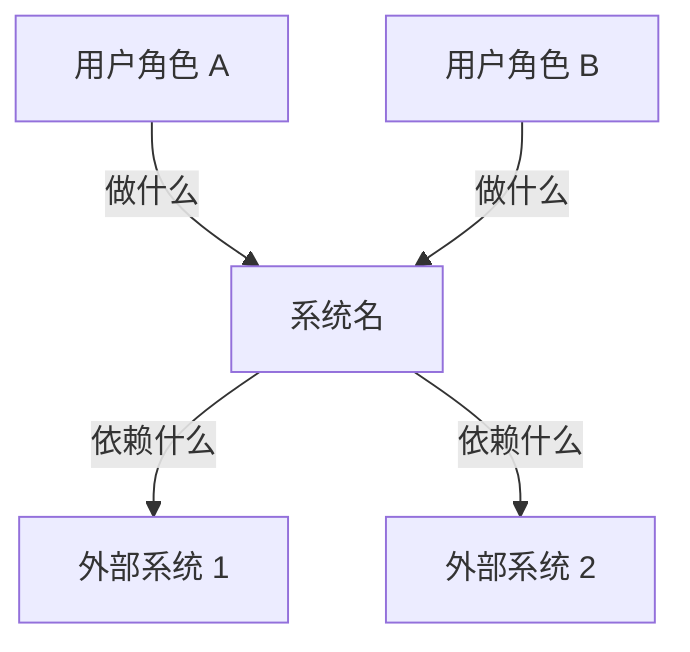
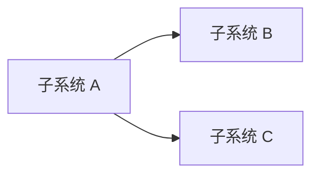
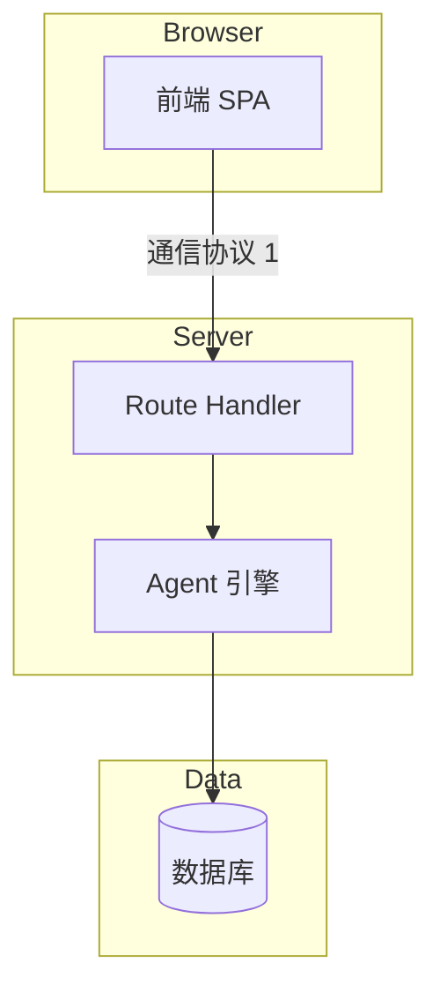
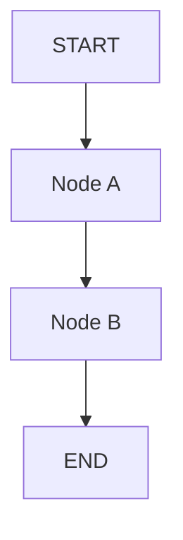

# 引思助手 高层架构设计模版

> **使用说明**
> - 每份高层架构对应一个版本，命名规则：`高层架构设计_v[版本号]_[功能名].md`（如 `高层架构设计_v0.1_MVP.md`）
> - 上游 = 同版本需求分析；下游 = 概要设计 + 详细设计
> - 高层架构回答「系统由哪些模块组成、模块如何对话、技术栈选什么、为什么这么选」
> - **不回答**：接口字段、表结构、prompt 模板、算法步骤——那是下游的事

---

## 0. 本文档职责边界

> 高层架构是「**系统视角的结构契约**」——把需求分析的 FR / NFR / 实体识别 / 外部依赖，组织为可独立实现的模块和它们之间的协议。
> **不指定单模块的内部实现细节**，那是概要 / 详细设计的事。

### 0.1 本文档写什么

- **系统上下文**：与外部世界（用户 / 第三方服务）的边界
- **服务 / 子系统拆分**：哪些代码归在一起、对外职责是什么
- **整体技术架构图**：模块之间用什么协议对话（SSE / REST / SDK / 事件）
- **LangGraph 节点拓扑**（AI 项目专属）：节点列表 + 拓扑图 + 状态字段（语义级，非类型级）
- **成本估算**：每月真实账单粗算（替代传统"资源估算"）
- **技术选型与关键决策**：每条议题含「问题 / 候选方案 / 采纳 + 理由 / 备选退路」
- **安全架构**：权限层级、敏感数据流向、攻击面
- **部署架构**：dev / production 两套拓扑
- **明确不做的架构议题**：高并发 / 缓存 / 高可用等显式声明 + 升级触发点

### 0.2 本文档不写什么

| 不写 | 写在哪里 |
|---|---|
| API 端点字段契约、错误码 | 概要设计 |
| 数据库表字段类型、索引、外键、RLS 策略 | 概要设计 |
| 类 / 函数 / 节点的方法签名 | 概要设计 |
| Prompt 模板、算法实现、错误处理路径 | 详细设计 |
| 单元测试 / 集成测试代码 | 详细设计 |
| CI / 部署脚本细节 | Runbook / 详细设计 |
| 业务目标、功能需求 | PRD / 需求分析 |

### 0.3 与上下游文档的衔接

| 关系 | 文档 | 衔接点 |
|---|---|---|
| ↑ | 需求分析 | 每个模块至少承载 1 条 FR；每个外部依赖在本文档体现为通信线条 |
| ↑ | 需求分析 §17 输出清单 | 架构层负责的开放问题在本文档 §8 / §12 给出答案 |
| ↓ | 概要设计 | 本文档的模块拆分 → 模块内部接口定义；本文档的实体 → 表 schema |
| ↓ | 详细设计 | 本文档的节点 → 节点内部 prompt / 算法 |

---

## 1. 文档元信息

| 字段 | 值 |
|---|---|
| 文档名称 | 高层架构设计_v[X.X]_[功能名].md |
| 版本 | v[X.X] |
| 状态 | 草稿 / 评审中 / 已签发 |
| 创建日期 | YYYY-MM-DD |
| 最后更新 | YYYY-MM-DD |
| 编写人 | [姓名] |
| 评审人 | [开发负责人 / 产品负责人] |
| **关联文档** | |
| ↑ 上游：PRD | doc/PRD/PRD_v[X.X]_[功能名].md |
| ↑ 上游：需求分析 | doc/需求分析/需求分析_v[X.X]_[功能名].md |
| → 下游：概要设计 | doc/概要设计/概要设计_v[X.X]_[功能名].md |
| → 下游：详细设计 | doc/详细设计/详细设计_v[X.X]_[功能名].md |

---

## 2. 架构目标与决策原则

> 用 3~5 条决策原则给整份架构定调，后续每个决策都应回到这些原则。

### 2.1 架构目标

- 目标 1：[一句话，可验证]
- 目标 2：[一句话]

### 2.2 决策原则（按重要性排序）

| # | 原则 | 含义 / 应用 |
|---|---|---|
| 1 | [原则] | [当冲突时如何应用] |
| 2 | [原则] | [同上] |

---

## 3. 系统上下文（C4 L1）

> 把整个系统看成一个黑盒，画出与外部参与者 / 外部系统的关系。
> 这是后续所有讨论的锚——任何决策都不能让黑盒的对外行为悄悄变化。

### 3.1 上下文图

### 3.2 外部参与者

| 参与者 | 与系统的交互 |
|---|---|
| [角色名] | [核心交互] |

### 3.3 外部系统

| 外部系统 | 用途 | 通信方式 |
|---|---|---|
| [系统名] | [用途] | [HTTPS REST / SDK / Webhook 等] |

---

## 4. 服务 / 子系统拆分

> 把系统拆为可独立实现的子系统。每个子系统的对外职责清晰、内部实现可被替换。
> 拆分原则要在 §2 决策原则中体现。

### 4.1 子系统清单

| 子系统 | 职责 | 包含的 FR 模块 | 物理位置（代码 / 服务）|
|---|---|---|---|
| [子系统名] | [一句话职责] | [FR-XXX, FR-YYY] | [src/xxx / 独立服务] |

### 4.2 子系统间的依赖关系

### 4.3 FR 模块 → 物理位置映射

> 让概要设计阶段一眼看到「每个 FR 模块的代码该放哪」

| FR 模块 | 物理位置 | 备注 |
|---|---|---|
| FR-[MOD] | `src/path/...` | — |

---

## 5. 整体技术架构图（C4 L2）

> Container 级别——把每个子系统放到具体的部署单元（前端 / Route Handler / Agent 引擎 / 数据库 / 外部 API）里。

### 5.1 Container 图

### 5.2 跨模块通信协议

| 起点 | 终点 | 协议 | 用途 |
|---|---|---|---|
| [模块] | [模块] | [协议] | [用途] |

---

## 6. [AI 项目专属] LangGraph 节点拓扑

> 仅 AI Agent 项目需要本章。
> 写：节点列表 + 拓扑图 + state 字段语义（**不写字段类型**）+ 守卫机制。
> 不写：每个节点的 prompt（详细设计的事）、state 字段具体 TS 类型（概要设计的事）。

### 6.1 节点拓扑图

### 6.2 节点清单

| 节点 | 触发条件 | 主要职责 | 输出 |
|---|---|---|---|
| [Node] | [何时进入] | [做什么] | [写入 state 的什么] |

### 6.3 State 字段语义

> 只写「字段名 + 一句话语义」，**不写**字段类型 / 默认值 / 校验规则——那是概要设计的事。

| 字段名 | 语义 | 谁写 | 谁读 |
|---|---|---|---|
| [字段] | [含义] | [节点] | [节点 / 前端] |

### 6.4 守卫机制（卡住 / 偏离 / 越界）

> 这些不一定是独立节点；可以是每个节点入口的 pre-check 或条件边。详细设计阶段决定物理形态。

| 守卫 | 触发条件 | 行为 |
|---|---|---|
| StuckGuard | [条件] | [行为] |

---

## 7. 成本估算

> MVP 阶段重点是**月度账单**，不是 QPS / 容量。

### 7.1 使用强度假设

| 维度 | 估算值 | 依据 |
|---|---|---|
| [维度] | [值] | [假设] |

### 7.2 月度成本分解

| 项目 | 单价 | 月用量 | 月费用 |
|---|---|---|---|
| [项目] | [单价] | [用量] | [合计] |

### 7.3 总览

- **MVP 月度总成本预估**：**[范围]**
- **超出预算的报警阈值**：[阈值] → [应对]

---

## 8. 技术选型与关键决策

> 每条决策包含 4 段：「问题陈述 / 候选方案 / 采纳 + 理由 / 备选退路」。
> 决策的输入来自需求分析 §17 输出清单。

### 8.1 决策清单总览

| ID | 议题 | 采纳方案 | 影响 FR |
|---|---|---|---|
| D1 | [议题] | [方案] | [FR] |

### 8.2 决策详情

#### D1 [议题标题]

- **问题陈述**：[一段话描述决策动机]
- **候选方案**：
  - A: [方案 A，含优缺点]
  - B: [方案 B，含优缺点]
- **采纳**：方案 [X]
- **理由**：[决策原则联动 + 量化对比]
- **备选退路**：[什么情况下回退到方案 B / C]

---

## 9. 安全架构

> 描述系统的**安全分层**和**敏感数据流向**。具体 RLS SQL / 鉴权中间件实现交概要设计。

### 9.1 权限层级

| 层级 | 职责 | 物理位置 |
|---|---|---|
| [层] | [职责] | [实现位置] |

### 9.2 敏感数据流向

### 9.3 攻击面与缓解

| 攻击面 | 缓解方法 |
|---|---|
| [攻击面] | [缓解] |

---

## 10. 部署架构

### 10.1 开发环境拓扑

### 10.2 生产环境拓扑（目标）

### 10.3 环境差异表

| 维度 | dev | production |
|---|---|---|
| [维度] | [dev 值] | [生产值] |

---

## 11. 明确不做的架构议题

> 写**为什么不做** + **何时该升级**——这是对自己未来的诚实。

| 议题 | MVP 不做的理由 | 升级触发点 | 升级方向 |
|---|---|---|---|
| 高并发架构 | [理由] | [触发条件] | [方向，不展开] |

---

## 12. 风险与未决问题

> 需求分析的 R 风险升级版 + 架构层新发现的风险。

| 编号 | 风险描述 | 影响子系统 / 决策 | 严重度 | 应对 | 决策时点 |
|---|---|---|---|---|---|
| AR-001 | [描述] | [影响] | 高 / 中 / 低 | [应对] | YYYY-MM-DD |

---

## 13. 概要设计准入检查表 + 下游开放问题

### 13.1 概要设计准入（硬门控）

| # | 检查项 | 状态 | 备注 |
|---|---|---|---|
| 1 | 所有子系统职责清晰 | ⬜ | — |
| 2 | 所有 FR 模块都映射到某个子系统 | ⬜ | — |
| 3 | C4 L1 / L2 图齐全 | ⬜ | — |
| 4 | 关键决策 §8 每条有"备选退路" | ⬜ | — |
| 5 | 成本估算已给月度预估 | ⬜ | — |
| 6 | 安全分层 ≥ 3 层 | ⬜ | — |
| 7 | dev / production 两套部署图 | ⬜ | — |
| 8 | 明确不做议题已列出升级触发点 | ⬜ | — |
| 9 | 风险表覆盖需求分析 §14 全部高严重度风险 | ⬜ | — |
| 10 | 下游开放问题已分配到概要设计 / 详细设计 | ⬜ | — |
| 11 | 编写人 + 评审人确认可进入概要设计 | ⬜ | — |

### 13.2 下游开放问题清单

| # | 问题 | 由谁回答 | 截止日 |
|---|---|---|---|
| 1 | [问题] | 概要设计 / 详细设计 | YYYY-MM-DD |
